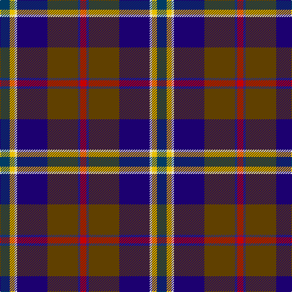

**Bands:** [RBGBWYB](/stripes/rbgbwyb/) · **Stripes:** [R DB DY DB W LY DT](/stripes/stripes7/) R DB DY DB W LY DT

This was sourced from tartans-authority.  It is a [7 band tartan](/bands/bands7/).

Original link http://www.tartansauthority.com/tartan-ferret/display/10048/

## Thread count
DBb/16 Y8 LN4 DBa50 T50 DB4 R/10

## Palette
Each colour and its ΔE from the base-6 reference it is a variant of.

| Colour | Shade | Base | ΔE (OKLab) |
|---|---|---|---|
| DB | <code style="background-color:#2C2C80;">#2C2C80</code> `#2C2C80` | B <code style="background-color:#2A418A;">#2A418A</code> | 0.06 |
| DBa | <code style="background-color:#1C0070;">#1C0070</code> `#1C0070` | B <code style="background-color:#2A418A;">#2A418A</code> | 0.14 |
| DBb | <code style="background-color:#003C64;">#003C64</code> `#003C64` | B <code style="background-color:#2A418A;">#2A418A</code> | 0.08 |
| LN | <code style="background-color:#E0E0E0;">#E0E0E0</code> `#E0E0E0` | W <code style="background-color:#F7F7F7;">#F7F7F7</code> | 0.07 |
| R | <code style="background-color:#C80000;">#C80000</code> `#C80000` | R <code style="background-color:#CC0000;">#CC0000</code> | 0.01 |
| T | <code style="background-color:#604000;">#604000</code> `#604000` | G <code style="background-color:#006100;">#006100</code> | 0.14 |
| Y | <code style="background-color:#E8C000;">#E8C000</code> `#E8C000` | Y <code style="background-color:#F2BF00;">#F2BF00</code> | 0.02 |

# Sample pattern

## Nearest tartans

The nearest existing variants by ΔTartan distance.

1. [Young Family Tartan Tartan Number: 2048. Earliest known date: 1991 Based on the Christina Young blanket dating from 1726 and preserved at the Scottish Tartans Society museum in Keith, Banffshire. The design retains the unusual purple - yellow - orange box check of the original blanket and changes only the ground colour to the greens and blues of the Douglas tartan. There are 7 colours. Black is normally replaced by dark blue in commercial weaving. See products available Copyright © Blair Urquhart, Comrie, 2015](/setts/s8/k3db3g15db15m5lo3ly2m1~x2/) — ΔT 1.06
1. [Culloden Grey](/setts/s8/r6db3dp24w2k23y23k2y6~x2/) — ΔT 1.16
1. [Julien Pigeut Tartan Tartan Number: 6574. Earliest known date: 2004 For the wedding of Julien and Sylvia Piguet. Also worn by Roland Mathez best man of Julien. See products available Copyright © Blair Urquhart, Comrie, 2015](/setts/s8/k40n15o10ly3t5w5db10t20/) — ΔT 1.18
1. [Iowa (District)](/setts/s8/r4ly3g12k16dy5db20k4w2~x2/) — ΔT 1.18
1. [Unidentified (ex Tony Murray)](/setts/s7/r2ly2db9dy1dg9r1w1~x2/) — ΔT 1.20
1. [Anne Arundel County](/setts/s8/r4y10k9dy2k9db33k7g4~x2/) — ΔT 1.23
1. [Souza Nery (Personal)](/setts/s7/ly4g22r3k17r3db37w3~x2/) — ΔT 1.26
1. [Leung (Personal)](/setts/s9/m4k7m2db25k19w2g13k2ly3~x2/) — ΔT 1.27
1. [Anne Arundel County](/setts/s8/r4o10k9o2k9db33dt7g4~x2/) — ΔT 1.28
1. [Morris of Balgonie (Personal)](/setts/s6/w2dp20r3k10g20lo2~x2/) — ΔT 1.28

## Neighbour map

Every grey dot is one of 14299 variants placed by the first two principal components of the ΔTartan feature space (44% of its variance). Red is this tartan; blue dots are its nearest — click one to open its page.

<svg viewBox="0 0 640 380" role="img" style="max-width:100%;height:auto;border:1px solid #e0e0e0;border-radius:4px;display:block" xmlns="http://www.w3.org/2000/svg"><image href="/nn/cloud.v1.png" width="640" height="380"/><a href="/setts/s8/k3db3g15db15m5lo3ly2m1~x2/"><circle cx="118.6" cy="132.1" r="4" fill="#3465a4"><title>Young Family Tartan Tartan Number: 2048. Earliest known date: 1991 Based on the Christina Young blanket dating from 1726 and preserved at the Scottish Tartans Society museum in Keith, Banffshire. The design retains the unusual purple - yellow - orange box check of the original blanket and changes only the ground colour to the greens and blues of the Douglas tartan. There are 7 colours. Black is normally replaced by dark blue in commercial weaving. See products available Copyright © Blair Urquhart, Comrie, 2015</title></circle></a><a href="/setts/s8/r6db3dp24w2k23y23k2y6~x2/"><circle cx="138.4" cy="151.9" r="4" fill="#3465a4"><title>Culloden Grey</title></circle></a><a href="/setts/s8/k40n15o10ly3t5w5db10t20/"><circle cx="108.5" cy="135.7" r="4" fill="#3465a4"><title>Julien Pigeut Tartan Tartan Number: 6574. Earliest known date: 2004 For the wedding of Julien and Sylvia Piguet. Also worn by Roland Mathez best man of Julien. See products available Copyright © Blair Urquhart, Comrie, 2015</title></circle></a><a href="/setts/s8/r4ly3g12k16dy5db20k4w2~x2/"><circle cx="81.9" cy="156.7" r="4" fill="#3465a4"><title>Iowa (District)</title></circle></a><a href="/setts/s7/r2ly2db9dy1dg9r1w1~x2/"><circle cx="148.6" cy="162.0" r="4" fill="#3465a4"><title>Unidentified (ex Tony Murray)</title></circle></a><a href="/setts/s8/r4y10k9dy2k9db33k7g4~x2/"><circle cx="162.5" cy="127.8" r="4" fill="#3465a4"><title>Anne Arundel County</title></circle></a><a href="/setts/s7/ly4g22r3k17r3db37w3~x2/"><circle cx="176.3" cy="155.4" r="4" fill="#3465a4"><title>Souza Nery (Personal)</title></circle></a><a href="/setts/s9/m4k7m2db25k19w2g13k2ly3~x2/"><circle cx="152.4" cy="147.8" r="4" fill="#3465a4"><title>Leung (Personal)</title></circle></a><a href="/setts/s8/r4o10k9o2k9db33dt7g4~x2/"><circle cx="196.4" cy="143.2" r="4" fill="#3465a4"><title>Anne Arundel County</title></circle></a><a href="/setts/s6/w2dp20r3k10g20lo2~x2/"><circle cx="151.6" cy="178.9" r="4" fill="#3465a4"><title>Morris of Balgonie (Personal)</title></circle></a><circle cx="149.0" cy="142.8" r="5" fill="#c00000"/></svg>

ID: /setts/s7/dt8ly4w2db25dy25db2r5~x2/
