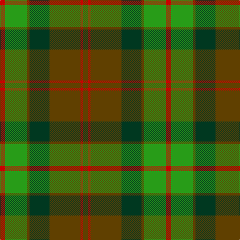

In pattern [GRGGGGR](/stripes/grggggr/).

This was sourced from house-of-tartan.  It is a [7 stripe tartan](/stripes/stripes7/).

Original link http://www.house-of-tartan.scotland.net/house/TartanViewjs.asp?colr=Def&tnam=1541

## Thread count
R/10 G44 T5 DG40 T62 R5 T/10

## Palette
Each colour and the base-6 reference it is a variant of.

| Colour | Shade | Base |
|---|---|---|
| DG | <code style="background-color:#003820;">#003820</code> `oklch(30.0% 0.070 158.3)` <small>#003820</small> | G <code style="background-color:#006100;">#006100</code> |
| G | <code style="background-color:#289C18;">#289C18</code> `oklch(60.6% 0.191 141.6)` <small>#289C18</small> | G <code style="background-color:#006100;">#006100</code> |
| R | <code style="background-color:#C80000;">#C80000</code> `oklch(52.3% 0.215 29.2)` <small>#C80000</small> | R <code style="background-color:#CC0000;">#CC0000</code> |
| T | <code style="background-color:#604000;">#604000</code> `oklch(39.8% 0.083 76.8)` <small>#604000</small> | G <code style="background-color:#006100;">#006100</code> |

# Sample pattern

## Nearest tartans

The nearest existing variants by ΔTartan distance.

1. [Ballantrae (Dalgety)](/setts/s7/dy5r3dy31dg20dy3g22r5~x2/) — ΔT 0.28
1. [Ballintrae](/setts/s7/r10g44o5dg40o62r5o10/) — ΔT 0.72
1. [Doyle](/setts/s7/g24r9g4dg19ly2dg6g7~x2/) — ΔT 1.12
1. [Scott Htg (Clan)](/setts/s8/r3dy16g10r3g3lb2g3r3~x2/) — ΔT 1.18
1. [Crantock](/setts/s8/y24dp3y3dp3y3dp7dg20r3~x2/) — ΔT 1.19
1. [Loch Rannoch Trade Tartan Tartan Number: 1735. Earliest known date: 1975 Nothing See products available Copyright © Blair Urquhart, Comrie, 2015](/setts/s8/do24g2do5lo14g2lo5dy17do2~x2/) — ΔT 1.20
1. [Arizona Jones](/setts/s10/g18k1r9k12r9k1g18k1n6g1~x2/) — ΔT 1.23
1. [McInery (Personal)](/setts/s8/r8g2r12k6r3db3g24k2~x2/) — ΔT 1.27
1. [(2) Cook](/setts/s7/dg12b6dg6r15k1r1k2~x2/) — ΔT 1.32
1. [Scott, hunting](/setts/s8/r3o14g8r2g2w2g2r1~x2/) — ΔT 1.37

## Neighbour map

Every grey dot is one of 14299 variants placed by the first two principal components of the ΔTartan feature space (44% of its variance). Red is this tartan; blue dots are its nearest — click one to open its page.

<svg viewBox="0 0 640 380" role="img" style="max-width:100%;height:auto;border:1px solid #e0e0e0;border-radius:4px;display:block" xmlns="http://www.w3.org/2000/svg"><image href="/nn/cloud.v1.png" width="640" height="380"/><a href="/setts/s7/dy5r3dy31dg20dy3g22r5~x2/"><circle cx="261.7" cy="225.8" r="4" fill="#3465a4"><title>Ballantrae (Dalgety)</title></circle></a><a href="/setts/s7/r10g44o5dg40o62r5o10/"><circle cx="254.3" cy="207.1" r="4" fill="#3465a4"><title>Ballintrae</title></circle></a><a href="/setts/s7/g24r9g4dg19ly2dg6g7~x2/"><circle cx="303.5" cy="237.1" r="4" fill="#3465a4"><title>Doyle</title></circle></a><a href="/setts/s8/r3dy16g10r3g3lb2g3r3~x2/"><circle cx="247.9" cy="226.7" r="4" fill="#3465a4"><title>Scott Htg (Clan)</title></circle></a><a href="/setts/s8/y24dp3y3dp3y3dp7dg20r3~x2/"><circle cx="268.4" cy="215.3" r="4" fill="#3465a4"><title>Crantock</title></circle></a><a href="/setts/s8/do24g2do5lo14g2lo5dy17do2~x2/"><circle cx="277.6" cy="206.2" r="4" fill="#3465a4"><title>Loch Rannoch Trade Tartan Tartan Number: 1735. Earliest known date: 1975 Nothing See products available Copyright © Blair Urquhart, Comrie, 2015</title></circle></a><a href="/setts/s10/g18k1r9k12r9k1g18k1n6g1~x2/"><circle cx="300.4" cy="192.4" r="4" fill="#3465a4"><title>Arizona Jones</title></circle></a><a href="/setts/s8/r8g2r12k6r3db3g24k2~x2/"><circle cx="281.4" cy="201.2" r="4" fill="#3465a4"><title>McInery (Personal)</title></circle></a><a href="/setts/s7/dg12b6dg6r15k1r1k2~x2/"><circle cx="275.1" cy="210.6" r="4" fill="#3465a4"><title>(2) Cook</title></circle></a><a href="/setts/s8/r3o14g8r2g2w2g2r1~x2/"><circle cx="262.2" cy="178.4" r="4" fill="#3465a4"><title>Scott, hunting</title></circle></a><circle cx="270.3" cy="218.1" r="5" fill="#c00000"/></svg>

ID: /setts/s7/dy10r5dy62dg40dy5g44r10/
