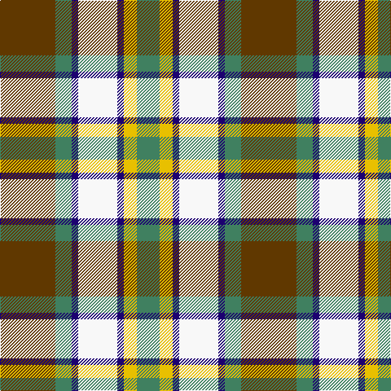

In pattern [GGBWBYG](/stripes/ggbwbyg/).

This was sourced from register-of-tartans.  It is a [7 stripe tartan](/stripes/stripes7/).

Original link https://www.tartanregister.gov.uk/tartanDetails.aspx?ref=3161

## Register references

External register numbers recorded for this tartan.

- Scottish Register of Tartans: [3161](https://www.tartanregister.gov.uk/tartanDetails.aspx?ref=3161)
- Scottish Tartans Authority (ITI): 5524

## Thread count
T/68 Ga20 DB8 Wa48 DB8 Y16 Ga/28

## Palette
Each colour and its ΔE from the base-6 reference it is a variant of.

| Colour | Shade | Base | ΔE (OKLab) |
|---|---|---|---|
| B | <code style="background-color:#1474B4;">#1474B4</code> `#1474B4` | B <code style="background-color:#2A418A;">#2A418A</code> | 0.15 |
| DB | <code style="background-color:#1C0070;">#1C0070</code> `#1C0070` | B <code style="background-color:#2A418A;">#2A418A</code> | 0.14 |
| DBa | <code style="background-color:#2C2C80;">#2C2C80</code> `#2C2C80` | B <code style="background-color:#2A418A;">#2A418A</code> | 0.06 |
| DY | <code style="background-color:#D09800;">#D09800</code> `#D09800` | Y <code style="background-color:#F2BF00;">#F2BF00</code> | 0.12 |
| G | <code style="background-color:#006818;">#006818</code> `#006818` | G <code style="background-color:#006100;">#006100</code> | 0.02 |
| Ga | <code style="background-color:#408060;">#408060</code> `#408060` | G <code style="background-color:#006100;">#006100</code> | 0.14 |
| T | <code style="background-color:#603800;">#603800</code> `#603800` | G <code style="background-color:#006100;">#006100</code> | 0.16 |
| W | <code style="background-color:#FCFCFC;">#FCFCFC</code> `#FCFCFC` | W <code style="background-color:#F7F7F7;">#F7F7F7</code> | 0.01 |
| Wa | <code style="background-color:#F8F8F8;">#F8F8F8</code> `#F8F8F8` | W <code style="background-color:#F7F7F7;">#F7F7F7</code> | 0.00 |
| Y | <code style="background-color:#E8C000;">#E8C000</code> `#E8C000` | Y <code style="background-color:#F2BF00;">#F2BF00</code> | 0.02 |

# Sample pattern

## Nearest tartans

The nearest existing variants by ΔTartan distance.

1. [Fraser, Red dress](/setts/s7/r4db18r4g19w25r10w4~x2/) — ΔT 0.71
1. [Ainslie, Lake](/setts/s7/db6w10g10r2ly3r1db3~x2/) — ΔT 0.82
1. [Barbour - Ancient](/setts/s7/w4k2w18k11db2y18ly2~x2/) — ΔT 0.86
1. [Gray, Sir John Hamilton (Commem)](/setts/s10/w4dt6r3dt10n14lo6w18lo6n4lo2~x2/) — ΔT 0.91
1. [MacRobart Dress (Personal)](/setts/s7/db8w33k15dg17t3dg17t3~x2/) — ΔT 0.92
1. [Thomson Dress (Grey) (Fashion)](/setts/s6/r4o25k6w12k11ly3~x2/) — ΔT 0.94
1. [Fraser Red Dress](/setts/s7/r4db18r4dg19w25r10w4~x2/) — ΔT 0.94
1. [Hackett, William (Coatbridge) (Personal)](/setts/s8/k20w4r4w20dg20w5dg2g2~x2/) — ΔT 0.96
1. [Bannockbane Dark Green](/setts/s7/dg4g3dg24w15lo21g3lo4~x2/) — ΔT 0.96
1. [Tombow 140th Anniversary, The](/setts/s7/g4ly7o9ly9db20w2db2~x2/) — ΔT 0.96

## Neighbour map

Every grey dot is one of 14299 variants placed by the first two principal components of the ΔTartan feature space (44% of its variance). Red is this tartan; blue dots are its nearest — click one to open its page.

<svg viewBox="0 0 640 380" role="img" style="max-width:100%;height:auto;border:1px solid #e0e0e0;border-radius:4px;display:block" xmlns="http://www.w3.org/2000/svg"><image href="/nn/cloud.v1.png" width="640" height="380"/><a href="/setts/s7/r4db18r4g19w25r10w4~x2/"><circle cx="86.6" cy="192.6" r="4" fill="#3465a4"><title>Fraser, Red dress</title></circle></a><a href="/setts/s7/db6w10g10r2ly3r1db3~x2/"><circle cx="72.8" cy="171.0" r="4" fill="#3465a4"><title>Ainslie, Lake</title></circle></a><a href="/setts/s7/w4k2w18k11db2y18ly2~x2/"><circle cx="130.5" cy="158.4" r="4" fill="#3465a4"><title>Barbour - Ancient</title></circle></a><a href="/setts/s10/w4dt6r3dt10n14lo6w18lo6n4lo2~x2/"><circle cx="65.8" cy="162.0" r="4" fill="#3465a4"><title>Gray, Sir John Hamilton (Commem)</title></circle></a><a href="/setts/s7/db8w33k15dg17t3dg17t3~x2/"><circle cx="114.9" cy="174.8" r="4" fill="#3465a4"><title>MacRobart Dress (Personal)</title></circle></a><a href="/setts/s6/r4o25k6w12k11ly3~x2/"><circle cx="141.3" cy="185.0" r="4" fill="#3465a4"><title>Thomson Dress (Grey) (Fashion)</title></circle></a><a href="/setts/s7/r4db18r4dg19w25r10w4~x2/"><circle cx="86.0" cy="191.0" r="4" fill="#3465a4"><title>Fraser Red Dress</title></circle></a><a href="/setts/s8/k20w4r4w20dg20w5dg2g2~x2/"><circle cx="122.6" cy="152.3" r="4" fill="#3465a4"><title>Hackett, William (Coatbridge) (Personal)</title></circle></a><a href="/setts/s7/dg4g3dg24w15lo21g3lo4~x2/"><circle cx="144.8" cy="184.5" r="4" fill="#3465a4"><title>Bannockbane Dark Green</title></circle></a><a href="/setts/s7/g4ly7o9ly9db20w2db2~x2/"><circle cx="156.1" cy="170.7" r="4" fill="#3465a4"><title>Tombow 140th Anniversary, The</title></circle></a><circle cx="103.4" cy="175.6" r="5" fill="#c00000"/></svg>

ID: /setts/s7/dy17g5db2w12db2ly4g7~x4/
