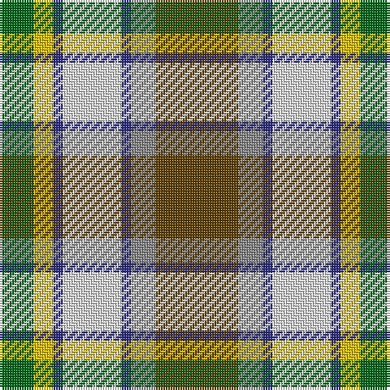

**Bands:** [GRBWBYG](/stripes/grbwbyg/) · **Stripes:** [DY O DB W DB LY G](/stripes/stripes7/) DY O DB W DB LY G

This was sourced from house-of-tartan.  It is a [7 band tartan](/bands/bands7/).

Original link http://www.house-of-tartan.scotland.net/house/TartanViewjs.asp?colr=Def&tnam=956

## Thread count
G/14 Y8 DB4 LN24 DB4 N10 T/34

## Palette
Each colour and its ΔE from the base-6 reference it is a variant of.

| Colour | Shade | Base | ΔE (OKLab) |
|---|---|---|---|
| DB | <code style="background-color:#2C2C80;">#2C2C80</code> `#2C2C80` | B <code style="background-color:#2A418A;">#2A418A</code> | 0.06 |
| G | <code style="background-color:#006818;">#006818</code> `#006818` | G <code style="background-color:#006100;">#006100</code> | 0.02 |
| LN | <code style="background-color:#E0E0E0;">#E0E0E0</code> `#E0E0E0` | W <code style="background-color:#F7F7F7;">#F7F7F7</code> | 0.07 |
| N | <code style="background-color:#888888;">#888888</code> `#888888` | R <code style="background-color:#CC0000;">#CC0000</code> | 0.24 |
| T | <code style="background-color:#604000;">#604000</code> `#604000` | G <code style="background-color:#006100;">#006100</code> | 0.14 |
| Y | <code style="background-color:#E8C000;">#E8C000</code> `#E8C000` | Y <code style="background-color:#F2BF00;">#F2BF00</code> | 0.02 |

# Sample pattern

## Nearest tartans

The nearest existing variants by ΔTartan distance.

1. [Ontario, Northern](/setts/s7/o17y5db2w12db2ly4g7~x2/) — ΔT 0.86
1. [Hackett William (Coatbridge) Hunting (Personal)](/setts/s8/k20ly4r4ly20g20w5g2lg2~x2/) — ΔT 0.93
1. [Carmen Lau (Hong Kong) (Personal)](/setts/s7/ly8r3b2db1w6g12db2~x2/) — ΔT 0.98
1. [Coulter Dress (Personal)](/setts/s8/r6w20g12o3g8t20k2t3~x2/) — ΔT 0.98
1. [Northern Ontario](/setts/s7/dy17g5db2w12db2ly4g7~x4/) — ΔT 1.00
1. [Nicolson of Taransay (Personal)](/setts/s7/w6g10r22db16g2g4g5~x2/) — ΔT 1.02
1. [Unnamed No 14](/setts/s9/r22t6db10ly4r4w4g22db8ly3/) — ΔT 1.03
1. [Ball Hunting](/setts/s6/lo13g8k5lb3w2r1~x4/) — ΔT 1.04
1. [Porcupine City of](/setts/s7/r10n3db1lb8db1lo2g5~x4/) — ΔT 1.08
1. [Brittany Hunting French Fancy Tartan Tartan Number: 5977. Earliest known date: 2003 For Richard and Anne-Marie Duclos of Le Coudray-Montceaux, France. Based on the Breton National at 3902. The term Randonnée (Walking) is used in the sense of the Scottish category, Hunting. See products available Copyright © Blair Urquhart, Comrie, 2015](/setts/s9/t4dy27lr8k4lr8k4lr8r11ly3~x2/) — ΔT 1.11

## Neighbour map

Every grey dot is one of 14313 variants placed by the first two principal components of the ΔTartan feature space (44% of its variance). Red is this tartan; blue dots are its nearest — click one to open its page.

<svg viewBox="0 0 640 380" role="img" style="max-width:100%;height:auto;border:1px solid #e0e0e0;border-radius:4px;display:block" xmlns="http://www.w3.org/2000/svg"><image href="/nn/cloud.v1.png" width="640" height="380"/><a href="/setts/s7/o17y5db2w12db2ly4g7~x2/"><circle cx="105.2" cy="173.7" r="4" fill="#3465a4"><title>Ontario, Northern</title></circle></a><a href="/setts/s8/k20ly4r4ly20g20w5g2lg2~x2/"><circle cx="88.5" cy="143.3" r="4" fill="#3465a4"><title>Hackett William (Coatbridge) Hunting (Personal)</title></circle></a><a href="/setts/s7/ly8r3b2db1w6g12db2~x2/"><circle cx="89.8" cy="144.4" r="4" fill="#3465a4"><title>Carmen Lau (Hong Kong) (Personal)</title></circle></a><a href="/setts/s8/r6w20g12o3g8t20k2t3~x2/"><circle cx="82.5" cy="152.9" r="4" fill="#3465a4"><title>Coulter Dress (Personal)</title></circle></a><a href="/setts/s7/dy17g5db2w12db2ly4g7~x4/"><circle cx="103.5" cy="175.6" r="4" fill="#3465a4"><title>Northern Ontario</title></circle></a><a href="/setts/s7/w6g10r22db16g2g4g5~x2/"><circle cx="105.7" cy="161.1" r="4" fill="#3465a4"><title>Nicolson of Taransay (Personal)</title></circle></a><a href="/setts/s9/r22t6db10ly4r4w4g22db8ly3/"><circle cx="89.7" cy="163.6" r="4" fill="#3465a4"><title>Unnamed No 14</title></circle></a><a href="/setts/s6/lo13g8k5lb3w2r1~x4/"><circle cx="141.7" cy="152.8" r="4" fill="#3465a4"><title>Ball Hunting</title></circle></a><a href="/setts/s7/r10n3db1lb8db1lo2g5~x4/"><circle cx="116.6" cy="163.2" r="4" fill="#3465a4"><title>Porcupine City of</title></circle></a><a href="/setts/s9/t4dy27lr8k4lr8k4lr8r11ly3~x2/"><circle cx="119.6" cy="150.4" r="4" fill="#3465a4"><title>Brittany Hunting French Fancy Tartan Tartan Number: 5977. Earliest known date: 2003 For Richard and Anne-Marie Duclos of Le Coudray-Montceaux, France. Based on the Breton National at 3902. The term Randonnée (Walking) is used in the sense of the Scottish category, Hunting. See products available Copyright © Blair Urquhart, Comrie, 2015</title></circle></a><circle cx="87.8" cy="166.3" r="5" fill="#c00000"/></svg>

ID: /setts/s7/dy17o5db2w12db2ly4g7~x2/
