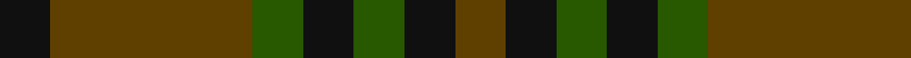

**Bands:** [GKGKGGK](/stripes/gkgkggk/) · **Stripes:** [DY K DG K DG DY K](/stripes/stripes7/) DY K DG K DG DY K

This was sourced from tartans-authority.  It is a [7 band tartan](/bands/bands7/).

Original link http://www.tartansauthority.com/tartan-ferret/display/10274/

## Thread count
K/10 T40 G10 K10 G10 K10 T/10

## Palette
Each colour and its ΔE from the base-6 reference it is a variant of.

| Colour | Shade | Base | ΔE (OKLab) |
|---|---|---|---|
| G | <code style="background-color:#285800;">#285800</code> `#285800` | G <code style="background-color:#006100;">#006100</code> | 0.03 |
| K | <code style="background-color:#101010;">#101010</code> `#101010` | K <code style="background-color:#000000;">#000000</code> | 0.17 |
| T | <code style="background-color:#604000;">#604000</code> `#604000` | G <code style="background-color:#006100;">#006100</code> | 0.14 |

# Sample pattern

## Nearest tartans

The nearest existing variants by ΔTartan distance.

1. [McCanna NW (Olympia, USA) Hunting (Personal)](/setts/s7/dy1k1g1k1g1dy4k1~x14/) — ΔT 0.59
1. [Chindecella Gorse (Kemete Heil)](/setts/s8/o9do4o4do4o24dy19do19dy4~x2/) — ΔT 1.49
1. [MacKinnon Hunting](/setts/s7/dg1dr8dg8r1dg8dr8lr1~x4/) — ΔT 1.53
1. [MacKinnon Hunting](/setts/s7/dg1dr8dg8r1dg8dr8lr1~x2/) — ΔT 1.53
1. [Fraser Hunting #2](/setts/s6/dy1db3dy1dg3dy4r1~x2/) — ΔT 1.68
1. [Bright of Garth (Personal)](/setts/s5/g7dy6dt7dy1dt2~x6/) — ΔT 1.85
1. [Lindsay](/setts/s9/dg24dt3dg3dt3dg3dt9m24dg3m4~x2/) — ΔT 1.88
1. [Daks (Loden)](/setts/s8/db3dy7g2y2g14dy2g2db3~x2/) — ΔT 1.89
1. [MacNab WI 2](/setts/s4/dg15r3n11b2~x2/) — ΔT 1.91
1. [MacNab WI2](/setts/s4/dg15r3n11b2/) — ΔT 1.91

## Neighbour map

Every grey dot is one of 14313 variants placed by the first two principal components of the ΔTartan feature space (44% of its variance). Red is this tartan; blue dots are its nearest — click one to open its page.

<svg viewBox="0 0 640 380" role="img" style="max-width:100%;height:auto;border:1px solid #e0e0e0;border-radius:4px;display:block" xmlns="http://www.w3.org/2000/svg"><image href="/nn/cloud.v1.png" width="640" height="380"/><a href="/setts/s7/dy1k1g1k1g1dy4k1~x14/"><circle cx="317.4" cy="305.2" r="4" fill="#3465a4"><title>McCanna NW (Olympia, USA) Hunting (Personal)</title></circle></a><a href="/setts/s8/o9do4o4do4o24dy19do19dy4~x2/"><circle cx="281.4" cy="273.8" r="4" fill="#3465a4"><title>Chindecella Gorse (Kemete Heil)</title></circle></a><a href="/setts/s7/dg1dr8dg8r1dg8dr8lr1~x4/"><circle cx="361.8" cy="281.8" r="4" fill="#3465a4"><title>MacKinnon Hunting</title></circle></a><a href="/setts/s7/dg1dr8dg8r1dg8dr8lr1~x2/"><circle cx="361.8" cy="281.8" r="4" fill="#3465a4"><title>MacKinnon Hunting</title></circle></a><a href="/setts/s6/dy1db3dy1dg3dy4r1~x2/"><circle cx="270.9" cy="323.5" r="4" fill="#3465a4"><title>Fraser Hunting #2</title></circle></a><a href="/setts/s5/g7dy6dt7dy1dt2~x6/"><circle cx="292.1" cy="332.0" r="4" fill="#3465a4"><title>Bright of Garth (Personal)</title></circle></a><a href="/setts/s9/dg24dt3dg3dt3dg3dt9m24dg3m4~x2/"><circle cx="336.5" cy="247.9" r="4" fill="#3465a4"><title>Lindsay</title></circle></a><a href="/setts/s8/db3dy7g2y2g14dy2g2db3~x2/"><circle cx="329.5" cy="256.0" r="4" fill="#3465a4"><title>Daks (Loden)</title></circle></a><a href="/setts/s4/dg15r3n11b2~x2/"><circle cx="335.6" cy="299.8" r="4" fill="#3465a4"><title>MacNab WI 2</title></circle></a><a href="/setts/s4/dg15r3n11b2/"><circle cx="335.6" cy="299.8" r="4" fill="#3465a4"><title>MacNab WI2</title></circle></a><circle cx="328.5" cy="312.8" r="5" fill="#c00000"/></svg>

ID: /setts/s7/dy1k1dg1k1dg1dy4k1~x10/
