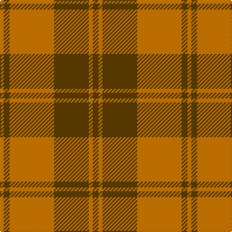

**Bands:** [GYGYYGY](/stripes/gygyygy/) · **Stripes:** [DY LO DY LO LO DY LO](/stripes/stripes7/) DY LO DY LO LO DY LO

This was sourced from tartans-authority.  It is a [7 band tartan](/bands/bands7/).

Original link http://www.tartansauthority.com/tartan-ferret/display/826/

## Thread count
O/4 T6 O4 Oa42 T36 Oa4 T/6

## Palette
Each colour and its ΔE from the base-6 reference it is a variant of.

| Colour | Shade | Base | ΔE (OKLab) |
|---|---|---|---|
| O | <code style="background-color:#D87C00;">#D87C00</code> `#D87C00` | Y <code style="background-color:#F2BF00;">#F2BF00</code> | 0.17 |
| Oa | <code style="background-color:#D87C00;">#D87C00</code> `#D87C00` | Y <code style="background-color:#F2BF00;">#F2BF00</code> | 0.17 |
| T | <code style="background-color:#604000;">#604000</code> `#604000` | G <code style="background-color:#006100;">#006100</code> | 0.14 |

# Sample pattern

## Nearest tartans

The nearest existing variants by ΔTartan distance.

1. [MacDonald of Vallay (Uist) (?)](/setts/s11/g18r3g2r2n6r2g2r24g2r2g6~x2/) — ΔT 1.38
1. [Crossnor School](/setts/s7/dg4r2dg13lb2r13dg2r4~x2/) — ΔT 1.44
1. [Scottish Piping Soc. of London (Corp](/setts/s7/r30y3db5y21r3y21db2~x2/) — ΔT 1.47
1. [Lennox](/setts/s7/g2lr1g10r2r10r1r2~x4/) — ΔT 1.48
1. [Burnett](/setts/s8/r4g14ly3g14r4g3r29y4~x2/) — ΔT 1.48
1. [Miyuki #4](/setts/s8/lo3dy8lo3dy20lo20r3lo8r3~x2/) — ΔT 1.51
1. [Burnett of Powis (Personal)](/setts/s8/r3y19ly3y19r3y3r21t3~x2/) — ΔT 1.54
1. [Valdres, Kvam & Vang (Artefact)](/setts/s9/r5r2r1g16r2r11r1r1r2~x4/) — ΔT 1.55
1. [Loch Rannoch #2](/setts/s8/dy24g2dy5o14g2o5lo17dy2~x2/) — ΔT 1.57
1. [Spice Apple](/setts/s7/g4lo1r22g12lo4g4r4~x4/) — ΔT 1.57

## Neighbour map

Every grey dot is one of 14313 variants placed by the first two principal components of the ΔTartan feature space (44% of its variance). Red is this tartan; blue dots are its nearest — click one to open its page.

<svg viewBox="0 0 640 380" role="img" style="max-width:100%;height:auto;border:1px solid #e0e0e0;border-radius:4px;display:block" xmlns="http://www.w3.org/2000/svg"><image href="/nn/cloud.v1.png" width="640" height="380"/><a href="/setts/s11/g18r3g2r2n6r2g2r24g2r2g6~x2/"><circle cx="349.9" cy="180.4" r="4" fill="#3465a4"><title>MacDonald of Vallay (Uist) (?)</title></circle></a><a href="/setts/s7/dg4r2dg13lb2r13dg2r4~x2/"><circle cx="327.4" cy="250.3" r="4" fill="#3465a4"><title>Crossnor School</title></circle></a><a href="/setts/s7/r30y3db5y21r3y21db2~x2/"><circle cx="390.6" cy="219.1" r="4" fill="#3465a4"><title>Scottish Piping Soc. of London (Corp</title></circle></a><a href="/setts/s7/g2lr1g10r2r10r1r2~x4/"><circle cx="285.3" cy="198.1" r="4" fill="#3465a4"><title>Lennox</title></circle></a><a href="/setts/s8/r4g14ly3g14r4g3r29y4~x2/"><circle cx="308.9" cy="194.0" r="4" fill="#3465a4"><title>Burnett</title></circle></a><a href="/setts/s8/lo3dy8lo3dy20lo20r3lo8r3~x2/"><circle cx="351.2" cy="255.9" r="4" fill="#3465a4"><title>Miyuki #4</title></circle></a><a href="/setts/s8/r3y19ly3y19r3y3r21t3~x2/"><circle cx="352.5" cy="225.5" r="4" fill="#3465a4"><title>Burnett of Powis (Personal)</title></circle></a><a href="/setts/s9/r5r2r1g16r2r11r1r1r2~x4/"><circle cx="338.4" cy="176.1" r="4" fill="#3465a4"><title>Valdres, Kvam &amp; Vang (Artefact)</title></circle></a><a href="/setts/s8/dy24g2dy5o14g2o5lo17dy2~x2/"><circle cx="269.2" cy="188.2" r="4" fill="#3465a4"><title>Loch Rannoch #2</title></circle></a><a href="/setts/s7/g4lo1r22g12lo4g4r4~x4/"><circle cx="369.1" cy="184.4" r="4" fill="#3465a4"><title>Spice Apple</title></circle></a><circle cx="364.3" cy="212.5" r="5" fill="#c00000"/></svg>

ID: /setts/s7/dy3lo2dy18lo21lo2dy3lo2~x2/
