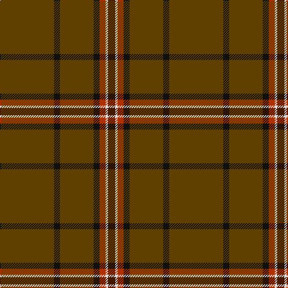

In pattern [BWRKGKG](/stripes/bwrkgkg/).

This was sourced from tartans-authority.  It is a [7 stripe tartan](/stripes/stripes7/).

Original link http://www.tartansauthority.com/tartan-ferret/display/4025/

## Thread count
T/90 K10 T56 K10 R10 LN4 DR/12

## Palette
Each colour and the base-6 reference it is a variant of.

| Colour | Shade | Base |
|---|---|---|
| DR | <code style="background-color:#441800;">#441800</code> `oklch(27.3% 0.076 46.3)` <small>#441800</small> | B <code style="background-color:#2A418A;">#2A418A</code> |
| K | <code style="background-color:#101010;">#101010</code> `oklch(17.3% 0.000 89.9)` <small>#101010</small> | K <code style="background-color:#000000;">#000000</code> |
| LN | <code style="background-color:#E0E0E0;">#E0E0E0</code> `oklch(90.7% 0.000 89.9)` <small>#E0E0E0</small> | W <code style="background-color:#F7F7F7;">#F7F7F7</code> |
| R | <code style="background-color:#B03000;">#B03000</code> `oklch(50.3% 0.171 36.3)` <small>#B03000</small> | R <code style="background-color:#CC0000;">#CC0000</code> |
| T | <code style="background-color:#604000;">#604000</code> `oklch(39.8% 0.083 76.8)` <small>#604000</small> | G <code style="background-color:#006100;">#006100</code> |

# Sample pattern

## Nearest tartans

The nearest existing variants by ΔTartan distance.

1. [State Seal of Missouri (Fashion)](/setts/s10/b6r7dy49lo2dy22b10dy5k5dy8g4~x2/) — ΔT 1.47
1. [Leiato of American Samoa (Personal)](/setts/s7/o45k5o28k5r5w2do6~x2/) — ΔT 1.55
1. [Kozmyk (Corporate)](/setts/s7/ly6dy14db10dy58g3dy8w2/) — ΔT 1.80
1. [Inches of Perth (District or Clan)](/setts/s9/dy44ly2k4dp2dy15m6k3t3ly2~x2/) — ΔT 1.83
1. [Welsh Stanley–Gpa (Personal)](/setts/s9/r2g2r2g4ly3dy45g2dy3g2~x2/) — ΔT 1.93
1. [Spencer](/setts/s11/y40n3y8r2y2w2y10n6do2n2w2~x2/) — ΔT 1.95
1. [Windy Meadows (Fashion)](/setts/s6/dy45lb2r4ly1o2n2~x4/) — ΔT 2.04
1. [Reid (1939)](/setts/s6/y40r8y4w2y4ly5~x2/) — ΔT 2.07
1. [Puxty-Dunne](/setts/s7/dt18w2k1w4dg13dt40r2~x2/) — ΔT 2.09
1. [Highland Autumn (Fashion)](/setts/s8/r2n2k2n28k8n9k1lo2~x2/) — ΔT 2.13

## Neighbour map

Every grey dot is one of 14299 variants placed by the first two principal components of the ΔTartan feature space (44% of its variance). Red is this tartan; blue dots are its nearest — click one to open its page.

<svg viewBox="0 0 640 380" role="img" style="max-width:100%;height:auto;border:1px solid #e0e0e0;border-radius:4px;display:block" xmlns="http://www.w3.org/2000/svg"><image href="/nn/cloud.v1.png" width="640" height="380"/><a href="/setts/s10/b6r7dy49lo2dy22b10dy5k5dy8g4~x2/"><circle cx="476.5" cy="145.3" r="4" fill="#3465a4"><title>State Seal of Missouri (Fashion)</title></circle></a><a href="/setts/s7/o45k5o28k5r5w2do6~x2/"><circle cx="525.4" cy="163.4" r="4" fill="#3465a4"><title>Leiato of American Samoa (Personal)</title></circle></a><a href="/setts/s7/ly6dy14db10dy58g3dy8w2/"><circle cx="548.9" cy="148.0" r="4" fill="#3465a4"><title>Kozmyk (Corporate)</title></circle></a><a href="/setts/s9/dy44ly2k4dp2dy15m6k3t3ly2~x2/"><circle cx="479.4" cy="122.8" r="4" fill="#3465a4"><title>Inches of Perth (District or Clan)</title></circle></a><a href="/setts/s9/r2g2r2g4ly3dy45g2dy3g2~x2/"><circle cx="586.4" cy="161.9" r="4" fill="#3465a4"><title>Welsh Stanley–Gpa (Personal)</title></circle></a><a href="/setts/s11/y40n3y8r2y2w2y10n6do2n2w2~x2/"><circle cx="538.7" cy="140.8" r="4" fill="#3465a4"><title>Spencer</title></circle></a><a href="/setts/s6/dy45lb2r4ly1o2n2~x4/"><circle cx="617.7" cy="120.4" r="4" fill="#3465a4"><title>Windy Meadows (Fashion)</title></circle></a><a href="/setts/s6/y40r8y4w2y4ly5~x2/"><circle cx="565.8" cy="187.6" r="4" fill="#3465a4"><title>Reid (1939)</title></circle></a><a href="/setts/s7/dt18w2k1w4dg13dt40r2~x2/"><circle cx="504.1" cy="152.9" r="4" fill="#3465a4"><title>Puxty-Dunne</title></circle></a><a href="/setts/s8/r2n2k2n28k8n9k1lo2~x2/"><circle cx="518.2" cy="164.7" r="4" fill="#3465a4"><title>Highland Autumn (Fashion)</title></circle></a><circle cx="546.9" cy="188.3" r="5" fill="#c00000"/></svg>

ID: /setts/s7/dy45k5dy28k5r5w2do6~x2/
