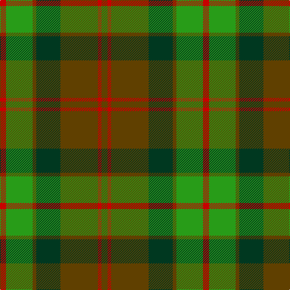

This page is one **sett** — a single exact thread-count. It belongs to the [tartan](/tartans/r5g22t3dg20t31r3t5/)
(the same proportion at any scale), whose colour order is pattern [GRGGGGR](/stripes/grggggr/).

Sourced from register-of-tartans.  It is a [7 stripe tartan](/stripes/stripes7/).

Original link https://www.tartanregister.gov.uk/tartanDetails.aspx?ref=177

2 attestations — the source records this cloth was collapsed from (oldest owns this page)

<ul>
<li>01/01/2002 — Ballantrae (Dalgety) (register-of-tartans, <a href="https://www.tartanregister.gov.uk/tartanDetails.aspx?ref=177">record</a>)</li>
<li>pre 2002 — Ballantrae - Dalgety (Fashion) (tartans-authority, <a href="http://www.tartansauthority.com/tartan-ferret/display/1541/">record</a>)</li>
</ul>

## Register references

External register numbers recorded for this tartan.

- Scottish Register of Tartans: [177](https://www.tartanregister.gov.uk/tartanDetails.aspx?ref=177)
- Scottish Tartans Authority (ITI): 1541
- Scottish Tartans World Register: 1541

## Thread count
R/10 G44 T6 DG40 T62 R6 T/10

## Palette
Each colour and the base-6 reference it is a variant of.

| Colour | Shade | Base |
|---|---|---|
| DG | <code style="background-color:#003820;">#003820</code> `oklch(30.0% 0.070 158.3)` <small>#003820</small> | G <code style="background-color:#006100;">#006100</code> |
| G | <code style="background-color:#289C18;">#289C18</code> `oklch(60.6% 0.191 141.6)` <small>#289C18</small> | G <code style="background-color:#006100;">#006100</code> |
| R | <code style="background-color:#C80000;">#C80000</code> `oklch(52.3% 0.215 29.2)` <small>#C80000</small> | R <code style="background-color:#CC0000;">#CC0000</code> |
| T | <code style="background-color:#604000;">#604000</code> `oklch(39.8% 0.083 76.8)` <small>#604000</small> | G <code style="background-color:#006100;">#006100</code> |

# Sample pattern

## Nearest tartans

The nearest existing variants by ΔTartan distance, with this tartan at the top so the swatches line up against it.

ΔTartan

Tartan

Sett

—

<a href="/ttd/edit/#slug=dy5r3dy31dg20dy3g22r5~x2">Ballantrae (Dalgety)</a> <a class="nn-out" href="/setts/s7/dy5r3dy31dg20dy3g22r5~x2/" title="open its dictionary page">↗</a>

0.28

<a href="/ttd/edit/#slug=dy10r5dy62dg40dy5g44r10">Ballintrae Trade Tartan Tartan Number: 1541. Earliest known date: 1982 Many new designs have been given district names to promote their Scottish connections. However, these names should not be confused with the District tartans which have earned their title through 'use and wont' and not a little history. See products available Copyright © Blair Urquhart, Comrie, 2015</a> <a class="nn-out" href="/setts/s7/dy10r5dy62dg40dy5g44r10/" title="open its dictionary page">↗</a>

0.77

<a href="/ttd/edit/#slug=r10g44o5dg40o62r5o10">Ballintrae</a> <a class="nn-out" href="/setts/s7/r10g44o5dg40o62r5o10/" title="open its dictionary page">↗</a>

1.05

<a href="/ttd/edit/#slug=r3dy16g10r3g3lb2g3r3~x2">Scott Htg (Clan)</a> <a class="nn-out" href="/setts/s8/r3dy16g10r3g3lb2g3r3~x2/" title="open its dictionary page">↗</a>

1.10

<a href="/ttd/edit/#slug=y24dp3y3dp3y3dp7dg20r3~x2">Crantock</a> <a class="nn-out" href="/setts/s8/y24dp3y3dp3y3dp7dg20r3~x2/" title="open its dictionary page">↗</a>

1.15

<a href="/ttd/edit/#slug=g24r9g4dg19ly2dg6g7~x2">Doyle</a> <a class="nn-out" href="/setts/s7/g24r9g4dg19ly2dg6g7~x2/" title="open its dictionary page">↗</a>

1.21

<a href="/ttd/edit/#slug=do24g2do5lo14g2lo5dy17do2~x2">Loch Rannoch Trade Tartan Tartan Number: 1735. Earliest known date: 1975 Nothing See products available Copyright © Blair Urquhart, Comrie, 2015</a> <a class="nn-out" href="/setts/s8/do24g2do5lo14g2lo5dy17do2~x2/" title="open its dictionary page">↗</a>

1.29

<a href="/ttd/edit/#slug=r8g2r12k6r3db3g24k2~x2">McInery (Personal)</a> <a class="nn-out" href="/setts/s8/r8g2r12k6r3db3g24k2~x2/" title="open its dictionary page">↗</a>

1.36

<a href="/ttd/edit/#slug=dg2r1dg8r5y5r1y2~x4">Glen Esk (1993)</a> <a class="nn-out" href="/setts/s7/dg2r1dg8r5y5r1y2~x4/" title="open its dictionary page">↗</a>

1.38

<a href="/ttd/edit/#slug=g18k1r9k12r9k1g18k1n6g1~x2">Arizona Jones</a> <a class="nn-out" href="/setts/s10/g18k1r9k12r9k1g18k1n6g1~x2/" title="open its dictionary page">↗</a>

1.38

<a href="/ttd/edit/#slug=r5dt12g3db4g20dt3g3r5~x4">Daks (0600150)</a> <a class="nn-out" href="/setts/s8/r5dt12g3db4g20dt3g3r5~x4/" title="open its dictionary page">↗</a>

## Neighbour map

Every grey dot is one of 14299 variants placed by the first two principal components of the ΔTartan feature space (44% of its variance). Red is this tartan; blue dots are its nearest — click one to open its page.

<svg viewBox="0 0 640 380" role="img" style="max-width:100%;height:auto;border:1px solid #e0e0e0;border-radius:4px;display:block" xmlns="http://www.w3.org/2000/svg"><image href="/nn/cloud.v1.png" width="640" height="380"/><a href="/setts/s7/dy10r5dy62dg40dy5g44r10/"><circle cx="270.3" cy="218.1" r="4" fill="#3465a4"><title>Ballintrae Trade Tartan Tartan Number: 1541. Earliest known date: 1982 Many new designs have been given district names to promote their Scottish connections. However, these names should not be confused with the District tartans which have earned their title through 'use and wont' and not a little history. See products available Copyright © Blair Urquhart, Comrie, 2015</title></circle></a><a href="/setts/s7/r10g44o5dg40o62r5o10/"><circle cx="254.3" cy="207.1" r="4" fill="#3465a4"><title>Ballintrae</title></circle></a><a href="/setts/s8/r3dy16g10r3g3lb2g3r3~x2/"><circle cx="247.9" cy="226.7" r="4" fill="#3465a4"><title>Scott Htg (Clan)</title></circle></a><a href="/setts/s8/y24dp3y3dp3y3dp7dg20r3~x2/"><circle cx="268.4" cy="215.3" r="4" fill="#3465a4"><title>Crantock</title></circle></a><a href="/setts/s7/g24r9g4dg19ly2dg6g7~x2/"><circle cx="303.5" cy="237.1" r="4" fill="#3465a4"><title>Doyle</title></circle></a><a href="/setts/s8/do24g2do5lo14g2lo5dy17do2~x2/"><circle cx="277.6" cy="206.2" r="4" fill="#3465a4"><title>Loch Rannoch Trade Tartan Tartan Number: 1735. Earliest known date: 1975 Nothing See products available Copyright © Blair Urquhart, Comrie, 2015</title></circle></a><a href="/setts/s8/r8g2r12k6r3db3g24k2~x2/"><circle cx="281.4" cy="201.2" r="4" fill="#3465a4"><title>McInery (Personal)</title></circle></a><a href="/setts/s7/dg2r1dg8r5y5r1y2~x4/"><circle cx="271.1" cy="257.8" r="4" fill="#3465a4"><title>Glen Esk (1993)</title></circle></a><a href="/setts/s10/g18k1r9k12r9k1g18k1n6g1~x2/"><circle cx="300.4" cy="192.4" r="4" fill="#3465a4"><title>Arizona Jones</title></circle></a><a href="/setts/s8/r5dt12g3db4g20dt3g3r5~x4/"><circle cx="248.5" cy="231.4" r="4" fill="#3465a4"><title>Daks (0600150)</title></circle></a><circle cx="261.7" cy="225.8" r="5" fill="#c00000"/></svg>

ID: /setts/s7/dy5r3dy31dg20dy3g22r5~x2/
