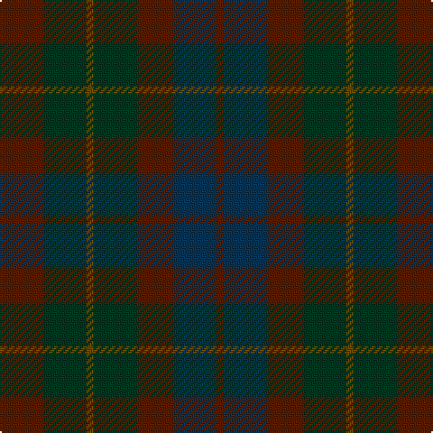

In pattern [GBGGGGG](/stripes/gbggggg/).

This was sourced from tartans-authority.  It is a [7 stripe tartan](/stripes/stripes7/).

Original link http://www.tartansauthority.com/tartan-ferret/display/2107/

## Thread count
T/24 DG24 Ta4 DG24 T20 DB24 T/4

## Palette
Each colour and the base-6 reference it is a variant of.

| Colour | Shade | Base |
|---|---|---|
| DB | <code style="background-color:#083454;">#083454</code> `oklch(31.5% 0.073 245.8)` <small>#083454</small> | B <code style="background-color:#2A418A;">#2A418A</code> |
| DG | <code style="background-color:#003820;">#003820</code> `oklch(30.0% 0.070 158.3)` <small>#003820</small> | G <code style="background-color:#006100;">#006100</code> |
| T | <code style="background-color:#581C00;">#581C00</code> `oklch(31.7% 0.096 41.9)` <small>#581C00</small> | G <code style="background-color:#006100;">#006100</code> |
| Ta | <code style="background-color:#684800;">#684800</code> `oklch(42.6% 0.088 79.5)` <small>#684800</small> | G <code style="background-color:#006100;">#006100</code> |

# Sample pattern

## Nearest tartans

The nearest existing variants by ΔTartan distance.

1. [Brown Watch (single) (Fashion)](/setts/s6/do7k2do12k10dg12k3~x2/) — ΔT 1.14
1. [Chindecella Ruadh (Kemete Heil)](/setts/s8/dr9do4dr4do4dr24dy19do19dy4~x2/) — ΔT 1.62
1. [Brown Heather (Fashion)](/setts/s6/do1dy6do6dy1n6dy1~x8/) — ΔT 1.63
1. [Inneryne (Personal)](/setts/s7/db4k4db16k14dg14m3dg3~x2/) — ΔT 1.65
1. [Calais (Fashion)](/setts/s7/dg11n4dg6dy11n1k1dy4~x4/) — ΔT 2.05
1. [MacArthur of Milton Hunting](/setts/s6/dg7db1dg1k4dp4k1~x4/) — ΔT 2.05
1. [St. Mirren (Corporate)](/setts/s12/do10k4do16k4do10k16do8k24do28r3do4r3/) — ΔT 2.06
1. [Callum (Buchan)](/setts/s5/n7o1n6o8o1~x8/) — ΔT 2.14
1. [Laois, County](/setts/s9/do15dy2do5dy5k18db5do5db2do15~x2/) — ΔT 2.19
1. [Amazing Union (Personal)](/setts/s9/r2do15dg12do2dt12do2dg12do15o2~x4/) — ΔT 2.22

## Neighbour map

Every grey dot is one of 14299 variants placed by the first two principal components of the ΔTartan feature space (44% of its variance). Red is this tartan; blue dots are its nearest — click one to open its page.

<svg viewBox="0 0 640 380" role="img" style="max-width:100%;height:auto;border:1px solid #e0e0e0;border-radius:4px;display:block" xmlns="http://www.w3.org/2000/svg"><image href="/nn/cloud.v1.png" width="640" height="380"/><a href="/setts/s6/do7k2do12k10dg12k3~x2/"><circle cx="377.1" cy="366.0" r="4" fill="#3465a4"><title>Brown Watch (single) (Fashion)</title></circle></a><a href="/setts/s8/dr9do4dr4do4dr24dy19do19dy4~x2/"><circle cx="388.6" cy="334.7" r="4" fill="#3465a4"><title>Chindecella Ruadh (Kemete Heil)</title></circle></a><a href="/setts/s6/do1dy6do6dy1n6dy1~x8/"><circle cx="365.3" cy="340.5" r="4" fill="#3465a4"><title>Brown Heather (Fashion)</title></circle></a><a href="/setts/s7/db4k4db16k14dg14m3dg3~x2/"><circle cx="292.3" cy="331.0" r="4" fill="#3465a4"><title>Inneryne (Personal)</title></circle></a><a href="/setts/s7/dg11n4dg6dy11n1k1dy4~x4/"><circle cx="369.6" cy="292.4" r="4" fill="#3465a4"><title>Calais (Fashion)</title></circle></a><a href="/setts/s6/dg7db1dg1k4dp4k1~x4/"><circle cx="345.2" cy="314.0" r="4" fill="#3465a4"><title>MacArthur of Milton Hunting</title></circle></a><a href="/setts/s12/do10k4do16k4do10k16do8k24do28r3do4r3/"><circle cx="390.2" cy="284.0" r="4" fill="#3465a4"><title>St. Mirren (Corporate)</title></circle></a><a href="/setts/s5/n7o1n6o8o1~x8/"><circle cx="375.2" cy="338.0" r="4" fill="#3465a4"><title>Callum (Buchan)</title></circle></a><a href="/setts/s9/do15dy2do5dy5k18db5do5db2do15~x2/"><circle cx="431.6" cy="298.3" r="4" fill="#3465a4"><title>Laois, County</title></circle></a><a href="/setts/s9/r2do15dg12do2dt12do2dg12do15o2~x4/"><circle cx="321.7" cy="276.7" r="4" fill="#3465a4"><title>Amazing Union (Personal)</title></circle></a><circle cx="329.1" cy="355.3" r="5" fill="#c00000"/></svg>

ID: /setts/s7/dy6dg6y1dg6dy5dt6dy1~x4/
