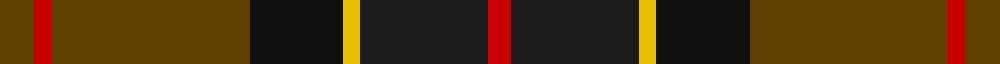
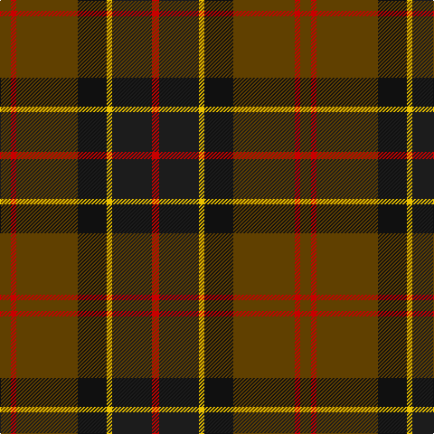

This page is one **sett** — a single exact thread-count. It belongs to the [tartan](/tartans/dy6r3dy34k16ly3dt22r4/)
(the same proportion at any scale), whose colour order is pattern [GRGKYBR](/stripes/grgkybr/).

Sourced from register-of-tartans.  It is a [7 stripe tartan](/stripes/stripes7/).

Original link https://www.tartanregister.gov.uk/tartanDetails.aspx?ref=178

2 attestations — the source records this cloth was collapsed from (oldest owns this page)

<ul>
<li>01/01/2002 — Ballantrae (Macnaughtons) (register-of-tartans, <a href="https://www.tartanregister.gov.uk/tartanDetails.aspx?ref=178">record</a>)</li>
<li>pre 2002 — Ballantrae - H of E (Fashion) (tartans-authority, <a href="http://www.tartansauthority.com/tartan-ferret/display/5852/">record</a>)</li>
</ul>

## Register references

External register numbers recorded for this tartan.

- Scottish Register of Tartans: [178](https://www.tartanregister.gov.uk/tartanDetails.aspx?ref=178)
- Scottish Tartans Authority (ITI): 5852

## Thread count
T/12 R6 T68 Ka32 Y6 K44 R/8

## Palette

Palette: <strong>Tartan Register</strong> <small style="color:#888">(6 of 7 colours)</small>
<table><thead><tr><th>Colour</th><th>Threads</th><th>Shade</th><th>Base</th><th>OKLCh</th></tr></thead><tbody><tr><td>T/</td><td style="text-align:right;font-variant-numeric:tabular-nums">12</td><td><code style="background-color:#604000;">#604000</code> <small style="color:#888">#604000</small></td><td>G <code style="background-color:#006100;">#006100</code></td><td><small style="color:#888">oklch(39.8% 0.083 76.8)</small></td></tr><tr><td>R</td><td style="text-align:right;font-variant-numeric:tabular-nums">6</td><td><code style="background-color:#C80000;">#C80000</code> <small style="color:#888">#C80000</small></td><td>R <code style="background-color:#CC0000;">#CC0000</code></td><td><small style="color:#888">oklch(52.3% 0.215 29.2)</small></td></tr><tr><td>T</td><td style="text-align:right;font-variant-numeric:tabular-nums">68</td><td><code style="background-color:#604000;">#604000</code> <small style="color:#888">#604000</small></td><td>G <code style="background-color:#006100;">#006100</code></td><td><small style="color:#888">oklch(39.8% 0.083 76.8)</small></td></tr><tr><td>Ka</td><td style="text-align:right;font-variant-numeric:tabular-nums">32</td><td><code style="background-color:#101010;">#101010</code> <small style="color:#888">#101010</small></td><td>K <code style="background-color:#000000;">#000000</code></td><td><small style="color:#888">oklch(17.3% 0.000 89.9)</small></td></tr><tr><td>Y</td><td style="text-align:right;font-variant-numeric:tabular-nums">6</td><td><code style="background-color:#E8C000;">#E8C000</code> <small style="color:#888">#E8C000</small></td><td>Y <code style="background-color:#F2BF00;">#F2BF00</code></td><td><small style="color:#888">oklch(81.9% 0.168 93.7)</small></td></tr><tr><td>K</td><td style="text-align:right;font-variant-numeric:tabular-nums">44</td><td><code style="background-color:#1C1C1C;">#1C1C1C</code> <small style="color:#888">#1C1C1C</small></td><td>B <code style="background-color:#2A418A;">#2A418A</code></td><td><small style="color:#888">oklch(22.6% 0.000 89.9)</small></td></tr><tr><td>R/</td><td style="text-align:right;font-variant-numeric:tabular-nums">8</td><td><code style="background-color:#C80000;">#C80000</code> <small style="color:#888">#C80000</small></td><td>R <code style="background-color:#CC0000;">#CC0000</code></td><td><small style="color:#888">oklch(52.3% 0.215 29.2)</small></td></tr></tbody></table>

# Sample pattern

## Nearest tartans

The nearest existing variants by ΔTartan distance, with this tartan at the top so the swatches line up against it.

ΔTartan

Tartan

Sett

—

<a href="/ttd/edit/#slug=dy6r3dy34k16ly3dt22r4~x2">Ballantrae (Macnaughtons)</a> <a class="nn-out" href="/setts/s7/dy6r3dy34k16ly3dt22r4~x2/" title="open its dictionary page">↗</a>

0.94

<a href="/ttd/edit/#slug=ly1dy10k8r8dy1lyi1~x4">Unidentified #66</a> <a class="nn-out" href="/setts/s6/ly1dy10k8r8dy1lyi1~x4/" title="open its dictionary page">↗</a>

0.98

<a href="/ttd/edit/#slug=r1n12k6ly1do10r1~x4">Andover (Fashion)</a> <a class="nn-out" href="/setts/s6/r1n12k6ly1do10r1~x4/" title="open its dictionary page">↗</a>

1.07

<a href="/setts/s8/db6w1y6dy12r2~x4/">Vass (Personal)</a>

1.07

<a href="/ttd/edit/#slug=g3dy32g4lb3g18dp18lo3~x2">Wcwm 9275-1410</a> <a class="nn-out" href="/setts/s7/g3dy32g4lb3g18dp18lo3~x2/" title="open its dictionary page">↗</a>

1.10

<a href="/setts/s5/db6w1dyi6dy12r2~x4/">Vass (Personal)</a>

1.11

<a href="/setts/s6/r1n12ki6k1do10r1~x4/">Andover</a>

1.11

<a href="/ttd/edit/#slug=db8lo1g12r10y2r6y2r4~x4">Indiana &quot;Cardinal&quot; (District)</a> <a class="nn-out" href="/setts/s8/db8lo1g12r10y2r6y2r4~x4/" title="open its dictionary page">↗</a>

1.12

<a href="/ttd/edit/#slug=lo4k28r2do22t8do3~x2">Loch Long One Design</a> <a class="nn-out" href="/setts/s6/lo4k28r2do22t8do3~x2/" title="open its dictionary page">↗</a>

1.12

<a href="/ttd/edit/#slug=dy6o2dy12k4dt14k1dy3ly2~x2">Mica, Green (Fashion)</a> <a class="nn-out" href="/setts/s8/dy6o2dy12k4dt14k1dy3ly2~x2/" title="open its dictionary page">↗</a>

1.15

<a href="/ttd/edit/#slug=r2do22g22do3db12y2~x2">Lisbon</a> <a class="nn-out" href="/setts/s6/r2do22g22do3db12y2~x2/" title="open its dictionary page">↗</a>

## Neighbour map

Every grey dot is one of 14359 variants placed by the first two principal components of the ΔTartan feature space (44% of its variance). Red is this tartan; blue dots are its nearest — click one to open its page.

<svg viewBox="0 0 640 380" role="img" style="max-width:100%;height:auto;border:1px solid #e0e0e0;border-radius:4px;display:block" xmlns="http://www.w3.org/2000/svg"><image href="/nn/cloud.v1.png" width="640" height="380"/><a href="/setts/s6/ly1dy10k8r8dy1lyi1~x4/"><circle cx="219.4" cy="215.4" r="4" fill="#3465a4"><title>Unidentified #66</title></circle></a><a href="/setts/s6/r1n12k6ly1do10r1~x4/"><circle cx="241.5" cy="208.7" r="4" fill="#3465a4"><title>Andover (Fashion)</title></circle></a><a href="/setts/s8/db6w1y6dy12r2~x4/"><circle cx="292.8" cy="212.1" r="4" fill="#3465a4"><title>Vass (Personal)</title></circle></a><a href="/setts/s7/g3dy32g4lb3g18dp18lo3~x2/"><circle cx="235.4" cy="200.0" r="4" fill="#3465a4"><title>Wcwm 9275-1410</title></circle></a><a href="/setts/s5/db6w1dyi6dy12r2~x4/"><circle cx="252.8" cy="235.5" r="4" fill="#3465a4"><title>Vass (Personal)</title></circle></a><a href="/setts/s6/r1n12ki6k1do10r1~x4/"><circle cx="255.4" cy="217.4" r="4" fill="#3465a4"><title>Andover</title></circle></a><a href="/setts/s8/db8lo1g12r10y2r6y2r4~x4/"><circle cx="236.4" cy="206.2" r="4" fill="#3465a4"><title>Indiana &quot;Cardinal&quot; (District)</title></circle></a><a href="/setts/s6/lo4k28r2do22t8do3~x2/"><circle cx="265.3" cy="202.3" r="4" fill="#3465a4"><title>Loch Long One Design</title></circle></a><a href="/setts/s8/dy6o2dy12k4dt14k1dy3ly2~x2/"><circle cx="274.4" cy="195.5" r="4" fill="#3465a4"><title>Mica, Green (Fashion)</title></circle></a><a href="/setts/s6/r2do22g22do3db12y2~x2/"><circle cx="240.9" cy="218.7" r="4" fill="#3465a4"><title>Lisbon</title></circle></a><circle cx="264.2" cy="205.1" r="5" fill="#c00000"/></svg>

ID: /setts/s7/dy6r3dy34k16ly3dt22r4~x2/
