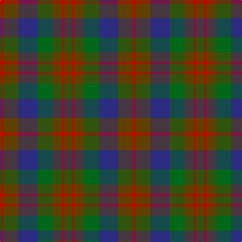

In pattern [GRGGBGR](/stripes/grggbgr/).

This was sourced from register-of-tartans.  It is a [7 stripe tartan](/stripes/stripes7/).

Original link https://www.tartanregister.gov.uk/tartanDetails.aspx?ref=955

## Attestations

This cloth appears in 2 source records; the oldest owns this page.

- 01/01/1930 — Dorward/Dogwood (register-of-tartans, [record](https://www.tartanregister.gov.uk/tartanDetails.aspx?ref=955))
- pre 2002 — Dorward/Dogwood (Name) (tartans-authority, [record](http://www.tartansauthority.com/tartan-ferret/display/2533/))

## Register references

External register numbers recorded for this tartan.

- Scottish Register of Tartans: [955](https://www.tartanregister.gov.uk/tartanDetails.aspx?ref=955)
- Scottish Tartans Authority (ITI): 2533
- Scottish Tartans World Register: 2533

## Thread count
T/14 R6 T18 G30 DB38 T28 R/8

## Palette
Each colour and the base-6 reference it is a variant of.

| Colour | Shade | Base |
|---|---|---|
| DB | <code style="background-color:#2C2C80;">#2C2C80</code> `oklch(35.0% 0.138 276.6)` <small>#2C2C80</small> | B <code style="background-color:#2A418A;">#2A418A</code> |
| G | <code style="background-color:#006818;">#006818</code> `oklch(45.0% 0.142 145.0)` <small>#006818</small> | G <code style="background-color:#006100;">#006100</code> |
| R | <code style="background-color:#C80000;">#C80000</code> `oklch(52.3% 0.215 29.2)` <small>#C80000</small> | R <code style="background-color:#CC0000;">#CC0000</code> |
| T | <code style="background-color:#604000;">#604000</code> `oklch(39.8% 0.083 76.8)` <small>#604000</small> | G <code style="background-color:#006100;">#006100</code> |

# Sample pattern

## Nearest tartans

The nearest existing variants by ΔTartan distance.

1. [Dorward](/setts/s7/o7r3o9g15db19o14r4~x2/) — ΔT 0.68
1. [Gleneagles Group Corporate Tartan Tartan Number: 2107. Earliest known date: 1989 Designed for a range of tartan goods called the Gleneagles Collection. See products available Copyright © Blair Urquhart, Comrie, 2015](/setts/s7/dr5g6dy1g6dr5db6dr1~x2/) — ΔT 0.79
1. [Tennant (Yules)](/setts/s7/r1dy7g7db7g7db7r1~x8/) — ΔT 1.04
1. [Fraser Hunting](/setts/s6/r1o4g3o1db3o1~x2/) — ΔT 1.15
1. [Scottish Airports (Corporate)](/setts/s6/dp4n18k17n3g18n4~x2/) — ΔT 1.18
1. [Tennant Family Tartan Tartan Number: 1653. Earliest known date: 1930 MacGregor-Hastie made few notes about his sample collection. In December 1967, Captain Tennant wrote to the Scottish Tartans Society, saying, ".. and I have no objection to other Tennants wearing it (Tennant tartan) but their problem will be to get hold of it ... I don't know of any other Tennant tartan and that is why I think my father designed this one." The head of the Tennant family is Lord Glenconner, descended from John Tennant of Blairston, Ayr. (1635). See products available Copyright © Blair Urquhart, Comrie, 2015](/setts/s7/r1dy7db7k7g7dy7r1~x4/) — ΔT 1.21
1. [MacDuff Hunting Clan Tartan Tartan Number: 1654. Earliest known date: 1906 STS records (sic) 'Sett may be quite wrong. (S.S. May 86)' See products available Copyright © Blair Urquhart, Comrie, 2015](/setts/s8/dy8r1dy8g8k8db8dy8r2~x2/) — ΔT 1.23
1. [Styrian](/setts/s8/o16dg29n19g8n19dg29o16r4~x2/) — ΔT 1.29
1. [Unidentified Pinafore](/setts/s7/dg24k4dg24k24t7r24t7~x2/) — ΔT 1.31
1. [Chindecella Gorse (Kemete Heil)](/setts/s8/o9do4o4do4o24dy19do19dy4~x2/) — ΔT 1.33

## Neighbour map

Every grey dot is one of 14299 variants placed by the first two principal components of the ΔTartan feature space (44% of its variance). Red is this tartan; blue dots are its nearest — click one to open its page.

<svg viewBox="0 0 640 380" role="img" style="max-width:100%;height:auto;border:1px solid #e0e0e0;border-radius:4px;display:block" xmlns="http://www.w3.org/2000/svg"><image href="/nn/cloud.v1.png" width="640" height="380"/><a href="/setts/s7/o7r3o9g15db19o14r4~x2/"><circle cx="230.3" cy="278.2" r="4" fill="#3465a4"><title>Dorward</title></circle></a><a href="/setts/s7/dr5g6dy1g6dr5db6dr1~x2/"><circle cx="212.9" cy="283.4" r="4" fill="#3465a4"><title>Gleneagles Group Corporate Tartan Tartan Number: 2107. Earliest known date: 1989 Designed for a range of tartan goods called the Gleneagles Collection. See products available Copyright © Blair Urquhart, Comrie, 2015</title></circle></a><a href="/setts/s7/r1dy7g7db7g7db7r1~x8/"><circle cx="208.3" cy="280.5" r="4" fill="#3465a4"><title>Tennant (Yules)</title></circle></a><a href="/setts/s6/r1o4g3o1db3o1~x2/"><circle cx="242.6" cy="302.9" r="4" fill="#3465a4"><title>Fraser Hunting</title></circle></a><a href="/setts/s6/dp4n18k17n3g18n4~x2/"><circle cx="222.8" cy="280.7" r="4" fill="#3465a4"><title>Scottish Airports (Corporate)</title></circle></a><a href="/setts/s7/r1dy7db7k7g7dy7r1~x4/"><circle cx="167.6" cy="261.1" r="4" fill="#3465a4"><title>Tennant Family Tartan Tartan Number: 1653. Earliest known date: 1930 MacGregor-Hastie made few notes about his sample collection. In December 1967, Captain Tennant wrote to the Scottish Tartans Society, saying, &quot;.. and I have no objection to other Tennants wearing it (Tennant tartan) but their problem will be to get hold of it ... I don't know of any other Tennant tartan and that is why I think my father designed this one.&quot; The head of the Tennant family is Lord Glenconner, descended from John Tennant of Blairston, Ayr. (1635). See products available Copyright © Blair Urquhart, Comrie, 2015</title></circle></a><a href="/setts/s8/dy8r1dy8g8k8db8dy8r2~x2/"><circle cx="215.8" cy="263.8" r="4" fill="#3465a4"><title>MacDuff Hunting Clan Tartan Tartan Number: 1654. Earliest known date: 1906 STS records (sic) 'Sett may be quite wrong. (S.S. May 86)' See products available Copyright © Blair Urquhart, Comrie, 2015</title></circle></a><a href="/setts/s8/o16dg29n19g8n19dg29o16r4~x2/"><circle cx="195.1" cy="266.6" r="4" fill="#3465a4"><title>Styrian</title></circle></a><a href="/setts/s7/dg24k4dg24k24t7r24t7~x2/"><circle cx="192.5" cy="268.7" r="4" fill="#3465a4"><title>Unidentified Pinafore</title></circle></a><a href="/setts/s8/o9do4o4do4o24dy19do19dy4~x2/"><circle cx="281.3" cy="273.8" r="4" fill="#3465a4"><title>Chindecella Gorse (Kemete Heil)</title></circle></a><circle cx="229.6" cy="279.8" r="5" fill="#c00000"/></svg>

ID: /setts/s7/dy7r3dy9g15db19dy14r4~x2/
