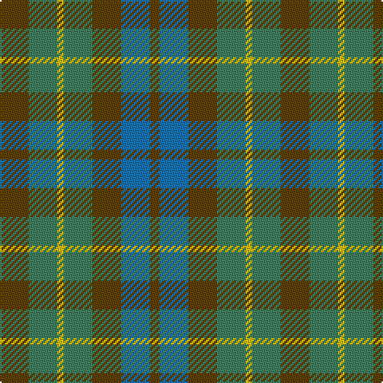

In pattern [GBGGYGG](/stripes/gbggygg/).

This was sourced from tartans-authority.  It is a [7 stripe tartan](/stripes/stripes7/).

Original link http://www.tartansauthority.com/tartan-ferret/display/1047/

## Thread count
T/18 G18 Y4 G18 T18 B18 T/6

## Palette
Each colour and the base-6 reference it is a variant of.

| Colour | Shade | Base |
|---|---|---|
| B | <code style="background-color:#1474B4;">#1474B4</code> `oklch(54.0% 0.129 245.1)` <small>#1474B4</small> | B <code style="background-color:#2A418A;">#2A418A</code> |
| G | <code style="background-color:#408060;">#408060</code> `oklch(54.8% 0.084 160.1)` <small>#408060</small> | G <code style="background-color:#006100;">#006100</code> |
| T | <code style="background-color:#604000;">#604000</code> `oklch(39.8% 0.083 76.8)` <small>#604000</small> | G <code style="background-color:#006100;">#006100</code> |
| Y | <code style="background-color:#E8C000;">#E8C000</code> `oklch(81.9% 0.168 93.7)` <small>#E8C000</small> | Y <code style="background-color:#F2BF00;">#F2BF00</code> |

# Sample pattern

## Nearest tartans

The nearest existing variants by ΔTartan distance.

1. [Fraser Hunting](/setts/s6/r1o4g3o1db3o1~x2/) — ΔT 1.10
1. [Dorward](/setts/s7/o7r3o9g15db19o14r4~x2/) — ΔT 1.20
1. [Styrian](/setts/s8/o16dg29n19g8n19dg29o16r4~x2/) — ΔT 1.39
1. [Dorward/Dogwood](/setts/s7/dy7r3dy9g15db19dy14r4~x2/) — ΔT 1.45
1. [Tennant (Yules)](/setts/s7/r1dy7g7db7g7db7r1~x8/) — ΔT 1.50
1. [Gleneagles Group Corporate Tartan Tartan Number: 2107. Earliest known date: 1989 Designed for a range of tartan goods called the Gleneagles Collection. See products available Copyright © Blair Urquhart, Comrie, 2015](/setts/s7/dr5g6dy1g6dr5db6dr1~x2/) — ΔT 1.63
1. [Ralston (USA)](/setts/s11/g7o3o3t3o3o3g12y4g4y4t3~x2/) — ΔT 1.76
1. [Fraser Hunting #2](/setts/s6/dy1db3dy1dg3dy4r1~x2/) — ΔT 1.81
1. [Buchanan, hunting](/setts/s11/db3o14g14o2db14o2db14o2g14o14r3~x2/) — ΔT 1.81
1. [Styrian (Fashion)](/setts/s5/g8n19dg29o16r4~x2/) — ΔT 1.82

## Neighbour map

Every grey dot is one of 14299 variants placed by the first two principal components of the ΔTartan feature space (44% of its variance). Red is this tartan; blue dots are its nearest — click one to open its page.

<svg viewBox="0 0 640 380" role="img" style="max-width:100%;height:auto;border:1px solid #e0e0e0;border-radius:4px;display:block" xmlns="http://www.w3.org/2000/svg"><image href="/nn/cloud.v1.png" width="640" height="380"/><a href="/setts/s6/r1o4g3o1db3o1~x2/"><circle cx="242.6" cy="302.9" r="4" fill="#3465a4"><title>Fraser Hunting</title></circle></a><a href="/setts/s7/o7r3o9g15db19o14r4~x2/"><circle cx="230.3" cy="278.2" r="4" fill="#3465a4"><title>Dorward</title></circle></a><a href="/setts/s8/o16dg29n19g8n19dg29o16r4~x2/"><circle cx="195.1" cy="266.6" r="4" fill="#3465a4"><title>Styrian</title></circle></a><a href="/setts/s7/dy7r3dy9g15db19dy14r4~x2/"><circle cx="229.6" cy="279.8" r="4" fill="#3465a4"><title>Dorward/Dogwood</title></circle></a><a href="/setts/s7/r1dy7g7db7g7db7r1~x8/"><circle cx="208.3" cy="280.5" r="4" fill="#3465a4"><title>Tennant (Yules)</title></circle></a><a href="/setts/s7/dr5g6dy1g6dr5db6dr1~x2/"><circle cx="212.9" cy="283.4" r="4" fill="#3465a4"><title>Gleneagles Group Corporate Tartan Tartan Number: 2107. Earliest known date: 1989 Designed for a range of tartan goods called the Gleneagles Collection. See products available Copyright © Blair Urquhart, Comrie, 2015</title></circle></a><a href="/setts/s11/g7o3o3t3o3o3g12y4g4y4t3~x2/"><circle cx="195.8" cy="259.3" r="4" fill="#3465a4"><title>Ralston (USA)</title></circle></a><a href="/setts/s6/dy1db3dy1dg3dy4r1~x2/"><circle cx="270.9" cy="323.6" r="4" fill="#3465a4"><title>Fraser Hunting #2</title></circle></a><a href="/setts/s11/db3o14g14o2db14o2db14o2g14o14r3~x2/"><circle cx="214.7" cy="246.7" r="4" fill="#3465a4"><title>Buchanan, hunting</title></circle></a><a href="/setts/s5/g8n19dg29o16r4~x2/"><circle cx="194.8" cy="273.2" r="4" fill="#3465a4"><title>Styrian (Fashion)</title></circle></a><circle cx="211.1" cy="313.2" r="5" fill="#c00000"/></svg>

ID: /setts/s7/dy9g9ly2g9dy9b9dy3~x2/
