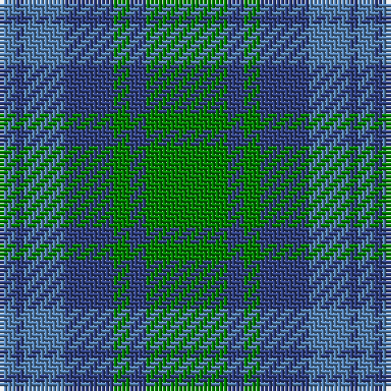

In pattern [BBBBGBG](/patterns/bbbbgbg/).

This was sourced from weddslist.  It is a [7 stripes tartan](/stripes/stripes7/).

Original link http://www.weddslist.com/cgi-bin/tartans/pg.pl?source=sts

## Thread count
Ba/4 B2 Ba10 B12 G4 B4 G/20

## Palette
Each colour and its ΔE from the base-6 reference it is a variant of.

| Colour | Shade | Base | ΔE (OKLab) |
|---|---|---|---|
| B | <code style="background-color:#304080;">#304080</code> `#304080` | B <code style="background-color:#2A418A;">#2A418A</code> | 0.02 |
| Ba | <code style="background-color:#5480B0;">#5480B0</code> `#5480B0` | B <code style="background-color:#2A418A;">#2A418A</code> | 0.19 |
| G | <code style="background-color:#008000;">#008000</code> `#008000` | G <code style="background-color:#006100;">#006100</code> | 0.10 |

# Sample pattern

## Nearest tartans

The nearest existing variants by ΔTartan distance.

1. [Falconer of Labhdal (Personal)](/setts/s6/b7k7b7g20b2g2x4~b5c8ca8-g009468-k101010/) — ΔT 1.08
1. [Universal Ancient](/setts/s8/b12g2b2g2b2ga8gb8ga1x2~b3c82af-g005020-ga503c14-gb309c18/) — ΔT 1.16
1. [Manx Centenary](/setts/s9/b22g3b3g3b3g9ga28g3ga6x2~b304080-g008000-ga808080/) — ΔT 1.31
1. [Strange Of Balcaskie](/setts/s7/g32r7g7r16b32y3r8x2~b304080-g008000-r806050-yf0c000/) — ΔT 1.32
1. [Unidentified No 17](/setts/s7/g10b2g2b6ba5b1ba2x2~b2c4084-ba3c82af-g005020/) — ΔT 1.35
1. [Bethlehem, City of (District)](/setts/s5/b3r10g9ra1g3x4~b1c0070-g006c3c-r888888-ra880000/) — ΔT 1.36
1. [Black Watch (Aljean)](/setts/s6/b1ba1b10ba9g10ba1x4~b1474b4-ba202060-g006818/) — ΔT 1.39
1. [Wallace, Blue Wallace](/setts/s5/b2ba29b12g29w2x2~b5480b0-ba304080-g008000-we0e0e0/) — ΔT 1.41
1. [Glasgow, Rock and Wheel](/setts/s7/g25r4b24r21g25r4b2x2~b304080-g008000-r802040/) — ΔT 1.41
1. [Valley of the Green (The ) Canadian Tartan Tartan Number: 148. Earliest known date: 1968 Specimen from Miss K Sinclair 1968 See products available Copyright © Blair Urquhart, Comrie, 2015](/setts/s7/b4g26ga8b8ga8gb3b2x2~b5c8ca8-g003820-ga006818-gb289c18/) — ΔT 1.46

## Neighbour map

Every grey dot is one of 15726 variants placed by the first two principal components of the ΔTartan feature space (44% of its variance). Red is this tartan; blue dots are its nearest — click one to open its page.

<svg viewBox="0 0 640 380" role="img" style="max-width:100%;height:auto;border:1px solid #e0e0e0;border-radius:4px;display:block" xmlns="http://www.w3.org/2000/svg"><image href="/nn/cloud.v1.png" width="640" height="380"/><a href="/setts/s6/b7k7b7g20b2g2x4~b5c8ca8-g009468-k101010/"><circle cx="293.7" cy="245.3" r="4" fill="#3465a4"><title>Falconer of Labhdal (Personal)</title></circle></a><a href="/setts/s8/b12g2b2g2b2ga8gb8ga1x2~b3c82af-g005020-ga503c14-gb309c18/"><circle cx="252.0" cy="211.3" r="4" fill="#3465a4"><title>Universal Ancient</title></circle></a><a href="/setts/s9/b22g3b3g3b3g9ga28g3ga6x2~b304080-g008000-ga808080/"><circle cx="301.4" cy="221.8" r="4" fill="#3465a4"><title>Manx Centenary</title></circle></a><a href="/setts/s7/g32r7g7r16b32y3r8x2~b304080-g008000-r806050-yf0c000/"><circle cx="235.6" cy="228.0" r="4" fill="#3465a4"><title>Strange Of Balcaskie</title></circle></a><a href="/setts/s7/g10b2g2b6ba5b1ba2x2~b2c4084-ba3c82af-g005020/"><circle cx="306.6" cy="266.6" r="4" fill="#3465a4"><title>Unidentified No 17</title></circle></a><a href="/setts/s5/b3r10g9ra1g3x4~b1c0070-g006c3c-r888888-ra880000/"><circle cx="277.4" cy="250.3" r="4" fill="#3465a4"><title>Bethlehem, City of (District)</title></circle></a><a href="/setts/s6/b1ba1b10ba9g10ba1x4~b1474b4-ba202060-g006818/"><circle cx="247.3" cy="251.4" r="4" fill="#3465a4"><title>Black Watch (Aljean)</title></circle></a><a href="/setts/s5/b2ba29b12g29w2x2~b5480b0-ba304080-g008000-we0e0e0/"><circle cx="255.2" cy="222.9" r="4" fill="#3465a4"><title>Wallace, Blue Wallace</title></circle></a><a href="/setts/s7/g25r4b24r21g25r4b2x2~b304080-g008000-r802040/"><circle cx="289.4" cy="241.6" r="4" fill="#3465a4"><title>Glasgow, Rock and Wheel</title></circle></a><a href="/setts/s7/b4g26ga8b8ga8gb3b2x2~b5c8ca8-g003820-ga006818-gb289c18/"><circle cx="275.9" cy="216.2" r="4" fill="#3465a4"><title>Valley of the Green (The ) Canadian Tartan Tartan Number: 148. Earliest known date: 1968 Specimen from Miss K Sinclair 1968 See products available Copyright © Blair Urquhart, Comrie, 2015</title></circle></a><circle cx="273.7" cy="251.3" r="5" fill="#c00000"/></svg>

ID: /setts/s7/g10b2g2b6ba5b1ba2x2~b304080-ba5480b0-g008000/
