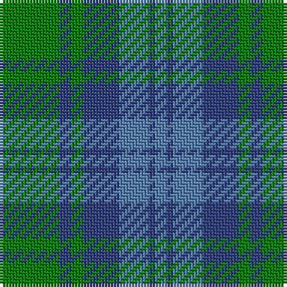

This page is one **sett** — a single exact thread-count. It belongs to the [tartan](/tartans/g10db2g2db6t5db1t2/)
(the same proportion at any scale), whose colour order is pattern [BBBBGBG](/stripes/bbbbgbg/).

Sourced from weddslist.  It is a [7 stripe tartan](/stripes/stripes7/).

Original link http://www.weddslist.com/cgi-bin/tartans/pg.pl?source=sts

## Thread count
G/20 B4 G4 B12 Ba10 B2 Ba/4

## Palette

Palette: <strong>custom</strong>
<table><thead><tr><th>Colour</th><th>Threads</th><th>Shade</th><th>Base</th><th>OKLCh</th></tr></thead><tbody><tr><td>G/</td><td style="text-align:right;font-variant-numeric:tabular-nums">20</td><td><code style="background-color:#008000;">#008000</code> <small style="color:#888">#008000</small></td><td>G <code style="background-color:#006100;">#006100</code></td><td><small style="color:#888">oklch(52.0% 0.177 142.5)</small></td></tr><tr><td>B</td><td style="text-align:right;font-variant-numeric:tabular-nums">4</td><td><code style="background-color:#304080;">#304080</code> <small style="color:#888">#304080</small></td><td>B <code style="background-color:#2A418A;">#2A418A</code></td><td><small style="color:#888">oklch(39.4% 0.109 270.2)</small></td></tr><tr><td>G</td><td style="text-align:right;font-variant-numeric:tabular-nums">4</td><td><code style="background-color:#008000;">#008000</code> <small style="color:#888">#008000</small></td><td>G <code style="background-color:#006100;">#006100</code></td><td><small style="color:#888">oklch(52.0% 0.177 142.5)</small></td></tr><tr><td>B</td><td style="text-align:right;font-variant-numeric:tabular-nums">12</td><td><code style="background-color:#304080;">#304080</code> <small style="color:#888">#304080</small></td><td>B <code style="background-color:#2A418A;">#2A418A</code></td><td><small style="color:#888">oklch(39.4% 0.109 270.2)</small></td></tr><tr><td>Ba</td><td style="text-align:right;font-variant-numeric:tabular-nums">10</td><td><code style="background-color:#5480B0;">#5480B0</code> <small style="color:#888">#5480B0</small></td><td>B <code style="background-color:#2A418A;">#2A418A</code></td><td><small style="color:#888">oklch(58.8% 0.089 251.5)</small></td></tr><tr><td>B</td><td style="text-align:right;font-variant-numeric:tabular-nums">2</td><td><code style="background-color:#304080;">#304080</code> <small style="color:#888">#304080</small></td><td>B <code style="background-color:#2A418A;">#2A418A</code></td><td><small style="color:#888">oklch(39.4% 0.109 270.2)</small></td></tr><tr><td>Ba/</td><td style="text-align:right;font-variant-numeric:tabular-nums">4</td><td><code style="background-color:#5480B0;">#5480B0</code> <small style="color:#888">#5480B0</small></td><td>B <code style="background-color:#2A418A;">#2A418A</code></td><td><small style="color:#888">oklch(58.8% 0.089 251.5)</small></td></tr></tbody></table>

# Sample pattern

## Nearest tartans

The nearest existing variants by ΔTartan distance, with this tartan at the top so the swatches line up against it.

ΔTartan

Tartan

Sett

—

<a href="/ttd/edit/#slug=g10db2g2db6t5db1t2~x2">Unnamed, No 17</a> <a class="nn-out" href="/setts/s7/g10db2g2db6t5db1t2~x2/" title="open its dictionary page">↗</a>

1.08

<a href="/ttd/edit/#slug=t7k7t7g20t2g2~x4">Falconer of Labhdal (Personal)</a> <a class="nn-out" href="/setts/s6/t7k7t7g20t2g2~x4/" title="open its dictionary page">↗</a>

1.16

<a href="/ttd/edit/#slug=t12dg2t2dg2t2dy8g8dy1~x2">Universal Ancient</a> <a class="nn-out" href="/setts/s8/t12dg2t2dg2t2dy8g8dy1~x2/" title="open its dictionary page">↗</a>

1.32

<a href="/ttd/edit/#slug=db22g3db3g3db3g9y28g3y6~x2">Manx Centenary</a> <a class="nn-out" href="/setts/s9/db22g3db3g3db3g9y28g3y6~x2/" title="open its dictionary page">↗</a>

1.33

<a href="/ttd/edit/#slug=g32o7g7o16db32ly3o8~x2">Strange Of Balcaskie</a> <a class="nn-out" href="/setts/s7/g32o7g7o16db32ly3o8~x2/" title="open its dictionary page">↗</a>

1.35

<a href="/ttd/edit/#slug=dg10db2dg2db6t5db1t2~x2">Unidentified No 17</a> <a class="nn-out" href="/setts/s7/dg10db2dg2db6t5db1t2~x2/" title="open its dictionary page">↗</a>

1.36

<a href="/ttd/edit/#slug=db3o10g9r1g3~x4">Bethlehem, City of (District)</a> <a class="nn-out" href="/setts/s5/db3o10g9r1g3~x4/" title="open its dictionary page">↗</a>

1.39

<a href="/ttd/edit/#slug=db1g10db9b10db1b1~x4">Black Watch (Aljean)</a> <a class="nn-out" href="/setts/s6/db1g10db9b10db1b1~x4/" title="open its dictionary page">↗</a>

1.42

<a href="/ttd/edit/#slug=g25m4db24m21g25m4db2~x2">Glasgow, Rock and Wheel</a> <a class="nn-out" href="/setts/s7/g25m4db24m21g25m4db2~x2/" title="open its dictionary page">↗</a>

1.48

<a href="/ttd/edit/#slug=k7t7g20t2g2t2g20t7k7t7~x4">Falconer of Labhdal Personal Tartan Tartan Number: 6787. Earliest known date: 2005 August This is what James K.R. Falconer calls an update of the family tartan submitted in September 2005 and is the conventional Falconer tartan as seen at #387 with an extra blue line in the centre of the green and the colours rendered in lighter shades. Woven by Drove Weaving of Langholm (Lochcarron) and organised through Pride of Lammermuir, Lady Hilary Menzies. See products available Copyright © Blair Urquhart, Comrie, 2015</a> <a class="nn-out" href="/setts/s10/k7t7g20t2g2t2g20t7k7t7~x4/" title="open its dictionary page">↗</a>

1.49

<a href="/ttd/edit/#slug=t12g2t2g2t2dy8g8dy1~x2">Universal Ancient International Tartan Tartan Number: 136. Earliest known date: Canada This design is different in warp and weft. The display gives the general appearance only. Produced to celebrate American tourism is Scotland. The colours are taken from the flags of the two nations and the Atlantic Ocean that separates them. See products available Copyright © Blair Urquhart, Comrie, 2015</a> <a class="nn-out" href="/setts/s8/t12g2t2g2t2dy8g8dy1~x2/" title="open its dictionary page">↗</a>

## Neighbour map

Every grey dot is one of 14299 variants placed by the first two principal components of the ΔTartan feature space (44% of its variance). Red is this tartan; blue dots are its nearest — click one to open its page.

<svg viewBox="0 0 640 380" role="img" style="max-width:100%;height:auto;border:1px solid #e0e0e0;border-radius:4px;display:block" xmlns="http://www.w3.org/2000/svg"><image href="/nn/cloud.v1.png" width="640" height="380"/><a href="/setts/s6/t7k7t7g20t2g2~x4/"><circle cx="296.5" cy="248.9" r="4" fill="#3465a4"><title>Falconer of Labhdal (Personal)</title></circle></a><a href="/setts/s8/t12dg2t2dg2t2dy8g8dy1~x2/"><circle cx="254.6" cy="218.9" r="4" fill="#3465a4"><title>Universal Ancient</title></circle></a><a href="/setts/s9/db22g3db3g3db3g9y28g3y6~x2/"><circle cx="303.7" cy="229.3" r="4" fill="#3465a4"><title>Manx Centenary</title></circle></a><a href="/setts/s7/g32o7g7o16db32ly3o8~x2/"><circle cx="238.0" cy="235.5" r="4" fill="#3465a4"><title>Strange Of Balcaskie</title></circle></a><a href="/setts/s7/dg10db2dg2db6t5db1t2~x2/"><circle cx="309.3" cy="277.2" r="4" fill="#3465a4"><title>Unidentified No 17</title></circle></a><a href="/setts/s5/db3o10g9r1g3~x4/"><circle cx="279.6" cy="255.3" r="4" fill="#3465a4"><title>Bethlehem, City of (District)</title></circle></a><a href="/setts/s6/db1g10db9b10db1b1~x4/"><circle cx="250.9" cy="258.3" r="4" fill="#3465a4"><title>Black Watch (Aljean)</title></circle></a><a href="/setts/s7/g25m4db24m21g25m4db2~x2/"><circle cx="291.4" cy="245.1" r="4" fill="#3465a4"><title>Glasgow, Rock and Wheel</title></circle></a><a href="/setts/s10/k7t7g20t2g2t2g20t7k7t7~x4/"><circle cx="289.6" cy="226.9" r="4" fill="#3465a4"><title>Falconer of Labhdal Personal Tartan Tartan Number: 6787. Earliest known date: 2005 August This is what James K.R. Falconer calls an update of the family tartan submitted in September 2005 and is the conventional Falconer tartan as seen at #387 with an extra blue line in the centre of the green and the colours rendered in lighter shades. Woven by Drove Weaving of Langholm (Lochcarron) and organised through Pride of Lammermuir, Lady Hilary Menzies. See products available Copyright © Blair Urquhart, Comrie, 2015</title></circle></a><a href="/setts/s8/t12g2t2g2t2dy8g8dy1~x2/"><circle cx="265.0" cy="221.6" r="4" fill="#3465a4"><title>Universal Ancient International Tartan Tartan Number: 136. Earliest known date: Canada This design is different in warp and weft. The display gives the general appearance only. Produced to celebrate American tourism is Scotland. The colours are taken from the flags of the two nations and the Atlantic Ocean that separates them. See products available Copyright © Blair Urquhart, Comrie, 2015</title></circle></a><circle cx="276.6" cy="258.1" r="5" fill="#c00000"/></svg>

ID: /setts/s7/g10db2g2db6t5db1t2~x2/
