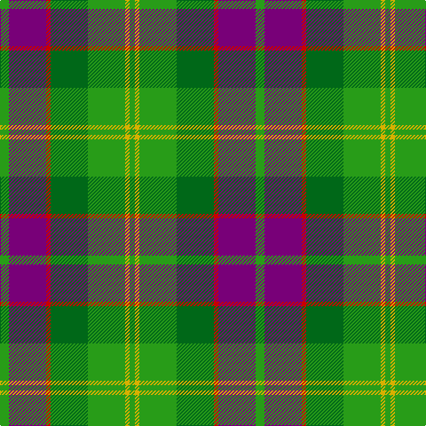

**Bands:** [GYGGRBG](/stripes/gyggrbg/) · **Stripes:** [G LY G G R DP G](/stripes/stripes7/) G LY G G R DP G

This was sourced from tartans-authority.  It is a [7 band tartan](/bands/bands7/).

Original link http://www.tartansauthority.com/tartan-ferret/display/2530/

## Also known as

This cloth is also recorded under:

- New Mexico: Land of Enchantment

## Attestations

This cloth appears in 2 source records; the oldest owns this page.

- 1997 — New Mexico (Fashion) (tartans-authority, [record](http://www.tartansauthority.com/tartan-ferret/display/2530/))
- 01/08/1998 — New Mexico: Land of Enchantment (register-of-tartans, [record](https://www.tartanregister.gov.uk/tartanDetails.aspx?ref=3115))

## Register references

External register numbers recorded for this tartan.

- Scottish Register of Tartans: [3115](https://www.tartanregister.gov.uk/tartanDetails.aspx?ref=3115)
- Scottish Tartans Authority (ITI): 2530
- Scottish Tartans World Register: 2530

## Thread count
G/10 P42 R5 Ga42 G42 Y5 G/6

## Palette
Each colour and its ΔE from the base-6 reference it is a variant of.

| Colour | Shade | Base | ΔE (OKLab) |
|---|---|---|---|
| G | <code style="background-color:#289C18;">#289C18</code> `#289C18` | G <code style="background-color:#006100;">#006100</code> | 0.19 |
| Ga | <code style="background-color:#006818;">#006818</code> `#006818` | G <code style="background-color:#006100;">#006100</code> | 0.02 |
| P | <code style="background-color:#780078;">#780078</code> `#780078` | B <code style="background-color:#2A418A;">#2A418A</code> | 0.17 |
| R | <code style="background-color:#C80000;">#C80000</code> `#C80000` | R <code style="background-color:#CC0000;">#CC0000</code> | 0.01 |
| Y | <code style="background-color:#D8B000;">#D8B000</code> `#D8B000` | Y <code style="background-color:#F2BF00;">#F2BF00</code> | 0.06 |

# Sample pattern

## Nearest tartans

The nearest existing variants by ΔTartan distance.

1. [Bannockbane Dark Green](/setts/s7/dg4g3dg24w15lo21g3lo4~x2/) — ΔT 0.93
1. [Bannockbane, Green](/setts/s7/dg8g6dg48w31o42g6o8/) — ΔT 0.99
1. [Red Dirt Girl](/setts/s9/dy21r2g18r2g18r2dg8w6dy10~x2/) — ΔT 1.08
1. [New Mexico](/setts/s7/g10db42r5dg42g42ly5g10/) — ΔT 1.11
1. [MPS Emerald Society](/setts/s6/ly4dg30g15db5b10ly4~x2/) — ΔT 1.13
1. [Turnbull, hunting](/setts/s5/r7ly3g28db28w3~x2/) — ΔT 1.14
1. [Cape Breton District Tartan Tartan Number: 1883. Earliest known date: 1957 In 1907, Mrs Lillian Crewe Walsh of Glace Bay, Cape Breton, wrote a poem in praise of Cape Breton. This poem was given by Mrs Walsh to Mrs Grant in 1957 and the tartan designed to accord with the poem. Grey for our Cape Breton Steel, Green for our lofty See products available Copyright © Blair Urquhart, Comrie, 2015](/setts/s7/ly5k5g17k6o24k6ly3~x2/) — ΔT 1.16
1. [MPS Emerald Society NCLEES 2012](/setts/s6/ly4dg30g15db5t10ly4~x2/) — ΔT 1.19
1. [McShane (Personal)](/setts/s8/g9lb2g9k2dy14ly4lb2r2~x4/) — ΔT 1.19
1. [MacAart](/setts/s10/o9k2o2r2g6k1ly1k1g6r3~x2/) — ΔT 1.20

## Neighbour map

Every grey dot is one of 14299 variants placed by the first two principal components of the ΔTartan feature space (44% of its variance). Red is this tartan; blue dots are its nearest — click one to open its page.

<svg viewBox="0 0 640 380" role="img" style="max-width:100%;height:auto;border:1px solid #e0e0e0;border-radius:4px;display:block" xmlns="http://www.w3.org/2000/svg"><image href="/nn/cloud.v1.png" width="640" height="380"/><a href="/setts/s7/dg4g3dg24w15lo21g3lo4~x2/"><circle cx="144.8" cy="184.5" r="4" fill="#3465a4"><title>Bannockbane Dark Green</title></circle></a><a href="/setts/s7/dg8g6dg48w31o42g6o8/"><circle cx="143.0" cy="184.1" r="4" fill="#3465a4"><title>Bannockbane, Green</title></circle></a><a href="/setts/s9/dy21r2g18r2g18r2dg8w6dy10~x2/"><circle cx="200.6" cy="195.3" r="4" fill="#3465a4"><title>Red Dirt Girl</title></circle></a><a href="/setts/s7/g10db42r5dg42g42ly5g10/"><circle cx="187.9" cy="218.1" r="4" fill="#3465a4"><title>New Mexico</title></circle></a><a href="/setts/s6/ly4dg30g15db5b10ly4~x2/"><circle cx="178.5" cy="213.8" r="4" fill="#3465a4"><title>MPS Emerald Society</title></circle></a><a href="/setts/s5/r7ly3g28db28w3~x2/"><circle cx="207.2" cy="208.8" r="4" fill="#3465a4"><title>Turnbull, hunting</title></circle></a><a href="/setts/s7/ly5k5g17k6o24k6ly3~x2/"><circle cx="152.5" cy="207.8" r="4" fill="#3465a4"><title>Cape Breton District Tartan Tartan Number: 1883. Earliest known date: 1957 In 1907, Mrs Lillian Crewe Walsh of Glace Bay, Cape Breton, wrote a poem in praise of Cape Breton. This poem was given by Mrs Walsh to Mrs Grant in 1957 and the tartan designed to accord with the poem. Grey for our Cape Breton Steel, Green for our lofty See products available Copyright © Blair Urquhart, Comrie, 2015</title></circle></a><a href="/setts/s6/ly4dg30g15db5t10ly4~x2/"><circle cx="174.7" cy="212.8" r="4" fill="#3465a4"><title>MPS Emerald Society NCLEES 2012</title></circle></a><a href="/setts/s8/g9lb2g9k2dy14ly4lb2r2~x4/"><circle cx="156.5" cy="189.2" r="4" fill="#3465a4"><title>McShane (Personal)</title></circle></a><a href="/setts/s10/o9k2o2r2g6k1ly1k1g6r3~x2/"><circle cx="147.0" cy="175.0" r="4" fill="#3465a4"><title>MacAart</title></circle></a><circle cx="171.8" cy="197.9" r="5" fill="#c00000"/></svg>

ID: /setts/s7/g10dp42r5g42g42ly5g6/
