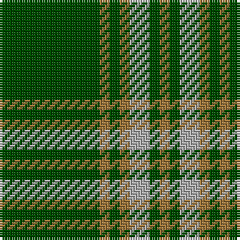

In pattern [GRGRYGR](/patterns/grgrygr/).

This was sourced from register-of-tartans.  It is a [7 stripes tartan](/stripes/stripes7/).

Original link https://www.tartanregister.gov.uk/tartanDetails.aspx?ref=1526

## Attestations

This cloth appears in 2 source records; the oldest owns this page.

- 01/01/1973 — Green Watch (register-of-tartans, [record](https://www.tartanregister.gov.uk/tartanDetails.aspx?ref=1526))
- 1973 — Green Watch (Fashion) (tartans-authority, [record](http://www.tartansauthority.com/tartan-ferret/display/5114/))

## Thread count
G/40 LT4 G4 LT4 N8 G4 LT/4

## Palette
Each colour and its ΔE from the base-6 reference it is a variant of.

| Colour | Shade | Base | ΔE (OKLab) |
|---|---|---|---|
| G | <code style="background-color:#004C00;">#004C00</code> `#004C00` | G <code style="background-color:#006100;">#006100</code> | 0.07 |
| LT | <code style="background-color:#A0783C;">#A0783C</code> `#A0783C` | R <code style="background-color:#CC0000;">#CC0000</code> | 0.18 |
| N | <code style="background-color:#B0B0B0;">#B0B0B0</code> `#B0B0B0` | Y <code style="background-color:#F2BF00;">#F2BF00</code> | 0.18 |

# Sample pattern

## Nearest tartans

The nearest existing variants by ΔTartan distance.

1. [Crow (Name)](/setts/s8/g2b2g6b4g3b4g18y2x4~b2c2c80-g006818-yfccc00/) — ΔT 1.15
1. [Connell (Personal?)](/setts/s6/r2g2r1g12r3k1x4~g006818-k101010-rc80000/) — ΔT 1.16
1. [Leeds, University of (Dance)](/setts/s8/g34r4g4r4g4r12g20w5x2~g006818-ra00048-we0e0e0/) — ΔT 1.20
1. [Welsh Assembly (Fashion)](/setts/s8/g5r9g4w5g30ra2g4ra2x2~g006818-r888888-rac80000-we0e0e0/) — ΔT 1.28
1. [Connell (Dalgliesh) (Personal)](/setts/s10/r3g12r1g2r2g2r1g12r3k1x4~g006818-k101010-rc80000/) — ΔT 1.29
1. [Angle, Green (Fashion)](/setts/s7/y1g11k6g3y1g1y1x4~g285800-k101010-ybc8c00/) — ΔT 1.30
1. [Welsh National District Tartan Tartan Number: 1523. Earliest known date: 1968 The Welsh Tartan owes its origin to a Society formed in Cardiff in 1967. Its aims were cultural and political - to strengthen Celtic ties and give visible signs of being an individual nation in culture, language and dress. The colours are those of the Welsh flag. It is said that the design was based on the Lord of the Isles tartan because the present Lord is also Prince of Wales. However comparison reveals similarity only to MacDonald, MacDonald of the Isles, or perhaps Applecross district. See products available Copyright © Blair Urquhart, Comrie, 2015](/setts/s5/r2g1r1g10w1x4~g00643c-ra00048-we0e0e0/) — ΔT 1.34
1. [Glenlivet](/setts/s8/g18r6g75b6g13ga35g12b6~b0000ff-g228b22-ga604000-rff0000/) — ΔT 1.36
1. [Northcroft (Personal)](/setts/s7/g24r4g3k14g5r2g10x2~g006818-k101010-rc80000/) — ΔT 1.40
1. [Welsh National (District)](/setts/s5/r8g3r4g44w4x2~g00643c-rc8002c-we0e0e0/) — ΔT 1.44

## Neighbour map

Every grey dot is one of 15726 variants placed by the first two principal components of the ΔTartan feature space (44% of its variance). Red is this tartan; blue dots are its nearest — click one to open its page.

<svg viewBox="0 0 640 380" role="img" style="max-width:100%;height:auto;border:1px solid #e0e0e0;border-radius:4px;display:block" xmlns="http://www.w3.org/2000/svg"><image href="/nn/cloud.v1.png" width="640" height="380"/><a href="/setts/s8/g2b2g6b4g3b4g18y2x4~b2c2c80-g006818-yfccc00/"><circle cx="437.3" cy="234.6" r="4" fill="#3465a4"><title>Crow (Name)</title></circle></a><a href="/setts/s6/r2g2r1g12r3k1x4~g006818-k101010-rc80000/"><circle cx="444.8" cy="219.1" r="4" fill="#3465a4"><title>Connell (Personal?)</title></circle></a><a href="/setts/s8/g34r4g4r4g4r12g20w5x2~g006818-ra00048-we0e0e0/"><circle cx="429.0" cy="228.6" r="4" fill="#3465a4"><title>Leeds, University of (Dance)</title></circle></a><a href="/setts/s8/g5r9g4w5g30ra2g4ra2x2~g006818-r888888-rac80000-we0e0e0/"><circle cx="432.3" cy="181.7" r="4" fill="#3465a4"><title>Welsh Assembly (Fashion)</title></circle></a><a href="/setts/s10/r3g12r1g2r2g2r1g12r3k1x4~g006818-k101010-rc80000/"><circle cx="474.2" cy="206.9" r="4" fill="#3465a4"><title>Connell (Dalgliesh) (Personal)</title></circle></a><a href="/setts/s7/y1g11k6g3y1g1y1x4~g285800-k101010-ybc8c00/"><circle cx="394.9" cy="225.0" r="4" fill="#3465a4"><title>Angle, Green (Fashion)</title></circle></a><a href="/setts/s5/r2g1r1g10w1x4~g00643c-ra00048-we0e0e0/"><circle cx="478.0" cy="230.9" r="4" fill="#3465a4"><title>Welsh National District Tartan Tartan Number: 1523. Earliest known date: 1968 The Welsh Tartan owes its origin to a Society formed in Cardiff in 1967. Its aims were cultural and political - to strengthen Celtic ties and give visible signs of being an individual nation in culture, language and dress. The colours are those of the Welsh flag. It is said that the design was based on the Lord of the Isles tartan because the present Lord is also Prince of Wales. However comparison reveals similarity only to MacDonald, MacDonald of the Isles, or perhaps Applecross district. See products available Copyright © Blair Urquhart, Comrie, 2015</title></circle></a><a href="/setts/s8/g18r6g75b6g13ga35g12b6~b0000ff-g228b22-ga604000-rff0000/"><circle cx="417.6" cy="198.5" r="4" fill="#3465a4"><title>Glenlivet</title></circle></a><a href="/setts/s7/g24r4g3k14g5r2g10x2~g006818-k101010-rc80000/"><circle cx="416.1" cy="239.4" r="4" fill="#3465a4"><title>Northcroft (Personal)</title></circle></a><a href="/setts/s5/r8g3r4g44w4x2~g00643c-rc8002c-we0e0e0/"><circle cx="503.2" cy="211.3" r="4" fill="#3465a4"><title>Welsh National (District)</title></circle></a><circle cx="457.6" cy="214.7" r="5" fill="#c00000"/></svg>

ID: /setts/s7/g10r1g1r1y2g1r1x4~g004c00-ra0783c-yb0b0b0/
