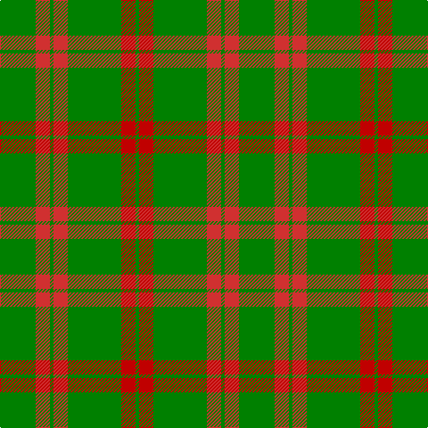

This page is one **sett** — a single exact thread-count. It belongs to the [tartan](/tartans/g10r4g1r4g15ri4g1/)
(the same proportion at any scale), whose colour order is pattern [GRGRGRG](/stripes/grgrgrg/).

Sourced from weddslist.  It is a [7 stripe tartan](/stripes/stripes7/).

Original link http://www.weddslist.com/cgi-bin/tartans/pg.pl?source=sts

## Thread count
G/40 R16 G4 R16 G60 Ra16 G/4

## Palette

Palette: <strong>custom</strong>
<table><thead><tr><th>Colour</th><th>Threads</th><th>Shade</th><th>Base</th><th>OKLCh</th></tr></thead><tbody><tr><td>G/</td><td style="text-align:right;font-variant-numeric:tabular-nums">40</td><td><code style="background-color:#008000;">#008000</code> <small style="color:#888">#008000</small></td><td>G <code style="background-color:#006100;">#006100</code></td><td><small style="color:#888">oklch(52.0% 0.177 142.5)</small></td></tr><tr><td>R</td><td style="text-align:right;font-variant-numeric:tabular-nums">16</td><td><code style="background-color:#D03030;">#D03030</code> <small style="color:#888">#D03030</small></td><td>R <code style="background-color:#CC0000;">#CC0000</code></td><td><small style="color:#888">oklch(56.4% 0.196 26.2)</small></td></tr><tr><td>G</td><td style="text-align:right;font-variant-numeric:tabular-nums">4</td><td><code style="background-color:#008000;">#008000</code> <small style="color:#888">#008000</small></td><td>G <code style="background-color:#006100;">#006100</code></td><td><small style="color:#888">oklch(52.0% 0.177 142.5)</small></td></tr><tr><td>R</td><td style="text-align:right;font-variant-numeric:tabular-nums">16</td><td><code style="background-color:#D03030;">#D03030</code> <small style="color:#888">#D03030</small></td><td>R <code style="background-color:#CC0000;">#CC0000</code></td><td><small style="color:#888">oklch(56.4% 0.196 26.2)</small></td></tr><tr><td>G</td><td style="text-align:right;font-variant-numeric:tabular-nums">60</td><td><code style="background-color:#008000;">#008000</code> <small style="color:#888">#008000</small></td><td>G <code style="background-color:#006100;">#006100</code></td><td><small style="color:#888">oklch(52.0% 0.177 142.5)</small></td></tr><tr><td>Ra</td><td style="text-align:right;font-variant-numeric:tabular-nums">16</td><td><code style="background-color:#C00000;">#C00000</code> <small style="color:#888">#C00000</small></td><td>R <code style="background-color:#CC0000;">#CC0000</code></td><td><small style="color:#888">oklch(50.7% 0.208 29.2)</small></td></tr><tr><td>G/</td><td style="text-align:right;font-variant-numeric:tabular-nums">4</td><td><code style="background-color:#008000;">#008000</code> <small style="color:#888">#008000</small></td><td>G <code style="background-color:#006100;">#006100</code></td><td><small style="color:#888">oklch(52.0% 0.177 142.5)</small></td></tr></tbody></table>

# Sample pattern

## Nearest tartans

The nearest existing variants by ΔTartan distance, with this tartan at the top so the swatches line up against it.

ΔTartan

Tartan

Sett

—

<a href="/ttd/edit/#slug=g10r4g1r4g15ri4g1~x4">Logan</a> <a class="nn-out" href="/setts/s7/g10r4g1r4g15ri4g1~x4/" title="open its dictionary page">↗</a>

0.73

<a href="/ttd/edit/#slug=g9ri4g1ri4g15r4g1~x4">Logan #4</a> <a class="nn-out" href="/setts/s7/g9ri4g1ri4g15r4g1~x4/" title="open its dictionary page">↗</a>

1.24

<a href="/ttd/edit/#slug=r2g2r1g12r3k1~x4">Connell (Personal?)</a> <a class="nn-out" href="/setts/s6/r2g2r1g12r3k1~x4/" title="open its dictionary page">↗</a>

1.33

<a href="/ttd/edit/#slug=r3g12r1g2r2g2r1g12r3k1~x4">Connell (Dalgliesh) (Personal)</a> <a class="nn-out" href="/setts/s10/r3g12r1g2r2g2r1g12r3k1~x4/" title="open its dictionary page">↗</a>

1.48

<a href="/ttd/edit/#slug=db1r3g11r2db5g11ly1~x2">MacKintosh, hunting</a> <a class="nn-out" href="/setts/s7/db1r3g11r2db5g11ly1~x2/" title="open its dictionary page">↗</a>

1.51

<a href="/ttd/edit/#slug=g24r4g3k14g5r2g10~x2">Northcroft (Personal)</a> <a class="nn-out" href="/setts/s7/g24r4g3k14g5r2g10~x2/" title="open its dictionary page">↗</a>

1.52

<a href="/ttd/edit/#slug=g34m4g4m4g4m12g20w5~x2">Leeds, University of (Dance)</a> <a class="nn-out" href="/setts/s8/g34m4g4m4g4m12g20w5~x2/" title="open its dictionary page">↗</a>

1.57

<a href="/ttd/edit/#slug=g18r6g75b6g13dy35g12b6">Glenlivet</a> <a class="nn-out" href="/setts/s8/g18r6g75b6g13dy35g12b6/" title="open its dictionary page">↗</a>

1.59

<a href="/ttd/edit/#slug=dg5r3dg3lo2dg1ly8dg24lo2~x2">St. Christopher (Corporate)</a> <a class="nn-out" href="/setts/s8/dg5r3dg3lo2dg1ly8dg24lo2~x2/" title="open its dictionary page">↗</a>

1.61

<a href="/ttd/edit/#slug=g5o9g4w5g30r2g4r2~x2">Welsh Assembly (Fashion)</a> <a class="nn-out" href="/setts/s8/g5o9g4w5g30r2g4r2~x2/" title="open its dictionary page">↗</a>

1.61

<a href="/ttd/edit/#slug=g3r16g4k6g28r2g3~x2">Maxwell Htg (Clan)</a> <a class="nn-out" href="/setts/s7/g3r16g4k6g28r2g3~x2/" title="open its dictionary page">↗</a>

## Neighbour map

Every grey dot is one of 14359 variants placed by the first two principal components of the ΔTartan feature space (44% of its variance). Red is this tartan; blue dots are its nearest — click one to open its page.

<svg viewBox="0 0 640 380" role="img" style="max-width:100%;height:auto;border:1px solid #e0e0e0;border-radius:4px;display:block" xmlns="http://www.w3.org/2000/svg"><image href="/nn/cloud.v1.png" width="640" height="380"/><a href="/setts/s7/g9ri4g1ri4g15r4g1~x4/"><circle cx="427.7" cy="217.8" r="4" fill="#3465a4"><title>Logan #4</title></circle></a><a href="/setts/s6/r2g2r1g12r3k1~x4/"><circle cx="444.9" cy="218.3" r="4" fill="#3465a4"><title>Connell (Personal?)</title></circle></a><a href="/setts/s10/r3g12r1g2r2g2r1g12r3k1~x4/"><circle cx="474.2" cy="206.8" r="4" fill="#3465a4"><title>Connell (Dalgliesh) (Personal)</title></circle></a><a href="/setts/s7/db1r3g11r2db5g11ly1~x2/"><circle cx="364.6" cy="218.0" r="4" fill="#3465a4"><title>MacKintosh, hunting</title></circle></a><a href="/setts/s7/g24r4g3k14g5r2g10~x2/"><circle cx="417.4" cy="240.1" r="4" fill="#3465a4"><title>Northcroft (Personal)</title></circle></a><a href="/setts/s8/g34m4g4m4g4m12g20w5~x2/"><circle cx="429.5" cy="227.0" r="4" fill="#3465a4"><title>Leeds, University of (Dance)</title></circle></a><a href="/setts/s8/g18r6g75b6g13dy35g12b6/"><circle cx="418.6" cy="200.3" r="4" fill="#3465a4"><title>Glenlivet</title></circle></a><a href="/setts/s8/dg5r3dg3lo2dg1ly8dg24lo2~x2/"><circle cx="441.4" cy="158.6" r="4" fill="#3465a4"><title>St. Christopher (Corporate)</title></circle></a><a href="/setts/s8/g5o9g4w5g30r2g4r2~x2/"><circle cx="433.2" cy="182.2" r="4" fill="#3465a4"><title>Welsh Assembly (Fashion)</title></circle></a><a href="/setts/s7/g3r16g4k6g28r2g3~x2/"><circle cx="419.5" cy="223.8" r="4" fill="#3465a4"><title>Maxwell Htg (Clan)</title></circle></a><circle cx="444.0" cy="223.5" r="5" fill="#c00000"/></svg>

ID: /setts/s7/g10r4g1r4g15ri4g1~x4/
