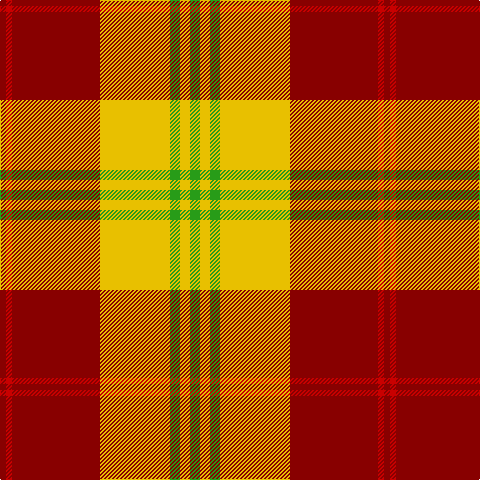

In pattern [GYGYRRR](/patterns/gygyrrr/).

This was sourced from tartans-authority.  It is a [7 stripes tartan](/stripes/stripes7/).

Original link http://www.tartansauthority.com/tartan-ferret/display/3966/

## Attestations

This cloth appears in 3 source records; the oldest owns this page.

- 2001 — Fernandes (Personal) (tartans-authority, [record](http://www.tartansauthority.com/tartan-ferret/display/3966/))
- undated — Fernandes (Personal) (register-of-tartans, [record](https://www.tartanregister.gov.uk/tartanDetails.aspx?ref=5028))
- undated — Fernandes Family Tartan Tartan Number: 3225. Earliest known date: 2001 Designed by Antonio Fernandes See products available Copyright © Blair Urquhart, Comrie, 2015 (house-of-tartan, [record](http://www.house-of-tartan.scotland.net/house/TartanViewjs.asp?colr=Def&tnam=3225))

## Thread count
DR/6 R6 DR88 Y70 G10 Y10 G/10

## Palette
Each colour and its ΔE from the base-6 reference it is a variant of.

| Colour | Shade | Base | ΔE (OKLab) |
|---|---|---|---|
| DR | <code style="background-color:#880000;">#880000</code> `#880000` | R <code style="background-color:#C80000;">#C80000</code> | 0.14 |
| G | <code style="background-color:#289C18;">#289C18</code> `#289C18` | G <code style="background-color:#006400;">#006400</code> | 0.18 |
| R | <code style="background-color:#C80000;">#C80000</code> `#C80000` | R <code style="background-color:#C80000;">#C80000</code> | 0.00 |
| Y | <code style="background-color:#E8C000;">#E8C000</code> `#E8C000` | Y <code style="background-color:#E8C000;">#E8C000</code> | 0.00 |

# Sample pattern

ID: /setts/s7/g10y10g10y70r88ra6r6-g289c18-r880000-rac80000-ye8c000/
