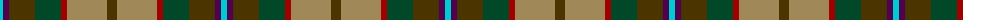
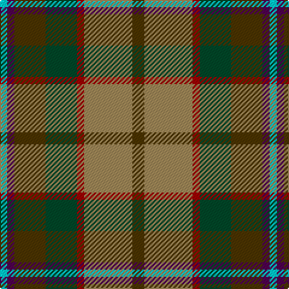

In pattern [GYRGGBW](/patterns/gyrggbw/).

This was sourced from register-of-tartans.  It is a [7 stripes tartan](/stripes/stripes7/).

Original link https://www.tartanregister.gov.uk/tartanDetails.aspx?ref=5777

## Thread count
LB/6 DP6 T26 DG26 DR6 LT40 T/10

## Palette
Each colour and its ΔE from the base-6 reference it is a variant of.

| Colour | Shade | Base | ΔE (OKLab) |
|---|---|---|---|
| DG | <code style="background-color:#004828;">#004828</code> `#004828` | G <code style="background-color:#006400;">#006400</code> | 0.11 |
| DP | <code style="background-color:#500050;">#500050</code> `#500050` | B <code style="background-color:#2C4084;">#2C4084</code> | 0.16 |
| DR | <code style="background-color:#A00000;">#A00000</code> `#A00000` | R <code style="background-color:#C80000;">#C80000</code> | 0.09 |
| LB | <code style="background-color:#00CCD0;">#00CCD0</code> `#00CCD0` | W <code style="background-color:#F4F4F0;">#F4F4F0</code> | 0.24 |
| LT | <code style="background-color:#A08858;">#A08858</code> `#A08858` | Y <code style="background-color:#E8C000;">#E8C000</code> | 0.21 |
| T | <code style="background-color:#4C3400;">#4C3400</code> `#4C3400` | G <code style="background-color:#006400;">#006400</code> | 0.16 |

# Sample pattern

ID: /setts/s7/g10y40r6ga26g26b6w6-b500050-g4c3400-ga004828-ra00000-w00ccd0-ya08858/
