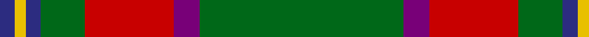

In pattern [BYBGRBG](/patterns/bybgrbg/).

This was sourced from house-of-tartan.  It is a [7 stripes tartan](/stripes/stripes7/).

Original link http://www.house-of-tartan.scotland.net/house/TartanViewjs.asp?colr=Def&tnam=664

## Thread count
DB/8 Y6 DB8 G24 R48 P14 G/110

## Palette
Each colour and its ΔE from the base-6 reference it is a variant of.

| Colour | Shade | Base | ΔE (OKLab) |
|---|---|---|---|
| DB | <code style="background-color:#2C2C80;">#2C2C80</code> `#2C2C80` | B <code style="background-color:#2C4084;">#2C4084</code> | 0.05 |
| G | <code style="background-color:#006818;">#006818</code> `#006818` | G <code style="background-color:#006400;">#006400</code> | 0.02 |
| P | <code style="background-color:#780078;">#780078</code> `#780078` | B <code style="background-color:#2C4084;">#2C4084</code> | 0.16 |
| R | <code style="background-color:#C80000;">#C80000</code> `#C80000` | R <code style="background-color:#C80000;">#C80000</code> | 0.00 |
| Y | <code style="background-color:#E8C000;">#E8C000</code> `#E8C000` | Y <code style="background-color:#E8C000;">#E8C000</code> | 0.00 |

# Sample pattern

## Nearest tartans

The nearest existing variants by ΔTartan distance.

1. [Crieff, and Strathearn](/setts/s7/g110b14r48g24ba8y6ba8-b800080-ba304080-g008000-rc00000-yf0c000/) — ΔT 0.64
1. [Canadian Caledonian District Tartan Tartan Number: 203. Earliest known date: 1939 MacKinlay strip. Designers Hastie-Cochrane and George MacBeth of Vancouver. See products available Copyright © Blair Urquhart, Comrie, 2015](/setts/s10/b6g32y2r2w2r12g6r2g6w2-b2c2c80-g006818-rc80000-we0e0e0-ye8c000/) — ΔT 0.98
1. [Hall (P.I.E.) (Personal)](/setts/s8/y10g6y6g106r14b10r26w8-b2c2c80-g006818-r901c38-wf8f8f8-ye8c000/) — ΔT 0.98
1. [Crieff & Strathearn #1](/setts/s7/g110b14r48g24ba8y6ba8-b2c2c80-ba003c64-g006818-r880000-ye8c000/) — ΔT 0.99
1. [Hynde (Sir John)](/setts/s11/g56r4g56r14w4r14w4r14k10b8w4-b6c0070-g006818-k101010-r880000-wc0c0c0/) — ΔT 1.07
1. [Canadian Caledonian](/setts/s10/b12g64y4r4w4r24g12r4g12w4-b2c2c80-g006818-rc80000-wfcfcfc-ye8c000/) — ΔT 1.11
1. [Selvon-Bruce (Personal)](/setts/s7/k12g8k12g72r8b8y4-b1c1c50-g288028-k101010-r880000-ybc8c00/) — ΔT 1.19
1. [Cavalier, Green](/setts/s11/g80b20r4b4w4b6ra16g12b4g8w4-b1c1c1c-g5c6428-ra07c58-raa00000-we0e0e0/) — ΔT 1.25
1. [Shannon (?)](/setts/s7/g96b22ga32y32g22r6g22-b780078-g604000-ga006818-rc80000-ye8c000/) — ΔT 1.27
1. [Shaw of Tordarroch Green (Htg) (Clan](/setts/s8/b10k2g60ba30r16g60r16ba4-b5c8ca8-ba2c2c80-g006818-k101010-rc80000/) — ΔT 1.27

## Neighbour map

Every grey dot is one of 15726 variants placed by the first two principal components of the ΔTartan feature space (44% of its variance). Red is this tartan; blue dots are its nearest — click one to open its page.

<svg viewBox="0 0 640 380" role="img" style="max-width:100%;height:auto;border:1px solid #e0e0e0;border-radius:4px;display:block" xmlns="http://www.w3.org/2000/svg"><image href="/nn/cloud.v1.png" width="640" height="380"/><a href="/setts/s7/g110b14r48g24ba8y6ba8-b800080-ba304080-g008000-rc00000-yf0c000/"><circle cx="356.6" cy="152.7" r="4" fill="#3465a4"><title>Crieff, and Strathearn</title></circle></a><a href="/setts/s10/b6g32y2r2w2r12g6r2g6w2-b2c2c80-g006818-rc80000-we0e0e0-ye8c000/"><circle cx="338.3" cy="132.1" r="4" fill="#3465a4"><title>Canadian Caledonian District Tartan Tartan Number: 203. Earliest known date: 1939 MacKinlay strip. Designers Hastie-Cochrane and George MacBeth of Vancouver. See products available Copyright © Blair Urquhart, Comrie, 2015</title></circle></a><a href="/setts/s8/y10g6y6g106r14b10r26w8-b2c2c80-g006818-r901c38-wf8f8f8-ye8c000/"><circle cx="342.2" cy="129.9" r="4" fill="#3465a4"><title>Hall (P.I.E.) (Personal)</title></circle></a><a href="/setts/s7/g110b14r48g24ba8y6ba8-b2c2c80-ba003c64-g006818-r880000-ye8c000/"><circle cx="383.9" cy="170.3" r="4" fill="#3465a4"><title>Crieff &amp; Strathearn #1</title></circle></a><a href="/setts/s11/g56r4g56r14w4r14w4r14k10b8w4-b6c0070-g006818-k101010-r880000-wc0c0c0/"><circle cx="333.2" cy="150.4" r="4" fill="#3465a4"><title>Hynde (Sir John)</title></circle></a><a href="/setts/s10/b12g64y4r4w4r24g12r4g12w4-b2c2c80-g006818-rc80000-wfcfcfc-ye8c000/"><circle cx="331.7" cy="129.2" r="4" fill="#3465a4"><title>Canadian Caledonian</title></circle></a><a href="/setts/s7/k12g8k12g72r8b8y4-b1c1c50-g288028-k101010-r880000-ybc8c00/"><circle cx="376.3" cy="152.0" r="4" fill="#3465a4"><title>Selvon-Bruce (Personal)</title></circle></a><a href="/setts/s11/g80b20r4b4w4b6ra16g12b4g8w4-b1c1c1c-g5c6428-ra07c58-raa00000-we0e0e0/"><circle cx="384.6" cy="119.1" r="4" fill="#3465a4"><title>Cavalier, Green</title></circle></a><a href="/setts/s7/g96b22ga32y32g22r6g22-b780078-g604000-ga006818-rc80000-ye8c000/"><circle cx="330.2" cy="179.5" r="4" fill="#3465a4"><title>Shannon (?)</title></circle></a><a href="/setts/s8/b10k2g60ba30r16g60r16ba4-b5c8ca8-ba2c2c80-g006818-k101010-rc80000/"><circle cx="362.4" cy="157.1" r="4" fill="#3465a4"><title>Shaw of Tordarroch Green (Htg) (Clan</title></circle></a><circle cx="363.7" cy="155.5" r="5" fill="#c00000"/></svg>

ID: /setts/s7/g110b14r48g24ba8y6ba8-b780078-ba2c2c80-g006818-rc80000-ye8c000/
