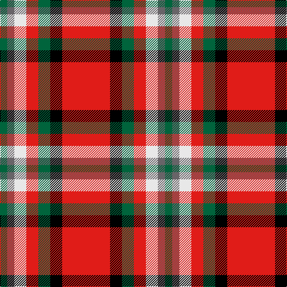

In pattern [GBWRGKR](/patterns/gbwrgkr/).

This was sourced from register-of-tartans.  It is a [7 stripes tartan](/stripes/stripes7/).

Original link https://www.tartanregister.gov.uk/tartanDetails.aspx?ref=10844

## Thread count
G/12 N12 LN20 R20 G20 K20 R/80

## Palette
Each colour and its ΔE from the base-6 reference it is a variant of.

| Colour | Shade | Base | ΔE (OKLab) |
|---|---|---|---|
| G | <code style="background-color:#00643C;">#00643C</code> `#00643C` | G <code style="background-color:#006400;">#006400</code> | 0.06 |
| K | <code style="background-color:#000000;">#000000</code> `#000000` | K <code style="background-color:#000000;">#000000</code> | 0.00 |
| LN | <code style="background-color:#E8E8E8;">#E8E8E8</code> `#E8E8E8` | W <code style="background-color:#F4F4F0;">#F4F4F0</code> | 0.04 |
| N | <code style="background-color:#686468;">#686468</code> `#686468` | B <code style="background-color:#2C4084;">#2C4084</code> | 0.16 |
| R | <code style="background-color:#E01C18;">#E01C18</code> `#E01C18` | R <code style="background-color:#C80000;">#C80000</code> | 0.06 |

# Sample pattern

ID: /setts/s7/g12b12w20r20g20k20r80-b686468-g00643c-k000000-re01c18-we8e8e8/
