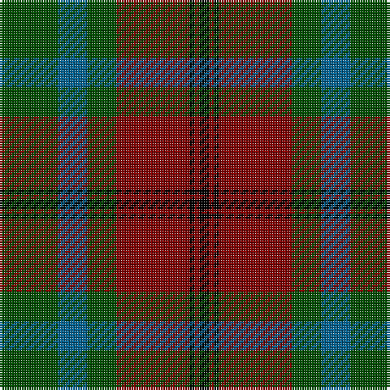

In pattern [GBGRKRK](/patterns/gbgrkrk/).

This was sourced from weddslist.  It is a [7 stripes tartan](/stripes/stripes7/).

Original link http://www.weddslist.com/cgi-bin/tartans/pg.pl?source=misc

## Thread count
G/24 B12 G12 DR30 K2 DR2 K/4

## Palette
Each colour and its ΔE from the base-6 reference it is a variant of.

| Colour | Shade | Base | ΔE (OKLab) |
|---|---|---|---|
| B | <code style="background-color:#006090;">#006090</code> `#006090` | B <code style="background-color:#2A418A;">#2A418A</code> | 0.09 |
| DR | <code style="background-color:#800000;">#800000</code> `#800000` | R <code style="background-color:#CC0000;">#CC0000</code> | 0.17 |
| G | <code style="background-color:#004C00;">#004C00</code> `#004C00` | G <code style="background-color:#006100;">#006100</code> | 0.07 |
| K | <code style="background-color:#000000;">#000000</code> `#000000` | K <code style="background-color:#000000;">#000000</code> | 0.00 |

# Sample pattern

## Nearest tartans

The nearest existing variants by ΔTartan distance.

1. [McInery (Personal)](/setts/s8/r8g2r12k6r3b3g24k2x2~b1c0070-g006818-k101010-r880000/) — ΔT 0.69
1. [Strathspey (Fashion)](/setts/s6/g3r22b5g10k10g2x2~b48748c-g006818-k101010-r880000/) — ΔT 0.83
1. [MacTavish Hunting Clan Tartan Tartan Number: 232. Earliest known date: pre 2003 See Lord Thomson See products available Copyright © Blair Urquhart, Comrie, 2015](/setts/s6/b3g26ga4b13k13b2x2~b5c8ca8-g604000-ga006818-k101010/) — ΔT 0.94
1. [Mitchell, Cameron (Personal)](/setts/s6/k16g32k8r4ra11r2x2~g003c14-k101010-r888888-ra880000/) — ΔT 0.94
1. [Loch Rannoch Trade Tartan Tartan Number: 1735. Earliest known date: 1975 Nothing See products available Copyright © Blair Urquhart, Comrie, 2015](/setts/s8/b24g2b5y14g2y5ga17b2x2~b441800-g006818-ga604000-ya08858/) — ΔT 1.01
1. [Brown of the Southeast (Personal)](/setts/s8/b12g2b4g2b4k33g13r4x2~b505c64-g4c5420-k101010-rc80000/) — ΔT 1.07
1. [Canadian Autumn](/setts/s6/g4r28b6g10k10g3x2~b1c0070-g006818-k101010-r880000/) — ΔT 1.12
1. [Cook (Name)](/setts/s7/g12ga6g6r15k1r1k2x2~g003820-ga048888-k101010-rc80000/) — ΔT 1.14
1. [MacTavish Hunting](/setts/s6/b4g28ga6b12k12b3x2~b5c8ca8-g603800-ga006818-k101010/) — ΔT 1.14
1. [Fraser Green](/setts/s6/w2b12g6b1ba6b1x4~b4c0000-ba5c5c5c-g447438-wc0c0c0/) — ΔT 1.15

## Neighbour map

Every grey dot is one of 15726 variants placed by the first two principal components of the ΔTartan feature space (44% of its variance). Red is this tartan; blue dots are its nearest — click one to open its page.

<svg viewBox="0 0 640 380" role="img" style="max-width:100%;height:auto;border:1px solid #e0e0e0;border-radius:4px;display:block" xmlns="http://www.w3.org/2000/svg"><image href="/nn/cloud.v1.png" width="640" height="380"/><a href="/setts/s8/r8g2r12k6r3b3g24k2x2~b1c0070-g006818-k101010-r880000/"><circle cx="279.7" cy="197.6" r="4" fill="#3465a4"><title>McInery (Personal)</title></circle></a><a href="/setts/s6/g3r22b5g10k10g2x2~b48748c-g006818-k101010-r880000/"><circle cx="250.4" cy="222.5" r="4" fill="#3465a4"><title>Strathspey (Fashion)</title></circle></a><a href="/setts/s6/b3g26ga4b13k13b2x2~b5c8ca8-g604000-ga006818-k101010/"><circle cx="249.6" cy="211.4" r="4" fill="#3465a4"><title>MacTavish Hunting Clan Tartan Tartan Number: 232. Earliest known date: pre 2003 See Lord Thomson See products available Copyright © Blair Urquhart, Comrie, 2015</title></circle></a><a href="/setts/s6/k16g32k8r4ra11r2x2~g003c14-k101010-r888888-ra880000/"><circle cx="295.8" cy="222.9" r="4" fill="#3465a4"><title>Mitchell, Cameron (Personal)</title></circle></a><a href="/setts/s8/b24g2b5y14g2y5ga17b2x2~b441800-g006818-ga604000-ya08858/"><circle cx="276.5" cy="201.4" r="4" fill="#3465a4"><title>Loch Rannoch Trade Tartan Tartan Number: 1735. Earliest known date: 1975 Nothing See products available Copyright © Blair Urquhart, Comrie, 2015</title></circle></a><a href="/setts/s8/b12g2b4g2b4k33g13r4x2~b505c64-g4c5420-k101010-rc80000/"><circle cx="301.7" cy="185.1" r="4" fill="#3465a4"><title>Brown of the Southeast (Personal)</title></circle></a><a href="/setts/s6/g4r28b6g10k10g3x2~b1c0070-g006818-k101010-r880000/"><circle cx="266.4" cy="223.9" r="4" fill="#3465a4"><title>Canadian Autumn</title></circle></a><a href="/setts/s7/g12ga6g6r15k1r1k2x2~g003820-ga048888-k101010-rc80000/"><circle cx="251.6" cy="190.4" r="4" fill="#3465a4"><title>Cook (Name)</title></circle></a><a href="/setts/s6/b4g28ga6b12k12b3x2~b5c8ca8-g603800-ga006818-k101010/"><circle cx="235.7" cy="227.2" r="4" fill="#3465a4"><title>MacTavish Hunting</title></circle></a><a href="/setts/s6/w2b12g6b1ba6b1x4~b4c0000-ba5c5c5c-g447438-wc0c0c0/"><circle cx="287.1" cy="210.8" r="4" fill="#3465a4"><title>Fraser Green</title></circle></a><circle cx="273.2" cy="206.2" r="5" fill="#c00000"/></svg>

ID: /setts/s7/g12b6g6r15k1r1k2x2~b006090-g004c00-k000000-r800000/
