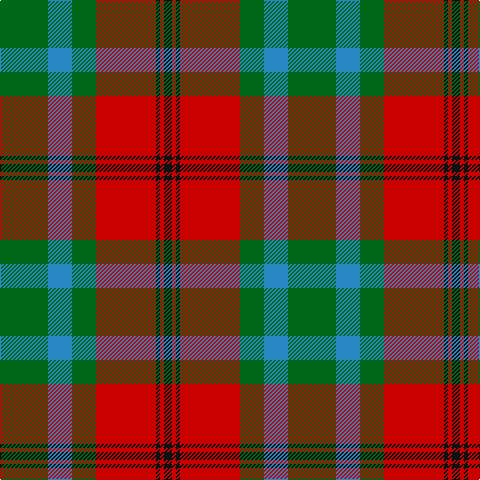

In pattern [GBGRKRK](/patterns/gbgrkrk/).

This was sourced from tartans-authority.  It is a [7 stripes tartan](/stripes/stripes7/).

Original link http://www.tartansauthority.com/tartan-ferret/display/3910/

## Attestations

This cloth appears in 2 source records; the oldest owns this page.

- 2001 — McCook/Cook (Name) (tartans-authority, [record](http://www.tartansauthority.com/tartan-ferret/display/3910/))
- undated — McCook/Cook (register-of-tartans, [record](https://www.tartanregister.gov.uk/tartanDetails.aspx?ref=5280))

## Thread count
G/48 B24 G24 R60 K4 R4 K/8

## Palette
Each colour and its ΔE from the base-6 reference it is a variant of.

| Colour | Shade | Base | ΔE (OKLab) |
|---|---|---|---|
| B | <code style="background-color:#2888C4;">#2888C4</code> `#2888C4` | B <code style="background-color:#2A418A;">#2A418A</code> | 0.21 |
| G | <code style="background-color:#006818;">#006818</code> `#006818` | G <code style="background-color:#006100;">#006100</code> | 0.02 |
| K | <code style="background-color:#101010;">#101010</code> `#101010` | K <code style="background-color:#000000;">#000000</code> | 0.17 |
| R | <code style="background-color:#C80000;">#C80000</code> `#C80000` | R <code style="background-color:#CC0000;">#CC0000</code> | 0.01 |

# Sample pattern

## Nearest tartans

The nearest existing variants by ΔTartan distance.

1. [MacKintosh, Geddes](/setts/s7/b1r5g18r4b9r10w1x4~b304080-g008000-rc00000-we0e0e0/) — ΔT 0.39
1. [Cranston, dress](/setts/s8/r30b3r2b3r6b14g26ga6~b304080-g30a010-ga008000-rc00000/) — ΔT 0.61
1. [Logan, with Yellow](/setts/s7/b8r3y1r3g14r3y1x4~b800080-g008000-rc00000-yf0c000/) — ΔT 0.67
1. [Cook (Name)](/setts/s7/g12ga6g6r15k1r1k2x2~g003820-ga048888-k101010-rc80000/) — ΔT 0.71
1. [Logan with Yellow](/setts/s7/b8r3y1r3g14r3y1x4~b780078-g006818-rc80000-ye8c000/) — ΔT 0.72
1. [Cranston Dress](/setts/s8/r15b2r1b2r3b7g13ga3x2~b2c2c80-g289c18-ga006818-rc80000/) — ΔT 0.72
1. [Cranston Dress Family Tartan Tartan Number: 753. Earliest known date: pre 2003 Restricted See products available Copyright © Blair Urquhart, Comrie, 2015](/setts/s8/r30b3r2b3r6b14g26ga6~b2c2c80-g289c18-ga006818-rc80000/) — ΔT 0.73
1. [Logan - 1819 (with yellow)](/setts/s7/b8r3y1r3g14r3y1x4~b440044-g285800-rc80000-ye8c000/) — ΔT 0.80
1. [Logan #3](/setts/s7/b9y4b1y4g15r4b1x4~b440044-g00801c-rc8002c-ye08070/) — ΔT 0.81
1. [Buccleuch (Fashion)](/setts/s8/y15k1y2k1y2k10g14w2x2~g5c6428-k101010-we0e0e0-ya08858/) — ΔT 0.84

## Neighbour map

Every grey dot is one of 15726 variants placed by the first two principal components of the ΔTartan feature space (44% of its variance). Red is this tartan; blue dots are its nearest — click one to open its page.

<svg viewBox="0 0 640 380" role="img" style="max-width:100%;height:auto;border:1px solid #e0e0e0;border-radius:4px;display:block" xmlns="http://www.w3.org/2000/svg"><image href="/nn/cloud.v1.png" width="640" height="380"/><a href="/setts/s7/b1r5g18r4b9r10w1x4~b304080-g008000-rc00000-we0e0e0/"><circle cx="247.8" cy="181.6" r="4" fill="#3465a4"><title>MacKintosh, Geddes</title></circle></a><a href="/setts/s8/r30b3r2b3r6b14g26ga6~b304080-g30a010-ga008000-rc00000/"><circle cx="241.4" cy="169.8" r="4" fill="#3465a4"><title>Cranston, dress</title></circle></a><a href="/setts/s7/b8r3y1r3g14r3y1x4~b800080-g008000-rc00000-yf0c000/"><circle cx="238.5" cy="174.8" r="4" fill="#3465a4"><title>Logan, with Yellow</title></circle></a><a href="/setts/s7/g12ga6g6r15k1r1k2x2~g003820-ga048888-k101010-rc80000/"><circle cx="251.6" cy="190.4" r="4" fill="#3465a4"><title>Cook (Name)</title></circle></a><a href="/setts/s7/b8r3y1r3g14r3y1x4~b780078-g006818-rc80000-ye8c000/"><circle cx="246.1" cy="178.0" r="4" fill="#3465a4"><title>Logan with Yellow</title></circle></a><a href="/setts/s8/r15b2r1b2r3b7g13ga3x2~b2c2c80-g289c18-ga006818-rc80000/"><circle cx="227.8" cy="169.8" r="4" fill="#3465a4"><title>Cranston Dress</title></circle></a><a href="/setts/s8/r30b3r2b3r6b14g26ga6~b2c2c80-g289c18-ga006818-rc80000/"><circle cx="235.5" cy="167.0" r="4" fill="#3465a4"><title>Cranston Dress Family Tartan Tartan Number: 753. Earliest known date: pre 2003 Restricted See products available Copyright © Blair Urquhart, Comrie, 2015</title></circle></a><a href="/setts/s7/b8r3y1r3g14r3y1x4~b440044-g285800-rc80000-ye8c000/"><circle cx="247.2" cy="180.3" r="4" fill="#3465a4"><title>Logan - 1819 (with yellow)</title></circle></a><a href="/setts/s7/b9y4b1y4g15r4b1x4~b440044-g00801c-rc8002c-ye08070/"><circle cx="209.1" cy="177.1" r="4" fill="#3465a4"><title>Logan #3</title></circle></a><a href="/setts/s8/y15k1y2k1y2k10g14w2x2~g5c6428-k101010-we0e0e0-ya08858/"><circle cx="228.1" cy="168.4" r="4" fill="#3465a4"><title>Buccleuch (Fashion)</title></circle></a><circle cx="247.8" cy="188.1" r="5" fill="#c00000"/></svg>

ID: /setts/s7/g12b6g6r15k1r1k2x4~b2888c4-g006818-k101010-rc80000/
