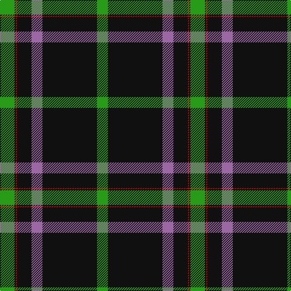

In pattern [GKRKRKG](/stripes/gkrkrkg/).

This was sourced from tartans-authority.  It is a [7 stripe tartan](/stripes/stripes7/).

Original link http://www.tartansauthority.com/tartan-ferret/display/5946/

## Thread count
G/24 K2 R2 K24 LP18 K90 G/18

## Palette
Each colour and its ΔE from the base-6 reference it is a variant of.

| Colour | Shade | Base | ΔE (OKLab) |
|---|---|---|---|
| G | <code style="background-color:#289C18;">#289C18</code> `#289C18` | G <code style="background-color:#006100;">#006100</code> | 0.19 |
| K | <code style="background-color:#101010;">#101010</code> `#101010` | K <code style="background-color:#000000;">#000000</code> | 0.17 |
| LP | <code style="background-color:#9C68A4;">#9C68A4</code> `#9C68A4` | R <code style="background-color:#CC0000;">#CC0000</code> | 0.21 |
| R | <code style="background-color:#C80000;">#C80000</code> `#C80000` | R <code style="background-color:#CC0000;">#CC0000</code> | 0.01 |

# Sample pattern

## Nearest tartans

The nearest existing variants by ΔTartan distance.

1. [Perry Hunting (Green) (Personal)](/setts/s5/k75g26lr2g4lo5~x2/) — ΔT 1.25
1. [Llewellyn (Welsh Name)](/setts/s9/k74o4k7o4k9o40k2o4k2/) — ΔT 1.26
1. [MacGregor, Black (Personal)](/setts/s6/k72g23k7g8r1w3~x2/) — ΔT 1.37
1. [MacDiarmid (Clan)](/setts/s9/k12r2k28g12k1w3k1g12r4~x2/) — ΔT 1.42
1. [Entrepreneurial Spark](/setts/s8/k14lo3w8lo4k6w9k31g1~x2/) — ΔT 1.44
1. [Williams, Jodi (Personal)](/setts/s7/o2db20r2g3r4g35r1~x2/) — ΔT 1.49
1. [Entier](/setts/s12/k2g4k6lr2k31ly2k1ly2k16g20ly1lr2~x2/) — ΔT 1.50
1. [MacDiarmid](/setts/s9/k12r2k28dg12k1w3k1dg12r4~x2/) — ΔT 1.52
1. [Cirse 3D](/setts/s8/lo8n5r1n15k2lo1k36n1~x2/) — ΔT 1.56
1. [George Heriots](/setts/s5/w3k35o24k1ly3~x2/) — ΔT 1.60

## Neighbour map

Every grey dot is one of 14299 variants placed by the first two principal components of the ΔTartan feature space (44% of its variance). Red is this tartan; blue dots are its nearest — click one to open its page.

<svg viewBox="0 0 640 380" role="img" style="max-width:100%;height:auto;border:1px solid #e0e0e0;border-radius:4px;display:block" xmlns="http://www.w3.org/2000/svg"><image href="/nn/cloud.v1.png" width="640" height="380"/><a href="/setts/s5/k75g26lr2g4lo5~x2/"><circle cx="466.4" cy="166.7" r="4" fill="#3465a4"><title>Perry Hunting (Green) (Personal)</title></circle></a><a href="/setts/s9/k74o4k7o4k9o40k2o4k2/"><circle cx="422.9" cy="116.1" r="4" fill="#3465a4"><title>Llewellyn (Welsh Name)</title></circle></a><a href="/setts/s6/k72g23k7g8r1w3~x2/"><circle cx="500.4" cy="149.3" r="4" fill="#3465a4"><title>MacGregor, Black (Personal)</title></circle></a><a href="/setts/s9/k12r2k28g12k1w3k1g12r4~x2/"><circle cx="343.6" cy="152.9" r="4" fill="#3465a4"><title>MacDiarmid (Clan)</title></circle></a><a href="/setts/s8/k14lo3w8lo4k6w9k31g1~x2/"><circle cx="379.9" cy="138.6" r="4" fill="#3465a4"><title>Entrepreneurial Spark</title></circle></a><a href="/setts/s7/o2db20r2g3r4g35r1~x2/"><circle cx="376.6" cy="144.8" r="4" fill="#3465a4"><title>Williams, Jodi (Personal)</title></circle></a><a href="/setts/s12/k2g4k6lr2k31ly2k1ly2k16g20ly1lr2~x2/"><circle cx="406.8" cy="132.1" r="4" fill="#3465a4"><title>Entier</title></circle></a><a href="/setts/s9/k12r2k28dg12k1w3k1dg12r4~x2/"><circle cx="352.3" cy="157.8" r="4" fill="#3465a4"><title>MacDiarmid</title></circle></a><a href="/setts/s8/lo8n5r1n15k2lo1k36n1~x2/"><circle cx="377.4" cy="131.7" r="4" fill="#3465a4"><title>Cirse 3D</title></circle></a><a href="/setts/s5/w3k35o24k1ly3~x2/"><circle cx="343.2" cy="150.5" r="4" fill="#3465a4"><title>George Heriots</title></circle></a><circle cx="415.5" cy="139.4" r="5" fill="#c00000"/></svg>

ID: /setts/s7/g12k1r1k12m9k45g9~x2/
