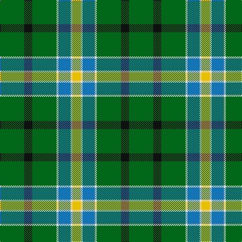

In pattern [GKGWBWY](/patterns/gkgwbwy/).

This was sourced from tartans-authority.  It is a [7 stripes tartan](/stripes/stripes7/).

Original link http://www.tartansauthority.com/tartan-ferret/display/8510/

## Thread count
G/48 K16 G48 LN4 B24 LN4 Y/16

## Palette
Each colour and its ΔE from the base-6 reference it is a variant of.

| Colour | Shade | Base | ΔE (OKLab) |
|---|---|---|---|
| B | <code style="background-color:#1474B4;">#1474B4</code> `#1474B4` | B <code style="background-color:#2A418A;">#2A418A</code> | 0.15 |
| G | <code style="background-color:#006818;">#006818</code> `#006818` | G <code style="background-color:#006100;">#006100</code> | 0.02 |
| K | <code style="background-color:#101010;">#101010</code> `#101010` | K <code style="background-color:#000000;">#000000</code> | 0.17 |
| LN | <code style="background-color:#E0E0E0;">#E0E0E0</code> `#E0E0E0` | W <code style="background-color:#F7F7F7;">#F7F7F7</code> | 0.07 |
| Y | <code style="background-color:#E8C000;">#E8C000</code> `#E8C000` | Y <code style="background-color:#F2BF00;">#F2BF00</code> | 0.02 |

# Sample pattern

## Nearest tartans

The nearest existing variants by ΔTartan distance.

1. [Taylor](/setts/s8/g8k2g13r4g12b22g5y3~b304080-g008000-k000000-rd03030-yf0c000~x2/) — ΔT 0.68
1. [Duncan, or Leslie of Wardis](/setts/s6/k4g21w3g21b21r4~b304080-g008000-k000000-rc00000-we0e0e0~x2/) — ΔT 1.00
1. [Carrick, hunting](/setts/s8/g13b1g1b1g3ba5k4y2~b800080-ba304080-g008000-k000000-yf0c000~x2/) — ΔT 1.24
1. [Bute Heather, Glencallum (Fashion)](/setts/s11/y13b2g38b13g8b8g17b2g17b4w11~b1c1c50-g006818-we0e0e0-ye8c000/) — ΔT 1.25
1. [Marshall Field](/setts/s8/g10b1w1b1y1b6g8r1~b2c2c80-g006818-rc80000-wfcfcfc-ye8c000~x8/) — ΔT 1.28
1. [Faskin Family (Aberdeenshire)](/setts/s9/b1ba10k10g12k1g12b2g16w1~b2d8acd-ba770676-g016817-k101010-wffffff~x2/) — ΔT 1.30
1. [Lauder](/setts/s6/g3b8g3k4g15r2~b304080-g008000-k000000-rc00000~x2/) — ΔT 1.31
1. [Casey of West Virginia (Personal)](/setts/s9/g4y1b1y1b2g9r1b6w1~b14283c-g007800-rc80000-wf8f8f8-yc88c00~x4/) — ΔT 1.34
1. [Faskin (Name)](/setts/s9/b1ba10k10g12k1g12b2g16w1~b2888c4-ba780078-g006818-k101010-we0e0e0~x2/) — ΔT 1.35
1. [Carrick Hunting District Tartan Tartan Number: 721. Earliest known date: 1930 This sample comes from the MacGregor-Hastie collection which forms the basis of the cloth archive of the Scottish Tartans Society. Some of the samples, including this one, were unmarked. One can assume that the sample dates between 1930 and 1950. See products available Copyright © Blair Urquhart, Comrie, 2015](/setts/s8/g13b1g1b1g3ba5k4y2~b780078-ba2c2c80-g006818-k101010-ye8c000~x2/) — ΔT 1.37

## Neighbour map

Every grey dot is one of 15726 variants placed by the first two principal components of the ΔTartan feature space (44% of its variance). Red is this tartan; blue dots are its nearest — click one to open its page.

<svg viewBox="0 0 640 380" role="img" style="max-width:100%;height:auto;border:1px solid #e0e0e0;border-radius:4px;display:block" xmlns="http://www.w3.org/2000/svg"><image href="/nn/cloud.v1.png" width="640" height="380"/><a href="/setts/s8/g8k2g13r4g12b22g5y3~b304080-g008000-k000000-rd03030-yf0c000~x2/"><circle cx="263.5" cy="197.8" r="4" fill="#3465a4"><title>Taylor</title></circle></a><a href="/setts/s6/k4g21w3g21b21r4~b304080-g008000-k000000-rc00000-we0e0e0~x2/"><circle cx="245.2" cy="226.0" r="4" fill="#3465a4"><title>Duncan, or Leslie of Wardis</title></circle></a><a href="/setts/s8/g13b1g1b1g3ba5k4y2~b800080-ba304080-g008000-k000000-yf0c000~x2/"><circle cx="257.1" cy="159.9" r="4" fill="#3465a4"><title>Carrick, hunting</title></circle></a><a href="/setts/s11/y13b2g38b13g8b8g17b2g17b4w11~b1c1c50-g006818-we0e0e0-ye8c000/"><circle cx="283.9" cy="152.3" r="4" fill="#3465a4"><title>Bute Heather, Glencallum (Fashion)</title></circle></a><a href="/setts/s8/g10b1w1b1y1b6g8r1~b2c2c80-g006818-rc80000-wfcfcfc-ye8c000~x8/"><circle cx="323.8" cy="185.4" r="4" fill="#3465a4"><title>Marshall Field</title></circle></a><a href="/setts/s9/b1ba10k10g12k1g12b2g16w1~b2d8acd-ba770676-g016817-k101010-wffffff~x2/"><circle cx="315.6" cy="180.8" r="4" fill="#3465a4"><title>Faskin Family (Aberdeenshire)</title></circle></a><a href="/setts/s6/g3b8g3k4g15r2~b304080-g008000-k000000-rc00000~x2/"><circle cx="285.5" cy="234.4" r="4" fill="#3465a4"><title>Lauder</title></circle></a><a href="/setts/s9/g4y1b1y1b2g9r1b6w1~b14283c-g007800-rc80000-wf8f8f8-yc88c00~x4/"><circle cx="237.6" cy="178.7" r="4" fill="#3465a4"><title>Casey of West Virginia (Personal)</title></circle></a><a href="/setts/s9/b1ba10k10g12k1g12b2g16w1~b2888c4-ba780078-g006818-k101010-we0e0e0~x2/"><circle cx="318.6" cy="182.0" r="4" fill="#3465a4"><title>Faskin (Name)</title></circle></a><a href="/setts/s8/g13b1g1b1g3ba5k4y2~b780078-ba2c2c80-g006818-k101010-ye8c000~x2/"><circle cx="286.5" cy="171.0" r="4" fill="#3465a4"><title>Carrick Hunting District Tartan Tartan Number: 721. Earliest known date: 1930 This sample comes from the MacGregor-Hastie collection which forms the basis of the cloth archive of the Scottish Tartans Society. Some of the samples, including this one, were unmarked. One can assume that the sample dates between 1930 and 1950. See products available Copyright © Blair Urquhart, Comrie, 2015</title></circle></a><circle cx="274.1" cy="195.4" r="5" fill="#c00000"/></svg>

ID: /setts/s7/g12k4g12w1b6w1y4~b1474b4-g006818-k101010-we0e0e0-ye8c000~x4/
