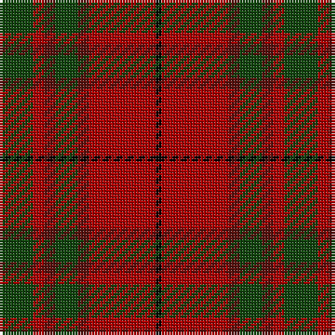

In pattern [GRBGBRK](/patterns/grbgbrk/).

This was sourced from weddslist.  It is a [7 stripes tartan](/stripes/stripes7/).

Original link http://www.weddslist.com/cgi-bin/tartans/pg.pl?source=tinsel

## Attestations

This cloth appears in 2 source records; the oldest owns this page.

- undated — MacNab VS (weddslist, [record](http://www.weddslist.com/cgi-bin/tartans/pg.pl?source=tinsel))
- undated — MacNab VS (weddslist, [record](http://www.weddslist.com/cgi-bin/tartans/pg.pl?source=x))

## Thread count
DG/12 DR4 DRa4 DG8 DRa4 DR24 K/2

## Palette
Each colour and its ΔE from the base-6 reference it is a variant of.

| Colour | Shade | Base | ΔE (OKLab) |
|---|---|---|---|
| DG | <code style="background-color:#11450D;">#11450D</code> `#11450D` | G <code style="background-color:#006100;">#006100</code> | 0.09 |
| DR | <code style="background-color:#AA0000;">#AA0000</code> `#AA0000` | R <code style="background-color:#CC0000;">#CC0000</code> | 0.07 |
| DRa | <code style="background-color:#59110D;">#59110D</code> `#59110D` | B <code style="background-color:#2A418A;">#2A418A</code> | 0.22 |
| K | <code style="background-color:#000000;">#000000</code> `#000000` | K <code style="background-color:#000000;">#000000</code> | 0.00 |

# Sample pattern

## Nearest tartans

The nearest existing variants by ΔTartan distance.

1. [Loch Rannoch](/setts/s8/b48g4b10r28g4r10ra34b4-b401000-g008000-r906030-ra806050/) — ΔT 1.11
1. [Hubbard (2016)](/setts/s9/b10r38ba4g16r6g36ba4g18ba4-b003c64-ba1c1c1c-g5c6428-rc80000/) — ΔT 1.13
1. [MacNab (Crimson)](/setts/s7/g56r14ra14g28ra14r96k8-g005020-k101010-rdc0000-ra781c38/) — ΔT 1.15
1. [MacNab #3](/setts/s7/g12r4ra4g8ra4r24k2-g005020-k101010-rdc0000-ra960028/) — ΔT 1.16
1. [Chisholm](/setts/s8/r24b4y2b4r6g16r6b2-b6e5058-g11450d-raa0000-yaaaaaa/) — ΔT 1.16
1. [Chisholm](/setts/s8/r12b2y1b2r3g8r3b1-b6e5058-g11450d-raa0000-yaaaaaa/) — ΔT 1.16
1. [Loch Rannoch Trade Tartan Tartan Number: 1735. Earliest known date: 1975 Nothing See products available Copyright © Blair Urquhart, Comrie, 2015](/setts/s8/b48g4b10y28g4y10ga34b4-b441800-g006818-ga604000-ya08858/) — ΔT 1.16
1. [Wasko (Personal)](/setts/s7/r16w4ra60g24ra6g24ra6-g006818-rc80000-raa00048-we0e0e0/) — ΔT 1.20
1. [Comyn](/setts/s8/k2r18g4r4g8y2g8r2-g11450d-k000000-raa0000-yaaaaaa/) — ΔT 1.23
1. [Comyn](/setts/s8/k1r9g2r2g4y1g4r1-g11450d-k000000-raa0000-yaaaaaa/) — ΔT 1.23

## Neighbour map

Every grey dot is one of 15726 variants placed by the first two principal components of the ΔTartan feature space (44% of its variance). Red is this tartan; blue dots are its nearest — click one to open its page.

<svg viewBox="0 0 640 380" role="img" style="max-width:100%;height:auto;border:1px solid #e0e0e0;border-radius:4px;display:block" xmlns="http://www.w3.org/2000/svg"><image href="/nn/cloud.v1.png" width="640" height="380"/><a href="/setts/s8/b48g4b10r28g4r10ra34b4-b401000-g008000-r906030-ra806050/"><circle cx="290.4" cy="207.2" r="4" fill="#3465a4"><title>Loch Rannoch</title></circle></a><a href="/setts/s9/b10r38ba4g16r6g36ba4g18ba4-b003c64-ba1c1c1c-g5c6428-rc80000/"><circle cx="316.5" cy="208.8" r="4" fill="#3465a4"><title>Hubbard (2016)</title></circle></a><a href="/setts/s7/g56r14ra14g28ra14r96k8-g005020-k101010-rdc0000-ra781c38/"><circle cx="297.9" cy="187.4" r="4" fill="#3465a4"><title>MacNab (Crimson)</title></circle></a><a href="/setts/s7/g12r4ra4g8ra4r24k2-g005020-k101010-rdc0000-ra960028/"><circle cx="297.9" cy="191.0" r="4" fill="#3465a4"><title>MacNab #3</title></circle></a><a href="/setts/s8/r24b4y2b4r6g16r6b2-b6e5058-g11450d-raa0000-yaaaaaa/"><circle cx="376.9" cy="202.9" r="4" fill="#3465a4"><title>Chisholm</title></circle></a><a href="/setts/s8/r12b2y1b2r3g8r3b1-b6e5058-g11450d-raa0000-yaaaaaa/"><circle cx="376.9" cy="202.9" r="4" fill="#3465a4"><title>Chisholm</title></circle></a><a href="/setts/s8/b48g4b10y28g4y10ga34b4-b441800-g006818-ga604000-ya08858/"><circle cx="275.4" cy="202.0" r="4" fill="#3465a4"><title>Loch Rannoch Trade Tartan Tartan Number: 1735. Earliest known date: 1975 Nothing See products available Copyright © Blair Urquhart, Comrie, 2015</title></circle></a><a href="/setts/s7/r16w4ra60g24ra6g24ra6-g006818-rc80000-raa00048-we0e0e0/"><circle cx="331.0" cy="184.9" r="4" fill="#3465a4"><title>Wasko (Personal)</title></circle></a><a href="/setts/s8/k2r18g4r4g8y2g8r2-g11450d-k000000-raa0000-yaaaaaa/"><circle cx="304.9" cy="205.1" r="4" fill="#3465a4"><title>Comyn</title></circle></a><a href="/setts/s8/k1r9g2r2g4y1g4r1-g11450d-k000000-raa0000-yaaaaaa/"><circle cx="304.9" cy="205.1" r="4" fill="#3465a4"><title>Comyn</title></circle></a><circle cx="319.1" cy="208.4" r="5" fill="#c00000"/></svg>

ID: /setts/s7/g12r4b4g8b4r24k2-b59110d-g11450d-k000000-raa0000/
