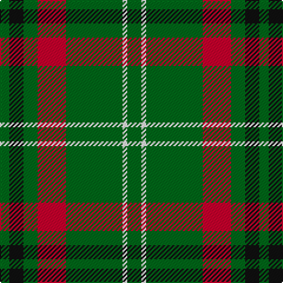

In pattern [GKGRGWG](/patterns/gkgrgwg/).

This was sourced from register-of-tartans.  It is a [7 stripes tartan](/stripes/stripes7/).

Original link https://www.tartanregister.gov.uk/tartanDetails.aspx?ref=112

## Attestations

This cloth appears in 3 source records; the oldest owns this page.

- 01/01/1998 — Arkansas (register-of-tartans, [record](https://www.tartanregister.gov.uk/tartanDetails.aspx?ref=112))
- 1998 — Arkansas (Fashion) (tartans-authority, [record](http://www.tartansauthority.com/tartan-ferret/display/2678/))
- undated — Arkansas State American District Tartan Tartan Number: 2678. Earliest known date: 1998 The official Arkansas state tartan. At one time there were two other contenders for this honour but this database only has details of one other - # 3264. Green represents the "Natural State" (the State's nickname), red the original settlers, white for the diamonds and black for the rich oil reserves. Approved by State Governor Mike Huckabee in the State Captal of Little Rock on 1st September, 1998. See products available Copyright © Blair Urquhart, Comrie, 2015 (house-of-tartan, [record](http://www.house-of-tartan.scotland.net/house/TartanViewjs.asp?colr=Def&tnam=2678))

## Thread count
Ga/8 K12 Ga12 R24 Ga48 W4 Ga/12

## Palette
Each colour and its ΔE from the base-6 reference it is a variant of.

| Colour | Shade | Base | ΔE (OKLab) |
|---|---|---|---|
| G | <code style="background-color:#285800;">#285800</code> `#285800` | G <code style="background-color:#006400;">#006400</code> | 0.04 |
| Ga | <code style="background-color:#006818;">#006818</code> `#006818` | G <code style="background-color:#006400;">#006400</code> | 0.02 |
| Gb | <code style="background-color:#289C18;">#289C18</code> `#289C18` | G <code style="background-color:#006400;">#006400</code> | 0.18 |
| K | <code style="background-color:#101010;">#101010</code> `#101010` | K <code style="background-color:#000000;">#000000</code> | 0.17 |
| R | <code style="background-color:#C8002C;">#C8002C</code> `#C8002C` | R <code style="background-color:#C80000;">#C80000</code> | 0.03 |
| W | <code style="background-color:#FCFCFC;">#FCFCFC</code> `#FCFCFC` | W <code style="background-color:#F4F4F0;">#F4F4F0</code> | 0.03 |

# Sample pattern

ID: /setts/s7/g12w4g48r24g12k12g8-g006818-k101010-rc8002c-wfcfcfc/
