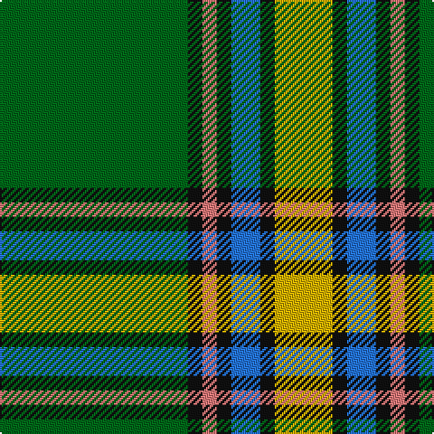

In pattern [GKRKBKY](/stripes/gkrkbky/).

This was sourced from register-of-tartans.  It is a [7 stripe tartan](/stripes/stripes7/).

Original link https://www.tartanregister.gov.uk/tartanDetails.aspx?ref=39

## Register references

External register numbers recorded for this tartan.

- Scottish Register of Tartans: [39](https://www.tartanregister.gov.uk/tartanDetails.aspx?ref=39)
- Scottish Tartans Authority (ITI): 2055
- Scottish Tartans World Register: 2055

## Thread count
G/104 K8 LR8 K8 B16 K8 Y/32

## Palette
Each colour and the base-6 reference it is a variant of.

| Colour | Shade | Base |
|---|---|---|
| B | <code style="background-color:#2474E8;">#2474E8</code> `oklch(57.8% 0.192 258.7)` <small>#2474E8</small> | B <code style="background-color:#2A418A;">#2A418A</code> |
| G | <code style="background-color:#006818;">#006818</code> `oklch(45.0% 0.142 145.0)` <small>#006818</small> | G <code style="background-color:#006100;">#006100</code> |
| K | <code style="background-color:#101010;">#101010</code> `oklch(17.3% 0.000 89.9)` <small>#101010</small> | K <code style="background-color:#000000;">#000000</code> |
| LR | <code style="background-color:#E87878;">#E87878</code> `oklch(70.0% 0.139 21.2)` <small>#E87878</small> | R <code style="background-color:#CC0000;">#CC0000</code> |
| Y | <code style="background-color:#D8B000;">#D8B000</code> `oklch(77.1% 0.158 92.3)` <small>#D8B000</small> | Y <code style="background-color:#F2BF00;">#F2BF00</code> |

# Sample pattern

## Nearest tartans

The nearest existing variants by ΔTartan distance.

1. [Alberta (District)](/setts/s7/g12k1r1k1b2k1ly4~x8/) — ΔT 0.29
1. [Alberta District Tartan Tartan Number: 2055. Earliest known date: 1961 Designed for the Edmonton Rehabilitation Society as a project for handloom weaving by disabled students. The Provincial Legislative of Alberta gave formal approval for the Alberta tartan in 1961. See products available Copyright © Blair Urquhart, Comrie, 2015](/setts/s7/g12k1r1k1t2k1ly4~x2/) — ΔT 0.41
1. [O'Neill](/setts/s8/w6g5r5g45k4o24k4g5~x2/) — ΔT 0.74
1. [Humphries (Name)](/setts/s8/g18r1lb2k1lb2r1o6k2~x4/) — ΔT 0.76
1. [O'Neill (Name)](/setts/s8/w6g5r5g45k4lo24k4g5~x2/) — ΔT 0.86
1. [Carrick, hunting](/setts/s8/g13p1g1p1g3db5k4ly2~x2/) — ΔT 0.97
1. [Hall (P.I.E.) (Personal)](/setts/s8/ly5g3ly3g53r7db5r13w4~x2/) — ΔT 1.00
1. [Manitoba](/setts/s8/t2g1t1g12dg2g1m6ly2~x4/) — ΔT 1.06
1. [New World Irish (Fashion)](/setts/s8/w9dg2g2w3g18k2dg33lo2~x2/) — ΔT 1.08
1. [Boucherville (Tartan de..) District Tartan Tartan Number: 2119. Earliest known date: 1990 From the notes accompanying the petition for accreditation. "Les symboles ont cette remarquable propriete de reunir en une expression imagee des notions diverses. Ils refletent l'histoire, les croyances, les idealogies et les aspirations de groupes humains habitant un territoire precis. Les tisserands, c'est nous tous....!" See products available Copyright © Blair Urquhart, Comrie, 2015](/setts/s9/g20ly2o5w4g2o2g2o2db6~x2/) — ΔT 1.12

## Neighbour map

Every grey dot is one of 14299 variants placed by the first two principal components of the ΔTartan feature space (44% of its variance). Red is this tartan; blue dots are its nearest — click one to open its page.

<svg viewBox="0 0 640 380" role="img" style="max-width:100%;height:auto;border:1px solid #e0e0e0;border-radius:4px;display:block" xmlns="http://www.w3.org/2000/svg"><image href="/nn/cloud.v1.png" width="640" height="380"/><a href="/setts/s7/g12k1r1k1b2k1ly4~x8/"><circle cx="270.8" cy="156.5" r="4" fill="#3465a4"><title>Alberta (District)</title></circle></a><a href="/setts/s7/g12k1r1k1t2k1ly4~x2/"><circle cx="270.5" cy="155.3" r="4" fill="#3465a4"><title>Alberta District Tartan Tartan Number: 2055. Earliest known date: 1961 Designed for the Edmonton Rehabilitation Society as a project for handloom weaving by disabled students. The Provincial Legislative of Alberta gave formal approval for the Alberta tartan in 1961. See products available Copyright © Blair Urquhart, Comrie, 2015</title></circle></a><a href="/setts/s8/w6g5r5g45k4o24k4g5~x2/"><circle cx="283.5" cy="159.2" r="4" fill="#3465a4"><title>O'Neill</title></circle></a><a href="/setts/s8/g18r1lb2k1lb2r1o6k2~x4/"><circle cx="289.8" cy="129.2" r="4" fill="#3465a4"><title>Humphries (Name)</title></circle></a><a href="/setts/s8/w6g5r5g45k4lo24k4g5~x2/"><circle cx="299.6" cy="167.3" r="4" fill="#3465a4"><title>O'Neill (Name)</title></circle></a><a href="/setts/s8/g13p1g1p1g3db5k4ly2~x2/"><circle cx="260.2" cy="159.0" r="4" fill="#3465a4"><title>Carrick, hunting</title></circle></a><a href="/setts/s8/ly5g3ly3g53r7db5r13w4~x2/"><circle cx="345.3" cy="131.6" r="4" fill="#3465a4"><title>Hall (P.I.E.) (Personal)</title></circle></a><a href="/setts/s8/t2g1t1g12dg2g1m6ly2~x4/"><circle cx="267.4" cy="167.1" r="4" fill="#3465a4"><title>Manitoba</title></circle></a><a href="/setts/s8/w9dg2g2w3g18k2dg33lo2~x2/"><circle cx="270.3" cy="149.8" r="4" fill="#3465a4"><title>New World Irish (Fashion)</title></circle></a><a href="/setts/s9/g20ly2o5w4g2o2g2o2db6~x2/"><circle cx="258.4" cy="163.8" r="4" fill="#3465a4"><title>Boucherville (Tartan de..) District Tartan Tartan Number: 2119. Earliest known date: 1990 From the notes accompanying the petition for accreditation. &quot;Les symboles ont cette remarquable propriete de reunir en une expression imagee des notions diverses. Ils refletent l'histoire, les croyances, les idealogies et les aspirations de groupes humains habitant un territoire precis. Les tisserands, c'est nous tous....!&quot; See products available Copyright © Blair Urquhart, Comrie, 2015</title></circle></a><circle cx="290.9" cy="152.6" r="5" fill="#c00000"/></svg>

ID: /setts/s7/g13k1r1k1b2k1ly4~x8/
