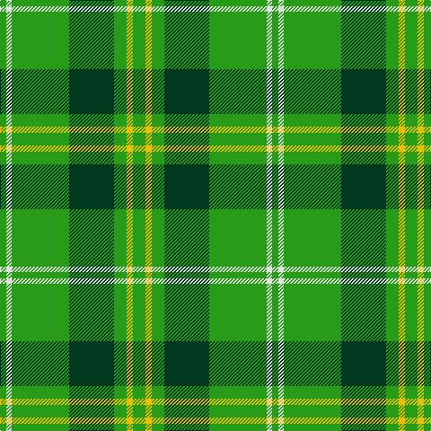

In pattern [GWGGGYG](/patterns/gwgggyg/).

This was sourced from register-of-tartans.  It is a [7 stripes tartan](/stripes/stripes7/).

Original link https://www.tartanregister.gov.uk/tartanDetails.aspx?ref=1277

## Attestations

This cloth appears in 2 source records; the oldest owns this page.

- 01/03/2007 — Freedom of Derry (register-of-tartans, [record](https://www.tartanregister.gov.uk/tartanDetails.aspx?ref=1277))
- March 2007 — Freedom of Derry (Fashion) (tartans-authority, [record](http://www.tartansauthority.com/tartan-ferret/display/7195/))

## Thread count
G/7 LN6 G64 DG50 G14 Y7 G/14

## Palette
Each colour and its ΔE from the base-6 reference it is a variant of.

| Colour | Shade | Base | ΔE (OKLab) |
|---|---|---|---|
| DG | <code style="background-color:#003820;">#003820</code> `#003820` | G <code style="background-color:#006400;">#006400</code> | 0.16 |
| G | <code style="background-color:#289C18;">#289C18</code> `#289C18` | G <code style="background-color:#006400;">#006400</code> | 0.18 |
| LN | <code style="background-color:#E0E0E0;">#E0E0E0</code> `#E0E0E0` | W <code style="background-color:#F4F4F0;">#F4F4F0</code> | 0.06 |
| Y | <code style="background-color:#E8C000;">#E8C000</code> `#E8C000` | Y <code style="background-color:#E8C000;">#E8C000</code> | 0.00 |

# Sample pattern

ID: /setts/s7/g14y7g14ga50g64w6g7-g289c18-ga003820-we0e0e0-ye8c000/
