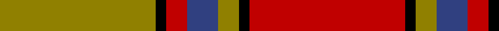
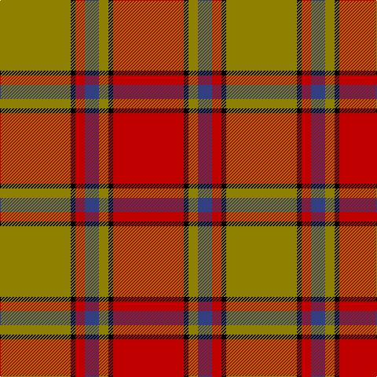

In pattern [GKRBGKR](/patterns/gkrbgkr/).

This was sourced from weddslist.  It is a [7 stripes tartan](/stripes/stripes7/).

Original link http://www.weddslist.com/cgi-bin/tartans/pg.pl?source=sts

## Thread count
LG/90 K6 R12 B18 LG12 K6 R/90

## Palette
Each colour and its ΔE from the base-6 reference it is a variant of.

| Colour | Shade | Base | ΔE (OKLab) |
|---|---|---|---|
| B | <code style="background-color:#304080;">#304080</code> `#304080` | B <code style="background-color:#2A418A;">#2A418A</code> | 0.02 |
| K | <code style="background-color:#000000;">#000000</code> `#000000` | K <code style="background-color:#000000;">#000000</code> | 0.00 |
| LG | <code style="background-color:#908000;">#908000</code> `#908000` | G <code style="background-color:#006100;">#006100</code> | 0.20 |
| R | <code style="background-color:#C00000;">#C00000</code> `#C00000` | R <code style="background-color:#CC0000;">#CC0000</code> | 0.03 |

# Sample pattern

## Nearest tartans

The nearest existing variants by ΔTartan distance.

1. [MacNab 6](/setts/s7/g28r7ra7g14ra7r48k4x2~g008000-k000000-rc00000-ra802040/) — ΔT 0.84
1. [MacNab 5](/setts/s7/g6r2ra2g4ra2r12k1x2~g008000-k000000-rc00000-ra900030/) — ΔT 0.88
1. [MacNab (Crimson)](/setts/s7/g28r7ra7g14ra7r48k4x2~g005020-k101010-rdc0000-ra781c38/) — ΔT 0.89
1. [Lennox District Tartan Tartan Number: 935. Earliest known date: pre 1600 Families with the surname 'Lennox' are usually considered related to Clans Stewart or MacFarlane. Some of this surname also choose to wear the distinctive and ancient 'Lennox' tartan. D W Stewart reproduced the sett from a 'lost' portrait of the Countess of Lennox dating from the 16th century. See products available Copyright © Blair Urquhart, Comrie, 2015](/setts/s7/g2w1g10r2ra10r1ra2x2~g006818-r880000-rac80000-we0e0e0/) — ΔT 0.89
1. [Scrymgeour (Clan)](/setts/s7/r15k1y2g3r2k1y15x6~g408060-k101010-rc80000-yd09800/) — ΔT 0.90
1. [Lennox](/setts/s7/g2y1g10r2ra10r1ra2x4~g006818-r880000-rac80000-yb8b8b8/) — ΔT 0.96
1. [Denny Hunting Clan Tartan Tartan Number: 518. Earliest known date: pre 2003 This tartan is remarkably similar to the Durham sett designed by Wilson's of Bannockburn around 1819. The variation in proportions may point to a deliberate modification suggested by the links between the names. See products available Copyright © Blair Urquhart, Comrie, 2015](/setts/s6/b1r16g6k1g6k1x2~b2c2c80-g006818-k101010-rc80000/) — ΔT 1.00
1. [MacNab #3](/setts/s7/g6r2ra2g4ra2r12k1x2~g005020-k101010-rdc0000-ra960028/) — ΔT 1.02
1. [MacNab VS](/setts/s7/g6r2ra2g4ra2r12k1x2~g004c00-k000000-rc80000-raff0000/) — ΔT 1.07
1. [Lennox](/setts/s7/g2w1g10r2ra10r1ra2x2~g008000-r800000-rac00000-we0e0e0/) — ΔT 1.09

## Neighbour map

Every grey dot is one of 15726 variants placed by the first two principal components of the ΔTartan feature space (44% of its variance). Red is this tartan; blue dots are its nearest — click one to open its page.

<svg viewBox="0 0 640 380" role="img" style="max-width:100%;height:auto;border:1px solid #e0e0e0;border-radius:4px;display:block" xmlns="http://www.w3.org/2000/svg"><image href="/nn/cloud.v1.png" width="640" height="380"/><a href="/setts/s7/g28r7ra7g14ra7r48k4x2~g008000-k000000-rc00000-ra802040/"><circle cx="288.8" cy="188.0" r="4" fill="#3465a4"><title>MacNab 6</title></circle></a><a href="/setts/s7/g6r2ra2g4ra2r12k1x2~g008000-k000000-rc00000-ra900030/"><circle cx="287.7" cy="191.4" r="4" fill="#3465a4"><title>MacNab 5</title></circle></a><a href="/setts/s7/g28r7ra7g14ra7r48k4x2~g005020-k101010-rdc0000-ra781c38/"><circle cx="298.0" cy="188.7" r="4" fill="#3465a4"><title>MacNab (Crimson)</title></circle></a><a href="/setts/s7/g2w1g10r2ra10r1ra2x2~g006818-r880000-rac80000-we0e0e0/"><circle cx="276.5" cy="193.8" r="4" fill="#3465a4"><title>Lennox District Tartan Tartan Number: 935. Earliest known date: pre 1600 Families with the surname 'Lennox' are usually considered related to Clans Stewart or MacFarlane. Some of this surname also choose to wear the distinctive and ancient 'Lennox' tartan. D W Stewart reproduced the sett from a 'lost' portrait of the Countess of Lennox dating from the 16th century. See products available Copyright © Blair Urquhart, Comrie, 2015</title></circle></a><a href="/setts/s7/r15k1y2g3r2k1y15x6~g408060-k101010-rc80000-yd09800/"><circle cx="311.3" cy="162.5" r="4" fill="#3465a4"><title>Scrymgeour (Clan)</title></circle></a><a href="/setts/s7/g2y1g10r2ra10r1ra2x4~g006818-r880000-rac80000-yb8b8b8/"><circle cx="284.5" cy="197.1" r="4" fill="#3465a4"><title>Lennox</title></circle></a><a href="/setts/s6/b1r16g6k1g6k1x2~b2c2c80-g006818-k101010-rc80000/"><circle cx="342.8" cy="179.3" r="4" fill="#3465a4"><title>Denny Hunting Clan Tartan Tartan Number: 518. Earliest known date: pre 2003 This tartan is remarkably similar to the Durham sett designed by Wilson's of Bannockburn around 1819. The variation in proportions may point to a deliberate modification suggested by the links between the names. See products available Copyright © Blair Urquhart, Comrie, 2015</title></circle></a><a href="/setts/s7/g6r2ra2g4ra2r12k1x2~g005020-k101010-rdc0000-ra960028/"><circle cx="297.9" cy="192.2" r="4" fill="#3465a4"><title>MacNab #3</title></circle></a><a href="/setts/s7/g6r2ra2g4ra2r12k1x2~g004c00-k000000-rc80000-raff0000/"><circle cx="285.1" cy="186.8" r="4" fill="#3465a4"><title>MacNab VS</title></circle></a><a href="/setts/s7/g2w1g10r2ra10r1ra2x2~g008000-r800000-rac00000-we0e0e0/"><circle cx="269.3" cy="191.6" r="4" fill="#3465a4"><title>Lennox</title></circle></a><circle cx="305.5" cy="167.2" r="5" fill="#c00000"/></svg>

ID: /setts/s7/g15k1r2b3g2k1r15x6~b304080-g908000-k000000-rc00000/
