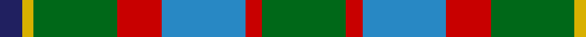
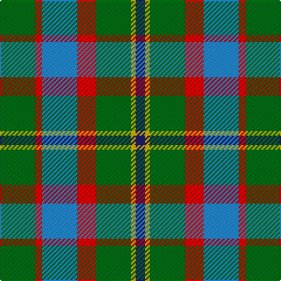

In pattern [BYGRBRG](/stripes/bygrbrg/).

This was sourced from register-of-tartans.  It is a [7 stripe tartan](/stripes/stripes7/).

Original link https://www.tartanregister.gov.uk/tartanDetails.aspx?ref=3570

## Also known as

This cloth is also recorded under:

- Rotary International

## Attestations

This cloth appears in 2 source records; the oldest owns this page.

- 01/01/1993 — Rotary International (register-of-tartans, [record](https://www.tartanregister.gov.uk/tartanDetails.aspx?ref=3570))
- Mar. 1996 — Rotary International (Corporate) (tartans-authority, [record](http://www.tartansauthority.com/tartan-ferret/display/2334/))

## Register references

External register numbers recorded for this tartan.

- Scottish Register of Tartans: [3570](https://www.tartanregister.gov.uk/tartanDetails.aspx?ref=3570)
- Scottish Tartans Authority (ITI): 2334
- Scottish Tartans World Register: 2334

## Thread count
G/30 R6 B30 R16 G30 Y4 DB/8

## Palette
Each colour and the base-6 reference it is a variant of.

| Colour | Shade | Base |
|---|---|---|
| B | <code style="background-color:#2888C4;">#2888C4</code> `oklch(60.1% 0.125 241.5)` <small>#2888C4</small> | B <code style="background-color:#2A418A;">#2A418A</code> |
| DB | <code style="background-color:#202060;">#202060</code> `oklch(28.9% 0.111 276.9)` <small>#202060</small> | B <code style="background-color:#2A418A;">#2A418A</code> |
| G | <code style="background-color:#006818;">#006818</code> `oklch(45.0% 0.142 145.0)` <small>#006818</small> | G <code style="background-color:#006100;">#006100</code> |
| R | <code style="background-color:#C80000;">#C80000</code> `oklch(52.3% 0.215 29.2)` <small>#C80000</small> | R <code style="background-color:#CC0000;">#CC0000</code> |
| Y | <code style="background-color:#D8B000;">#D8B000</code> `oklch(77.1% 0.158 92.3)` <small>#D8B000</small> | Y <code style="background-color:#F2BF00;">#F2BF00</code> |

# Sample pattern

## Nearest tartans

The nearest existing variants by ΔTartan distance, with this tartan at the top so the swatches line up against it.

ΔTartan

Tartan

Sett

—

<a href="/ttd/edit/#slug=g15r3t15r8g15ly2db4~x2">Rotary International</a> <a class="nn-out" href="/setts/s7/g15r3t15r8g15ly2db4~x2/" title="open its dictionary page">↗</a>

0.87

<a href="/ttd/edit/#slug=g25r4db25r13g25ly2t6~x2">Rotary</a> <a class="nn-out" href="/setts/s7/g25r4db25r13g25ly2t6~x2/" title="open its dictionary page">↗</a>

1.07

<a href="/ttd/edit/#slug=n8ly2n22dg6r2lb10dg12n3~x2">Bahamas</a> <a class="nn-out" href="/setts/s8/n8ly2n22dg6r2lb10dg12n3~x2/" title="open its dictionary page">↗</a>

1.18

<a href="/ttd/edit/#slug=g14dp11y3k5y3dp11g14ly2~x2">Wilson's No.124</a> <a class="nn-out" href="/setts/s8/g14dp11y3k5y3dp11g14ly2~x2/" title="open its dictionary page">↗</a>

1.20

<a href="/ttd/edit/#slug=g14dt11y3k5y3dt11g14ly2~x2">Wilson's No.122</a> <a class="nn-out" href="/setts/s8/g14dt11y3k5y3dt11g14ly2~x2/" title="open its dictionary page">↗</a>

1.21

<a href="/setts/s12/g15r3t15r8g15ly2db4~x2/">Rotary Corporate Tartan Tartan Number: 2334. Earliest known date: 1996 March 1996. Check colours. Sample in STA Johnston Collection. Woven by Lochcarron of Scotland. STS entry says that it was launched at the Rotary World Convention, Glasgow, 1997 and indicates that it was designed by the Tartans Society (Keith Lumsden) for Rotary International. A counter claim suggests that Geoffrey (Tailor) was the designer. He's certainly the official supplier and can be contacted on 0131 557 0256 - 17.9.04 - &quot;only polyviscose left and when that's finished, they won't be stocking any more.&quot; See products available Copyright © Blair Urquhart, Comrie, 2015</a>

1.24

<a href="/ttd/edit/#slug=n8ly2n22g6r2lb10g12n3~x2">Bahamas (District)</a> <a class="nn-out" href="/setts/s8/n8ly2n22g6r2lb10g12n3~x2/" title="open its dictionary page">↗</a>

1.25

<a href="/ttd/edit/#slug=lo30w4lo20g20k20lo3k6~x2">St Andrews Bay</a> <a class="nn-out" href="/setts/s7/lo30w4lo20g20k20lo3k6~x2/" title="open its dictionary page">↗</a>

1.25

<a href="/ttd/edit/#slug=g10dp42r5g42g42ly5g6">New Mexico (Fashion)</a> <a class="nn-out" href="/setts/s7/g10dp42r5g42g42ly5g6/" title="open its dictionary page">↗</a>

1.26

<a href="/ttd/edit/#slug=g31ly4g6k19db18t9~x2">Lanarkshire</a> <a class="nn-out" href="/setts/s6/g31ly4g6k19db18t9~x2/" title="open its dictionary page">↗</a>

1.31

<a href="/ttd/edit/#slug=g15ly3r3dp8w2~x6">ChuMac (Personal)</a> <a class="nn-out" href="/setts/s5/g15ly3r3dp8w2~x6/" title="open its dictionary page">↗</a>

## Neighbour map

Every grey dot is one of 14299 variants placed by the first two principal components of the ΔTartan feature space (44% of its variance). Red is this tartan; blue dots are its nearest — click one to open its page.

<svg viewBox="0 0 640 380" role="img" style="max-width:100%;height:auto;border:1px solid #e0e0e0;border-radius:4px;display:block" xmlns="http://www.w3.org/2000/svg"><image href="/nn/cloud.v1.png" width="640" height="380"/><a href="/setts/s7/g25r4db25r13g25ly2t6~x2/"><circle cx="242.9" cy="204.8" r="4" fill="#3465a4"><title>Rotary</title></circle></a><a href="/setts/s8/n8ly2n22dg6r2lb10dg12n3~x2/"><circle cx="249.2" cy="195.7" r="4" fill="#3465a4"><title>Bahamas</title></circle></a><a href="/setts/s8/g14dp11y3k5y3dp11g14ly2~x2/"><circle cx="184.9" cy="220.5" r="4" fill="#3465a4"><title>Wilson's No.124</title></circle></a><a href="/setts/s8/g14dt11y3k5y3dt11g14ly2~x2/"><circle cx="200.1" cy="241.9" r="4" fill="#3465a4"><title>Wilson's No.122</title></circle></a><a href="/setts/s12/g15r3t15r8g15ly2db4~x2/"><circle cx="170.7" cy="199.8" r="4" fill="#3465a4"><title>Rotary Corporate Tartan Tartan Number: 2334. Earliest known date: 1996 March 1996. Check colours. Sample in STA Johnston Collection. Woven by Lochcarron of Scotland. STS entry says that it was launched at the Rotary World Convention, Glasgow, 1997 and indicates that it was designed by the Tartans Society (Keith Lumsden) for Rotary International. A counter claim suggests that Geoffrey (Tailor) was the designer. He's certainly the official supplier and can be contacted on 0131 557 0256 - 17.9.04 - &quot;only polyviscose left and when that's finished, they won't be stocking any more.&quot; See products available Copyright © Blair Urquhart, Comrie, 2015</title></circle></a><a href="/setts/s8/n8ly2n22g6r2lb10g12n3~x2/"><circle cx="261.0" cy="201.8" r="4" fill="#3465a4"><title>Bahamas (District)</title></circle></a><a href="/setts/s7/lo30w4lo20g20k20lo3k6~x2/"><circle cx="199.3" cy="197.7" r="4" fill="#3465a4"><title>St Andrews Bay</title></circle></a><a href="/setts/s7/g10dp42r5g42g42ly5g6/"><circle cx="171.8" cy="197.9" r="4" fill="#3465a4"><title>New Mexico (Fashion)</title></circle></a><a href="/setts/s6/g31ly4g6k19db18t9~x2/"><circle cx="165.2" cy="232.1" r="4" fill="#3465a4"><title>Lanarkshire</title></circle></a><a href="/setts/s5/g15ly3r3dp8w2~x6/"><circle cx="205.8" cy="210.4" r="4" fill="#3465a4"><title>ChuMac (Personal)</title></circle></a><circle cx="205.9" cy="226.5" r="5" fill="#c00000"/></svg>

ID: /setts/s7/g15r3t15r8g15ly2db4~x2/
