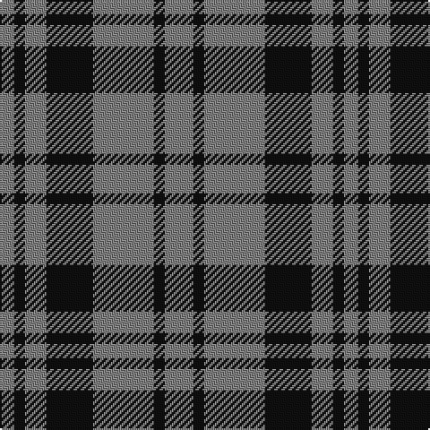

In pattern [GKGKGKG](/patterns/gkgkgkg/).

This was sourced from register-of-tartans.  It is a [7 stripes tartan](/stripes/stripes7/).

Original link https://www.tartanregister.gov.uk/tartanDetails.aspx?ref=3696

## Thread count
N/8 K6 N12 K26 N34 K6 N/16

## Palette
Each colour and its ΔE from the base-6 reference it is a variant of.

| Colour | Shade | Base | ΔE (OKLab) |
|---|---|---|---|
| K | <code style="background-color:#101010;">#101010</code> `#101010` | K <code style="background-color:#000000;">#000000</code> | 0.17 |
| N | <code style="background-color:#808080;">#808080</code> `#808080` | G <code style="background-color:#006400;">#006400</code> | 0.22 |

# Sample pattern

## Nearest tartans

The nearest existing variants by ΔTartan distance.

1. [Scott Black & Grey (Corporate)](/setts/s7/r16k6r34k26r12k6r8-k101010-r888888/) — ΔT 0.25
1. [Unidentified, Sample](/setts/s6/b22r8y18b8y4b22-b304080-rc00000-yf0c000/) — ΔT 1.47
1. [Unidentified Sample](/setts/s6/b22r8y18b8y4b22-b2c4084-rdc0000-ye8c000/) — ΔT 1.49
1. [Bute Heather, Black](/setts/s10/k12g40k12g8k8g16g4k16g4k10-g808080-k101010/) — ΔT 1.49
1. [Wilson's, No 211](/setts/s4/g32b16g4b8-b800080-g008000/) — ΔT 1.55
1. [Tokharion](/setts/s6/b4y20b4y20b8w4-b2c2c80-we0e0e0-ya08858/) — ΔT 1.61
1. [Special Saffron](/setts/s6/g86y44g21y44g86b10-b2888c4-g003820-ydc943c/) — ΔT 1.67
1. [Latin](/setts/s6/b6y18b6y18b40r6-b2c2c80-rc8002c-ybc8c00/) — ΔT 1.70
1. [Douglas, Grey (Vestiarium Scoticum)](/setts/s8/k40r4k8r4k16r40k4r8-k101010-r888888/) — ΔT 1.76
1. [Grey Breton](/setts/s9/b14k19b14k6b14k6b14k47b6-b666666-k101010/) — ΔT 1.78

## Neighbour map

Every grey dot is one of 15726 variants placed by the first two principal components of the ΔTartan feature space (44% of its variance). Red is this tartan; blue dots are its nearest — click one to open its page.

<svg viewBox="0 0 640 380" role="img" style="max-width:100%;height:auto;border:1px solid #e0e0e0;border-radius:4px;display:block" xmlns="http://www.w3.org/2000/svg"><image href="/nn/cloud.v1.png" width="640" height="380"/><a href="/setts/s7/r16k6r34k26r12k6r8-k101010-r888888/"><circle cx="357.2" cy="270.8" r="4" fill="#3465a4"><title>Scott Black &amp; Grey (Corporate)</title></circle></a><a href="/setts/s6/b22r8y18b8y4b22-b304080-rc00000-yf0c000/"><circle cx="296.2" cy="267.2" r="4" fill="#3465a4"><title>Unidentified, Sample</title></circle></a><a href="/setts/s6/b22r8y18b8y4b22-b2c4084-rdc0000-ye8c000/"><circle cx="294.8" cy="267.2" r="4" fill="#3465a4"><title>Unidentified Sample</title></circle></a><a href="/setts/s10/k12g40k12g8k8g16g4k16g4k10-g808080-k101010/"><circle cx="340.1" cy="228.1" r="4" fill="#3465a4"><title>Bute Heather, Black</title></circle></a><a href="/setts/s4/g32b16g4b8-b800080-g008000/"><circle cx="376.5" cy="281.7" r="4" fill="#3465a4"><title>Wilson's, No 211</title></circle></a><a href="/setts/s6/b4y20b4y20b8w4-b2c2c80-we0e0e0-ya08858/"><circle cx="362.0" cy="260.0" r="4" fill="#3465a4"><title>Tokharion</title></circle></a><a href="/setts/s6/g86y44g21y44g86b10-b2888c4-g003820-ydc943c/"><circle cx="356.0" cy="257.0" r="4" fill="#3465a4"><title>Special Saffron</title></circle></a><a href="/setts/s6/b6y18b6y18b40r6-b2c2c80-rc8002c-ybc8c00/"><circle cx="305.6" cy="240.3" r="4" fill="#3465a4"><title>Latin</title></circle></a><a href="/setts/s8/k40r4k8r4k16r40k4r8-k101010-r888888/"><circle cx="352.6" cy="221.5" r="4" fill="#3465a4"><title>Douglas, Grey (Vestiarium Scoticum)</title></circle></a><a href="/setts/s9/b14k19b14k6b14k6b14k47b6-b666666-k101010/"><circle cx="366.7" cy="257.0" r="4" fill="#3465a4"><title>Grey Breton</title></circle></a><circle cx="363.9" cy="274.3" r="5" fill="#c00000"/></svg>

ID: /setts/s7/g16k6g34k26g12k6g8-g808080-k101010/
