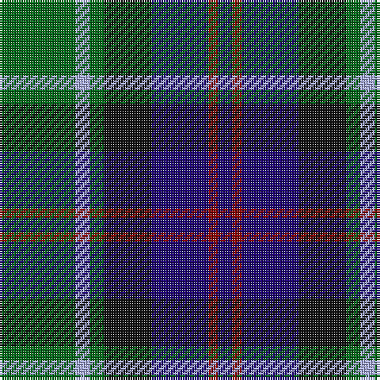

This page is one **sett** — a single exact thread-count. It belongs to the [tartan](/tartans/g16lb3g3k10db12r2db3/)
(the same proportion at any scale), whose colour order is pattern [BRBKGWG](/stripes/brbkgwg/).

Sourced from tartans-authority.  It is a [7 stripe tartan](/stripes/stripes7/).

Original link http://www.tartansauthority.com/tartan-ferret/display/3440/

2 attestations — the source records this cloth was collapsed from (oldest owns this page)

<ul>
<li>pre 2002 — MacLean, Donald (Personal) (tartans-authority, <a href="http://www.tartansauthority.com/tartan-ferret/display/3440/">record</a>)</li>
<li>undated — MacLean, Donald (Personal) (register-of-tartans, <a href="https://www.tartanregister.gov.uk/tartanDetails.aspx?ref=5205">record</a>)</li>
</ul>

## Register references

External register numbers recorded for this tartan.

- Scottish Register of Tartans: [5205](https://www.tartanregister.gov.uk/tartanDetails.aspx?ref=5205)
- Scottish Tartans Authority (ITI): 3440

## Thread count
G/32 LP6 G6 K20 DB24 DR4 DB/6

## Palette

Palette: <strong>Tartan Register</strong>
<table><thead><tr><th>Colour</th><th>Threads</th><th>Shade</th><th>Base</th><th>OKLCh</th></tr></thead><tbody><tr><td>G/</td><td style="text-align:right;font-variant-numeric:tabular-nums">32</td><td><code style="background-color:#006818;">#006818</code> <small style="color:#888">#006818</small></td><td>G <code style="background-color:#006100;">#006100</code></td><td><small style="color:#888">oklch(45.0% 0.142 145.0)</small></td></tr><tr><td>LP</td><td style="text-align:right;font-variant-numeric:tabular-nums">6</td><td><code style="background-color:#A8ACE8;">#A8ACE8</code> <small style="color:#888">#A8ACE8</small></td><td>W <code style="background-color:#F7F7F7;">#F7F7F7</code></td><td><small style="color:#888">oklch(76.3% 0.086 281.2)</small></td></tr><tr><td>G</td><td style="text-align:right;font-variant-numeric:tabular-nums">6</td><td><code style="background-color:#006818;">#006818</code> <small style="color:#888">#006818</small></td><td>G <code style="background-color:#006100;">#006100</code></td><td><small style="color:#888">oklch(45.0% 0.142 145.0)</small></td></tr><tr><td>K</td><td style="text-align:right;font-variant-numeric:tabular-nums">20</td><td><code style="background-color:#101010;">#101010</code> <small style="color:#888">#101010</small></td><td>K <code style="background-color:#000000;">#000000</code></td><td><small style="color:#888">oklch(17.3% 0.000 89.9)</small></td></tr><tr><td>DB</td><td style="text-align:right;font-variant-numeric:tabular-nums">24</td><td><code style="background-color:#1C0070;">#1C0070</code> <small style="color:#888">#1C0070</small></td><td>B <code style="background-color:#2A418A;">#2A418A</code></td><td><small style="color:#888">oklch(26.3% 0.162 277.1)</small></td></tr><tr><td>DR</td><td style="text-align:right;font-variant-numeric:tabular-nums">4</td><td><code style="background-color:#880000;">#880000</code> <small style="color:#888">#880000</small></td><td>R <code style="background-color:#CC0000;">#CC0000</code></td><td><small style="color:#888">oklch(39.4% 0.162 29.2)</small></td></tr><tr><td>DB/</td><td style="text-align:right;font-variant-numeric:tabular-nums">6</td><td><code style="background-color:#1C0070;">#1C0070</code> <small style="color:#888">#1C0070</small></td><td>B <code style="background-color:#2A418A;">#2A418A</code></td><td><small style="color:#888">oklch(26.3% 0.162 277.1)</small></td></tr></tbody></table>

# Sample pattern

## Nearest tartans

The nearest existing variants by ΔTartan distance, with this tartan at the top so the swatches line up against it.

ΔTartan

Tartan

Sett

—

<a href="/ttd/edit/#slug=g16lb3g3k10db12r2db3~x2">MacLean, Donald (Personal)</a> <a class="nn-out" href="/setts/s7/g16lb3g3k10db12r2db3~x2/" title="open its dictionary page">↗</a>

0.62

<a href="/ttd/edit/#slug=t4g14ly2k14db14k2db3~x2">Hogarth of Firhill (Clan)</a> <a class="nn-out" href="/setts/s7/t4g14ly2k14db14k2db3~x2/" title="open its dictionary page">↗</a>

0.66

<a href="/ttd/edit/#slug=r4db24k12g14k4lb3~x2">MacPhail Hunting #2</a> <a class="nn-out" href="/setts/s6/r4db24k12g14k4lb3~x2/" title="open its dictionary page">↗</a>

0.68

<a href="/ttd/edit/#slug=k2g17k16r2db17w2~x2">Galbraith</a> <a class="nn-out" href="/setts/s6/k2g17k16r2db17w2~x2/" title="open its dictionary page">↗</a>

0.73

<a href="/ttd/edit/#slug=k1g8w1k8db8r1~x4">Leslie Hunting</a> <a class="nn-out" href="/setts/s6/k1g8w1k8db8r1~x4/" title="open its dictionary page">↗</a>

0.74

<a href="/ttd/edit/#slug=r2k1db8k8g8k1t2~x2">Argyll</a> <a class="nn-out" href="/setts/s7/r2k1db8k8g8k1t2~x2/" title="open its dictionary page">↗</a>

0.74

<a href="/ttd/edit/#slug=r2k1db8k8g8k1t2~x4">Campbell of Cawdor</a> <a class="nn-out" href="/setts/s7/r2k1db8k8g8k1t2~x4/" title="open its dictionary page">↗</a>

0.74

<a href="/ttd/edit/#slug=r2k1db8k8g8k1y2~x2">Campbell of Cawdor Clan Tartan Tartan Number: 2. Earliest known date: 1798 Campbell of Cawdor is one of Wilson's variations based on the military sett. It was originally a numbered pattern, acquiring the name 'Argyle' in 1798 and 'Argylle' in 1819. It is not until W. and A. Smith's work of 1850 that the full title is given, 'Campbell of Cawdor'. This sett is authorized by the present Clan Chief, MacCailien Mor. See products available Copyright © Blair Urquhart, Comrie, 2015</a> <a class="nn-out" href="/setts/s7/r2k1db8k8g8k1y2~x2/" title="open its dictionary page">↗</a>

0.74

<a href="/ttd/edit/#slug=r3g16w2k16db16k2db2~x2">Colquhoun Clan Tartan Tartan Number: 274. Earliest known date: 1810-15 The Bonnie Banks and Braes of Loch Lomand were the setting for the interesting and sometimes violent history of the Colquhouns of Luss. Their tartan is well documented, appearing in the earliest collections, and certified by the Chief, with his seal and signature, in the archives of the Highland Society of London. (c.1816). The Clan tartan, in its present form, was woven by Wilson's of Bannockburn at the beginning of the 19th century and recorded in the firms pattern books dated 1819. Wilson often used purple in place of blue and produced proportionately equivalent patterns in different weights of cloth. Logan recorded a similar sett in 1831. The Vestiarium Scoticum shows a pattern with the white stripe next to the blue but this is regarded as an error. See products available Copyright © Blair Urquhart, Comrie, 2015</a> <a class="nn-out" href="/setts/s7/r3g16w2k16db16k2db2~x2/" title="open its dictionary page">↗</a>

0.74

<a href="/ttd/edit/#slug=k3ly3g22db6k17g6db22r3db3~x2">Maresh</a> <a class="nn-out" href="/setts/s9/k3ly3g22db6k17g6db22r3db3~x2/" title="open its dictionary page">↗</a>

0.75

<a href="/ttd/edit/#slug=k4w1g10k10db10r2~x4">Rose Hunting</a> <a class="nn-out" href="/setts/s6/k4w1g10k10db10r2~x4/" title="open its dictionary page">↗</a>

## Neighbour map

Every grey dot is one of 14359 variants placed by the first two principal components of the ΔTartan feature space (44% of its variance). Red is this tartan; blue dots are its nearest — click one to open its page.

<svg viewBox="0 0 640 380" role="img" style="max-width:100%;height:auto;border:1px solid #e0e0e0;border-radius:4px;display:block" xmlns="http://www.w3.org/2000/svg"><image href="/nn/cloud.v1.png" width="640" height="380"/><a href="/setts/s7/t4g14ly2k14db14k2db3~x2/"><circle cx="134.9" cy="222.1" r="4" fill="#3465a4"><title>Hogarth of Firhill (Clan)</title></circle></a><a href="/setts/s6/r4db24k12g14k4lb3~x2/"><circle cx="172.4" cy="222.0" r="4" fill="#3465a4"><title>MacPhail Hunting #2</title></circle></a><a href="/setts/s6/k2g17k16r2db17w2~x2/"><circle cx="151.3" cy="214.5" r="4" fill="#3465a4"><title>Galbraith</title></circle></a><a href="/setts/s6/k1g8w1k8db8r1~x4/"><circle cx="160.6" cy="222.6" r="4" fill="#3465a4"><title>Leslie Hunting</title></circle></a><a href="/setts/s7/r2k1db8k8g8k1t2~x2/"><circle cx="151.0" cy="218.0" r="4" fill="#3465a4"><title>Argyll</title></circle></a><a href="/setts/s7/r2k1db8k8g8k1t2~x4/"><circle cx="151.0" cy="218.0" r="4" fill="#3465a4"><title>Campbell of Cawdor</title></circle></a><a href="/setts/s7/r2k1db8k8g8k1y2~x2/"><circle cx="149.5" cy="216.9" r="4" fill="#3465a4"><title>Campbell of Cawdor Clan Tartan Tartan Number: 2. Earliest known date: 1798 Campbell of Cawdor is one of Wilson's variations based on the military sett. It was originally a numbered pattern, acquiring the name 'Argyle' in 1798 and 'Argylle' in 1819. It is not until W. and A. Smith's work of 1850 that the full title is given, 'Campbell of Cawdor'. This sett is authorized by the present Clan Chief, MacCailien Mor. See products available Copyright © Blair Urquhart, Comrie, 2015</title></circle></a><a href="/setts/s7/r3g16w2k16db16k2db2~x2/"><circle cx="150.2" cy="206.9" r="4" fill="#3465a4"><title>Colquhoun Clan Tartan Tartan Number: 274. Earliest known date: 1810-15 The Bonnie Banks and Braes of Loch Lomand were the setting for the interesting and sometimes violent history of the Colquhouns of Luss. Their tartan is well documented, appearing in the earliest collections, and certified by the Chief, with his seal and signature, in the archives of the Highland Society of London. (c.1816). The Clan tartan, in its present form, was woven by Wilson's of Bannockburn at the beginning of the 19th century and recorded in the firms pattern books dated 1819. Wilson often used purple in place of blue and produced proportionately equivalent patterns in different weights of cloth. Logan recorded a similar sett in 1831. The Vestiarium Scoticum shows a pattern with the white stripe next to the blue but this is regarded as an error. See products available Copyright © Blair Urquhart, Comrie, 2015</title></circle></a><a href="/setts/s9/k3ly3g22db6k17g6db22r3db3~x2/"><circle cx="168.7" cy="203.3" r="4" fill="#3465a4"><title>Maresh</title></circle></a><a href="/setts/s6/k4w1g10k10db10r2~x4/"><circle cx="166.4" cy="224.4" r="4" fill="#3465a4"><title>Rose Hunting</title></circle></a><circle cx="164.3" cy="216.4" r="5" fill="#c00000"/></svg>

ID: /setts/s7/g16lb3g3k10db12r2db3~x2/
