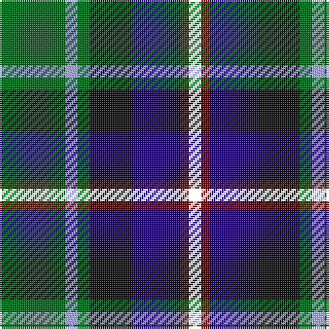

In pattern [GWGKBRK](/stripes/gwgkbrk/).

This was sourced from house-of-tartan.  It is a [7 stripe tartan](/stripes/stripes7/).

Original link http://www.house-of-tartan.scotland.net/house/TartanViewjs.asp?colr=Def&tnam=3440

## Thread count
G/32 LP6 G6 K20 DB24 DR4 B/6

## Palette
Each colour and the base-6 reference it is a variant of.

| Colour | Shade | Base |
|---|---|---|
| DB | <code style="background-color:#1C0070;">#1C0070</code> `oklch(26.3% 0.162 277.1)` <small>#1C0070</small> | B <code style="background-color:#2A418A;">#2A418A</code> |
| DR | <code style="background-color:#880000;">#880000</code> `oklch(39.4% 0.162 29.2)` <small>#880000</small> | R <code style="background-color:#CC0000;">#CC0000</code> |
| G | <code style="background-color:#006818;">#006818</code> `oklch(45.0% 0.142 145.0)` <small>#006818</small> | G <code style="background-color:#006100;">#006100</code> |
| K | <code style="background-color:#101010;">#101010</code> `oklch(17.3% 0.000 89.9)` <small>#101010</small> | K <code style="background-color:#000000;">#000000</code> |
| LP | <code style="background-color:#A8ACE8;">#A8ACE8</code> `oklch(76.3% 0.086 281.2)` <small>#A8ACE8</small> | W <code style="background-color:#F7F7F7;">#F7F7F7</code> |

# Sample pattern

## Nearest tartans

The nearest existing variants by ΔTartan distance.

1. [Blairmore](/setts/s8/db34w5db5r5db5dr26g33o6~x2/) — ΔT 0.73
1. [Morris of Eddergoll (Personal)](/setts/s6/w2db20r3k10g20lo2~x2/) — ΔT 0.80
1. [McComb](/setts/s7/db3r2db18k6dg18ly2g3~x2/) — ΔT 0.80
1. [Royal Burgh of Peebles (District)](/setts/s7/r3g3db4g17k13dt26w3~x2/) — ΔT 0.81
1. [Dobson Name Tartan Tartan Number: 10943. Earliest known date: 2013 Designed by Kelly Dobson Matson for the personal use of the Dobson Family, Palm Bay, Florida, a family of bagpipers, who wish to wear their own tartan while they play. The colours are favoured colours chosen by the majority of the family. See products available Copyright © Blair Urquhart, Comrie, 2015](/setts/s6/g36ly3dy5db18k10k18~x2/) — ΔT 0.87
1. [MacLean, Donald (Personal)](/setts/s7/g16lb3g3k10db12r2db3~x2/) — ΔT 0.95
1. [James (Personal)](/setts/s7/r2k6ly1dg12ly1db6lr2~x4/) — ΔT 0.97
1. [MacCraig](/setts/s9/dr2lb1g7r1k7g1db7r1g2~x8/) — ΔT 0.98
1. [Yates (Personal)](/setts/s8/k29r3dt24n6k8w4n8o6~x2/) — ΔT 1.00
1. [Harvey of Cornwall (Personal)](/setts/s7/w10k52db52dg24ly10dg5r5/) — ΔT 1.01

## Neighbour map

Every grey dot is one of 14299 variants placed by the first two principal components of the ΔTartan feature space (44% of its variance). Red is this tartan; blue dots are its nearest — click one to open its page.

<svg viewBox="0 0 640 380" role="img" style="max-width:100%;height:auto;border:1px solid #e0e0e0;border-radius:4px;display:block" xmlns="http://www.w3.org/2000/svg"><image href="/nn/cloud.v1.png" width="640" height="380"/><a href="/setts/s8/db34w5db5r5db5dr26g33o6~x2/"><circle cx="119.3" cy="179.1" r="4" fill="#3465a4"><title>Blairmore</title></circle></a><a href="/setts/s6/w2db20r3k10g20lo2~x2/"><circle cx="138.9" cy="181.3" r="4" fill="#3465a4"><title>Morris of Eddergoll (Personal)</title></circle></a><a href="/setts/s7/db3r2db18k6dg18ly2g3~x2/"><circle cx="177.3" cy="181.7" r="4" fill="#3465a4"><title>McComb</title></circle></a><a href="/setts/s7/r3g3db4g17k13dt26w3~x2/"><circle cx="155.6" cy="190.3" r="4" fill="#3465a4"><title>Royal Burgh of Peebles (District)</title></circle></a><a href="/setts/s6/g36ly3dy5db18k10k18~x2/"><circle cx="148.7" cy="190.5" r="4" fill="#3465a4"><title>Dobson Name Tartan Tartan Number: 10943. Earliest known date: 2013 Designed by Kelly Dobson Matson for the personal use of the Dobson Family, Palm Bay, Florida, a family of bagpipers, who wish to wear their own tartan while they play. The colours are favoured colours chosen by the majority of the family. See products available Copyright © Blair Urquhart, Comrie, 2015</title></circle></a><a href="/setts/s7/g16lb3g3k10db12r2db3~x2/"><circle cx="164.3" cy="215.2" r="4" fill="#3465a4"><title>MacLean, Donald (Personal)</title></circle></a><a href="/setts/s7/r2k6ly1dg12ly1db6lr2~x4/"><circle cx="163.5" cy="169.8" r="4" fill="#3465a4"><title>James (Personal)</title></circle></a><a href="/setts/s9/dr2lb1g7r1k7g1db7r1g2~x8/"><circle cx="102.8" cy="177.0" r="4" fill="#3465a4"><title>MacCraig</title></circle></a><a href="/setts/s8/k29r3dt24n6k8w4n8o6~x2/"><circle cx="174.7" cy="178.6" r="4" fill="#3465a4"><title>Yates (Personal)</title></circle></a><a href="/setts/s7/w10k52db52dg24ly10dg5r5/"><circle cx="123.6" cy="167.4" r="4" fill="#3465a4"><title>Harvey of Cornwall (Personal)</title></circle></a><circle cx="129.8" cy="196.3" r="5" fill="#c00000"/></svg>

ID: /setts/s7/g16lb3g3k10db12r2k3~x2/
