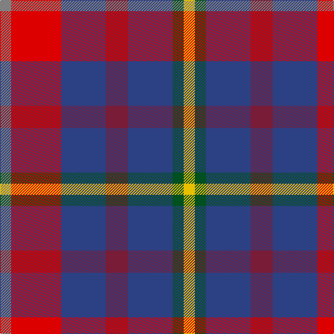

In pattern [GRBRBGY](/patterns/grbrbgy/).

This was sourced from register-of-tartans.  It is a [7 stripes tartan](/stripes/stripes7/).

Original link https://www.tartanregister.gov.uk/tartanDetails.aspx?ref=5889

## Thread count
N/16 R72 B64 DR32 B64 G16 Y/16

## Palette
Each colour and its ΔE from the base-6 reference it is a variant of.

| Colour | Shade | Base | ΔE (OKLab) |
|---|---|---|---|
| B | <code style="background-color:#2C4084;">#2C4084</code> `#2C4084` | B <code style="background-color:#2A418A;">#2A418A</code> | 0.01 |
| DR | <code style="background-color:#781C38;">#781C38</code> `#781C38` | R <code style="background-color:#CC0000;">#CC0000</code> | 0.18 |
| G | <code style="background-color:#005020;">#005020</code> `#005020` | G <code style="background-color:#006100;">#006100</code> | 0.07 |
| N | <code style="background-color:#808080;">#808080</code> `#808080` | G <code style="background-color:#006100;">#006100</code> | 0.23 |
| R | <code style="background-color:#DC0000;">#DC0000</code> `#DC0000` | R <code style="background-color:#CC0000;">#CC0000</code> | 0.03 |
| Y | <code style="background-color:#E8C000;">#E8C000</code> `#E8C000` | Y <code style="background-color:#F2BF00;">#F2BF00</code> | 0.02 |

# Sample pattern

## Nearest tartans

The nearest existing variants by ΔTartan distance.

1. [Feis An Eilein (Corporate)](/setts/s7/w8r36b32ra16b32g8y8-b2c2c80-g006818-rc80000-ra880000-w98c8e8-ye8c000/) — ΔT 0.58
1. [Nicolson of Tiree & Coll (Clan)](/setts/s6/g12b32r44ba12k8bb8-b2c2c80-ba003c64-bb780078-g289c18-k101010-rc80000/) — ΔT 1.10
1. [Sustainability (Fashion)](/setts/s8/b40k6g36r24ba8r24b30y8-b2c2c80-ba2888c4-g006818-k101010-rc80000-ye8c000/) — ΔT 1.13
1. [Hueg (Formal) (Personal)](/setts/s11/b8ba6b26g16r24ga8r24b8r10w8r8-b1474b4-ba003c64-g006818-ga00643c-rc8002c-wfcfcfc/) — ΔT 1.21
1. [Hueg (Munich) Formal (Personal)](/setts/s11/b8ba6b26g16r24ga8r24b8r10w8r8-b5f749c-ba433a5a-g23321b-ga124b24-rca2625-wf9f5ef/) — ΔT 1.32
1. [Lanark (Fashion #1)](/setts/s6/r4b12ba4g12ba20w4-b202060-ba680028-g006818-ra00000-wa8ace8/) — ΔT 1.32
1. [Isle of Gigha (District)](/setts/s7/y16b32k8b32r32y32b8-b202060-k101010-ra00048-ybc8c00/) — ΔT 1.34
1. [Nicolson of Lewis (Clan?)](/setts/s6/b12ba20bb8g20r44w12-b344054-ba003c64-bb5c5c5c-g003820-rc80000-we0e0e0/) — ΔT 1.34
1. [Commonwealth](/setts/s10/b24w8r24w10k8ra24b40r8b10r8-b304080-k000000-rc00000-ra703000-we0e0e0/) — ΔT 1.37
1. [Lord's Own Highlanders (Corporate)](/setts/s6/w10r40k16ra10b72y10-b501850-k101010-r888888-rac80000-we0e0e0-ybc8c00/) — ΔT 1.46

## Neighbour map

Every grey dot is one of 15726 variants placed by the first two principal components of the ΔTartan feature space (44% of its variance). Red is this tartan; blue dots are its nearest — click one to open its page.

<svg viewBox="0 0 640 380" role="img" style="max-width:100%;height:auto;border:1px solid #e0e0e0;border-radius:4px;display:block" xmlns="http://www.w3.org/2000/svg"><image href="/nn/cloud.v1.png" width="640" height="380"/><a href="/setts/s7/w8r36b32ra16b32g8y8-b2c2c80-g006818-rc80000-ra880000-w98c8e8-ye8c000/"><circle cx="136.1" cy="212.7" r="4" fill="#3465a4"><title>Feis An Eilein (Corporate)</title></circle></a><a href="/setts/s6/g12b32r44ba12k8bb8-b2c2c80-ba003c64-bb780078-g289c18-k101010-rc80000/"><circle cx="125.9" cy="202.9" r="4" fill="#3465a4"><title>Nicolson of Tiree &amp; Coll (Clan)</title></circle></a><a href="/setts/s8/b40k6g36r24ba8r24b30y8-b2c2c80-ba2888c4-g006818-k101010-rc80000-ye8c000/"><circle cx="118.7" cy="201.6" r="4" fill="#3465a4"><title>Sustainability (Fashion)</title></circle></a><a href="/setts/s11/b8ba6b26g16r24ga8r24b8r10w8r8-b1474b4-ba003c64-g006818-ga00643c-rc8002c-wfcfcfc/"><circle cx="125.6" cy="198.1" r="4" fill="#3465a4"><title>Hueg (Formal) (Personal)</title></circle></a><a href="/setts/s11/b8ba6b26g16r24ga8r24b8r10w8r8-b5f749c-ba433a5a-g23321b-ga124b24-rca2625-wf9f5ef/"><circle cx="139.9" cy="201.2" r="4" fill="#3465a4"><title>Hueg (Munich) Formal (Personal)</title></circle></a><a href="/setts/s6/r4b12ba4g12ba20w4-b202060-ba680028-g006818-ra00000-wa8ace8/"><circle cx="179.3" cy="243.3" r="4" fill="#3465a4"><title>Lanark (Fashion #1)</title></circle></a><a href="/setts/s7/y16b32k8b32r32y32b8-b202060-k101010-ra00048-ybc8c00/"><circle cx="114.3" cy="249.5" r="4" fill="#3465a4"><title>Isle of Gigha (District)</title></circle></a><a href="/setts/s6/b12ba20bb8g20r44w12-b344054-ba003c64-bb5c5c5c-g003820-rc80000-we0e0e0/"><circle cx="97.7" cy="207.2" r="4" fill="#3465a4"><title>Nicolson of Lewis (Clan?)</title></circle></a><a href="/setts/s10/b24w8r24w10k8ra24b40r8b10r8-b304080-k000000-rc00000-ra703000-we0e0e0/"><circle cx="145.2" cy="202.9" r="4" fill="#3465a4"><title>Commonwealth</title></circle></a><a href="/setts/s6/w10r40k16ra10b72y10-b501850-k101010-r888888-rac80000-we0e0e0-ybc8c00/"><circle cx="176.5" cy="175.8" r="4" fill="#3465a4"><title>Lord's Own Highlanders (Corporate)</title></circle></a><circle cx="150.8" cy="219.2" r="5" fill="#c00000"/></svg>

ID: /setts/s7/g16r72b64ra32b64ga16y16-b2c4084-g808080-ga005020-rdc0000-ra781c38-ye8c000/
