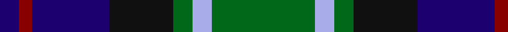

In pattern [BRBKGWG](/patterns/brbkgwg/).

This was sourced from tartans-authority.  It is a [7 stripes tartan](/stripes/stripes7/).

Original link http://www.tartansauthority.com/tartan-ferret/display/3440/

## Attestations

This cloth appears in 2 source records; the oldest owns this page.

- pre 2002 — MacLean, Donald (Personal) (tartans-authority, [record](http://www.tartansauthority.com/tartan-ferret/display/3440/))
- undated — MacLean, Donald (Personal) (register-of-tartans, [record](https://www.tartanregister.gov.uk/tartanDetails.aspx?ref=5205))

## Thread count
DB/6 DR4 DB24 K20 G6 LP6 G/32

## Palette
Each colour and its ΔE from the base-6 reference it is a variant of.

| Colour | Shade | Base | ΔE (OKLab) |
|---|---|---|---|
| DB | <code style="background-color:#1C0070;">#1C0070</code> `#1C0070` | B <code style="background-color:#2A418A;">#2A418A</code> | 0.14 |
| DR | <code style="background-color:#880000;">#880000</code> `#880000` | R <code style="background-color:#CC0000;">#CC0000</code> | 0.15 |
| G | <code style="background-color:#006818;">#006818</code> `#006818` | G <code style="background-color:#006100;">#006100</code> | 0.02 |
| K | <code style="background-color:#101010;">#101010</code> `#101010` | K <code style="background-color:#000000;">#000000</code> | 0.17 |
| LP | <code style="background-color:#A8ACE8;">#A8ACE8</code> `#A8ACE8` | W <code style="background-color:#F7F7F7;">#F7F7F7</code> | 0.23 |

# Sample pattern

## Nearest tartans

The nearest existing variants by ΔTartan distance.

1. [Hogarth of Firhill (Clan)](/setts/s7/b4g14y2k14ba14k2ba3~b5c8ca8-ba2c2c80-g006818-k101010-ye8c000~x2/) — ΔT 0.63
1. [MacLeod of Assynt Clan Tartan Tartan Number: 1582. Earliest known date: 1906 In a portrait of the 24th chief, John Norman, painted posthumously (perhaps by Julius Jacobson, born 1811) in 1835, John Norman is shown in the costume worn for the visit of George IV to Edinburgh in 1822. The snuff-box may be evidence that the Vestiarium 'loud' design, which is very similar to that of the snuff box, had particular significance for John Norman or his wife, Ann Stephenson. (Ruairidh MacLeod, Tartans of Clan MacLeod, 1990.) See products available Copyright © Blair Urquhart, Comrie, 2015](/setts/s6/r3k2g15k10b20y2~b2c2c80-g006818-k101010-rc80000-ye8c000~x2/) — ΔT 0.65
1. [MacPhail Hunting #2](/setts/s6/r4b24k12g14k4w3~b2c2c80-g006818-k101010-rc80000-wc0c0c0~x2/) — ΔT 0.66
1. [Galbraith](/setts/s6/k2g17k16r2b17w2~b2c2c80-g006818-k101010-rc80000-wfcfcfc~x2/) — ΔT 0.68
1. [Leslie Hunting](/setts/s6/k1g8w1k8b8r1~b202060-g006818-k101010-rc80000-we0e0e0~x4/) — ΔT 0.73
1. [Argyll](/setts/s7/b2k1g8k8ba8k1r2~b5c8ca8-ba2c2c80-g006818-k101010-rc80000~x2/) — ΔT 0.74
1. [Campbell of Cawdor](/setts/s7/b2k1g8k8ba8k1r2~b5c8ca8-ba2c2c80-g006818-k101010-rc80000~x4/) — ΔT 0.74
1. [Colquhoun Clan Tartan Tartan Number: 274. Earliest known date: 1810-15 The Bonnie Banks and Braes of Loch Lomand were the setting for the interesting and sometimes violent history of the Colquhouns of Luss. Their tartan is well documented, appearing in the earliest collections, and certified by the Chief, with his seal and signature, in the archives of the Highland Society of London. (c.1816). The Clan tartan, in its present form, was woven by Wilson's of Bannockburn at the beginning of the 19th century and recorded in the firms pattern books dated 1819. Wilson often used purple in place of blue and produced proportionately equivalent patterns in different weights of cloth. Logan recorded a similar sett in 1831. The Vestiarium Scoticum shows a pattern with the white stripe next to the blue but this is regarded as an error. See products available Copyright © Blair Urquhart, Comrie, 2015](/setts/s7/r3g16w2k16b16k2b2~b2c2c80-g006818-k101010-rc80000-we0e0e0~x2/) — ΔT 0.74
1. [Hunter (Galbraith etc)](/setts/s6/k2g17k16r2b17w2~b1c0070-g006818-k101010-rc80000-wf8f8f8~x2/) — ΔT 0.74
1. [Syme (Clan)](/setts/s6/k1g8w1k8b8r1~b1c1c50-g408060-k101010-rc80000-wf8f8f8~x4/) — ΔT 0.74

## Neighbour map

Every grey dot is one of 15726 variants placed by the first two principal components of the ΔTartan feature space (44% of its variance). Red is this tartan; blue dots are its nearest — click one to open its page.

<svg viewBox="0 0 640 380" role="img" style="max-width:100%;height:auto;border:1px solid #e0e0e0;border-radius:4px;display:block" xmlns="http://www.w3.org/2000/svg"><image href="/nn/cloud.v1.png" width="640" height="380"/><a href="/setts/s7/b4g14y2k14ba14k2ba3~b5c8ca8-ba2c2c80-g006818-k101010-ye8c000~x2/"><circle cx="131.1" cy="216.1" r="4" fill="#3465a4"><title>Hogarth of Firhill (Clan)</title></circle></a><a href="/setts/s6/r3k2g15k10b20y2~b2c2c80-g006818-k101010-rc80000-ye8c000~x2/"><circle cx="182.8" cy="204.3" r="4" fill="#3465a4"><title>MacLeod of Assynt Clan Tartan Tartan Number: 1582. Earliest known date: 1906 In a portrait of the 24th chief, John Norman, painted posthumously (perhaps by Julius Jacobson, born 1811) in 1835, John Norman is shown in the costume worn for the visit of George IV to Edinburgh in 1822. The snuff-box may be evidence that the Vestiarium 'loud' design, which is very similar to that of the snuff box, had particular significance for John Norman or his wife, Ann Stephenson. (Ruairidh MacLeod, Tartans of Clan MacLeod, 1990.) See products available Copyright © Blair Urquhart, Comrie, 2015</title></circle></a><a href="/setts/s6/r4b24k12g14k4w3~b2c2c80-g006818-k101010-rc80000-wc0c0c0~x2/"><circle cx="169.3" cy="217.2" r="4" fill="#3465a4"><title>MacPhail Hunting #2</title></circle></a><a href="/setts/s6/k2g17k16r2b17w2~b2c2c80-g006818-k101010-rc80000-wfcfcfc~x2/"><circle cx="147.7" cy="209.8" r="4" fill="#3465a4"><title>Galbraith</title></circle></a><a href="/setts/s6/k1g8w1k8b8r1~b202060-g006818-k101010-rc80000-we0e0e0~x4/"><circle cx="157.1" cy="217.0" r="4" fill="#3465a4"><title>Leslie Hunting</title></circle></a><a href="/setts/s7/b2k1g8k8ba8k1r2~b5c8ca8-ba2c2c80-g006818-k101010-rc80000~x2/"><circle cx="147.6" cy="211.6" r="4" fill="#3465a4"><title>Argyll</title></circle></a><a href="/setts/s7/b2k1g8k8ba8k1r2~b5c8ca8-ba2c2c80-g006818-k101010-rc80000~x4/"><circle cx="147.6" cy="211.6" r="4" fill="#3465a4"><title>Campbell of Cawdor</title></circle></a><a href="/setts/s7/r3g16w2k16b16k2b2~b2c2c80-g006818-k101010-rc80000-we0e0e0~x2/"><circle cx="146.7" cy="201.7" r="4" fill="#3465a4"><title>Colquhoun Clan Tartan Tartan Number: 274. Earliest known date: 1810-15 The Bonnie Banks and Braes of Loch Lomand were the setting for the interesting and sometimes violent history of the Colquhouns of Luss. Their tartan is well documented, appearing in the earliest collections, and certified by the Chief, with his seal and signature, in the archives of the Highland Society of London. (c.1816). The Clan tartan, in its present form, was woven by Wilson's of Bannockburn at the beginning of the 19th century and recorded in the firms pattern books dated 1819. Wilson often used purple in place of blue and produced proportionately equivalent patterns in different weights of cloth. Logan recorded a similar sett in 1831. The Vestiarium Scoticum shows a pattern with the white stripe next to the blue but this is regarded as an error. See products available Copyright © Blair Urquhart, Comrie, 2015</title></circle></a><a href="/setts/s6/k2g17k16r2b17w2~b1c0070-g006818-k101010-rc80000-wf8f8f8~x2/"><circle cx="144.5" cy="209.8" r="4" fill="#3465a4"><title>Hunter (Galbraith etc)</title></circle></a><a href="/setts/s6/k1g8w1k8b8r1~b1c1c50-g408060-k101010-rc80000-wf8f8f8~x4/"><circle cx="144.8" cy="209.8" r="4" fill="#3465a4"><title>Syme (Clan)</title></circle></a><circle cx="160.7" cy="211.6" r="5" fill="#c00000"/></svg>

ID: /setts/s7/g16w3g3k10b12r2b3~b1c0070-g006818-k101010-r880000-wa8ace8~x2/
