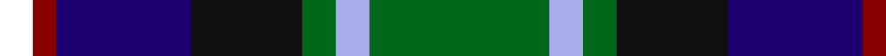
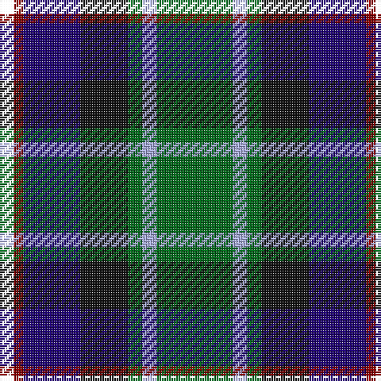

In pattern [GWGKBRK](/patterns/gwgkbrk/).

This was sourced from house-of-tartan.  It is a [7 stripes tartan](/stripes/stripes7/).

Original link http://www.house-of-tartan.scotland.net/house/TartanViewjs.asp?colr=Def&tnam=3440

## Thread count
B/6 DR4 DB24 K20 G6 LP6 G/32

## Palette
Each colour and its ΔE from the base-6 reference it is a variant of.

| Colour | Shade | Base | ΔE (OKLab) |
|---|---|---|---|
| DB | <code style="background-color:#1C0070;">#1C0070</code> `#1C0070` | B <code style="background-color:#2A418A;">#2A418A</code> | 0.14 |
| DR | <code style="background-color:#880000;">#880000</code> `#880000` | R <code style="background-color:#CC0000;">#CC0000</code> | 0.15 |
| G | <code style="background-color:#006818;">#006818</code> `#006818` | G <code style="background-color:#006100;">#006100</code> | 0.02 |
| K | <code style="background-color:#101010;">#101010</code> `#101010` | K <code style="background-color:#000000;">#000000</code> | 0.17 |
| LP | <code style="background-color:#A8ACE8;">#A8ACE8</code> `#A8ACE8` | W <code style="background-color:#F7F7F7;">#F7F7F7</code> | 0.23 |

# Sample pattern

## Nearest tartans

The nearest existing variants by ΔTartan distance.

1. [Blairmore](/setts/s8/b34w5b5r5b5ba26g33ra6~b000050-ba401000-g008000-rc00000-ra806050-we0e0e0~x2/) — ΔT 0.73
1. [Morris of Eddergoll (Personal)](/setts/s6/w2b20r3k10g20y2~b1c0070-g006818-k101010-rc80000-wf8f8f8-yd09800~x2/) — ΔT 0.80
1. [McComb](/setts/s7/b3r2b18k6g18y2ga3~b304080-g003000-ga008000-k000000-rc00000-yf0c000~x2/) — ΔT 0.80
1. [Royal Burgh of Peebles (District)](/setts/s7/r3g3b4g17k13ba26w3~b2c2c80-ba14283c-g006818-k101010-rc80000-wf8f8f8~x2/) — ΔT 0.81
1. [Dobson Name Tartan Tartan Number: 10943. Earliest known date: 2013 Designed by Kelly Dobson Matson for the personal use of the Dobson Family, Palm Bay, Florida, a family of bagpipers, who wish to wear their own tartan while they play. The colours are favoured colours chosen by the majority of the family. See products available Copyright © Blair Urquhart, Comrie, 2015](/setts/s6/g36y3ga5b18k10ka18~b1c1c50-g006838-ga503500-k101010-ka000000-ye4e068~x2/) — ΔT 0.87
1. [MacLean, Donald (Personal)](/setts/s7/g16w3g3k10b12r2b3~b1c0070-g006818-k101010-r880000-wa8ace8~x2/) — ΔT 0.95
1. [James (Personal)](/setts/s7/r2k6y1g12y1b6ya2~b242470-g004828-k101010-rc80000-yb0b430-yab4bcc0~x4/) — ΔT 0.97
1. [MacCraig](/setts/s9/b2w1g7r1k7g1ba7r1g2~b4c0000-ba1c0070-g006818-k000000-r880000-wa8ace8~x8/) — ΔT 0.98
1. [Yates (Personal)](/setts/s8/k29r3b24ba6k8w4ba8ra6~b003c64-ba5c5c5c-k101010-rc80000-ra888888-we0e0e0~x2/) — ΔT 0.99
1. [MacCraig (Clan)](/setts/s9/b2w1g7r1k7g1ba7r1g2~b4c0000-ba1c0070-g006818-k101010-r880000-wa8ace8~x8/) — ΔT 1.00

## Neighbour map

Every grey dot is one of 15726 variants placed by the first two principal components of the ΔTartan feature space (44% of its variance). Red is this tartan; blue dots are its nearest — click one to open its page.

<svg viewBox="0 0 640 380" role="img" style="max-width:100%;height:auto;border:1px solid #e0e0e0;border-radius:4px;display:block" xmlns="http://www.w3.org/2000/svg"><image href="/nn/cloud.v1.png" width="640" height="380"/><a href="/setts/s8/b34w5b5r5b5ba26g33ra6~b000050-ba401000-g008000-rc00000-ra806050-we0e0e0~x2/"><circle cx="115.6" cy="176.5" r="4" fill="#3465a4"><title>Blairmore</title></circle></a><a href="/setts/s6/w2b20r3k10g20y2~b1c0070-g006818-k101010-rc80000-wf8f8f8-yd09800~x2/"><circle cx="135.2" cy="178.7" r="4" fill="#3465a4"><title>Morris of Eddergoll (Personal)</title></circle></a><a href="/setts/s7/b3r2b18k6g18y2ga3~b304080-g003000-ga008000-k000000-rc00000-yf0c000~x2/"><circle cx="173.8" cy="177.7" r="4" fill="#3465a4"><title>McComb</title></circle></a><a href="/setts/s7/r3g3b4g17k13ba26w3~b2c2c80-ba14283c-g006818-k101010-rc80000-wf8f8f8~x2/"><circle cx="152.2" cy="184.8" r="4" fill="#3465a4"><title>Royal Burgh of Peebles (District)</title></circle></a><a href="/setts/s6/g36y3ga5b18k10ka18~b1c1c50-g006838-ga503500-k101010-ka000000-ye4e068~x2/"><circle cx="145.0" cy="186.8" r="4" fill="#3465a4"><title>Dobson Name Tartan Tartan Number: 10943. Earliest known date: 2013 Designed by Kelly Dobson Matson for the personal use of the Dobson Family, Palm Bay, Florida, a family of bagpipers, who wish to wear their own tartan while they play. The colours are favoured colours chosen by the majority of the family. See products available Copyright © Blair Urquhart, Comrie, 2015</title></circle></a><a href="/setts/s7/g16w3g3k10b12r2b3~b1c0070-g006818-k101010-r880000-wa8ace8~x2/"><circle cx="160.7" cy="211.6" r="4" fill="#3465a4"><title>MacLean, Donald (Personal)</title></circle></a><a href="/setts/s7/r2k6y1g12y1b6ya2~b242470-g004828-k101010-rc80000-yb0b430-yab4bcc0~x4/"><circle cx="160.4" cy="165.6" r="4" fill="#3465a4"><title>James (Personal)</title></circle></a><a href="/setts/s9/b2w1g7r1k7g1ba7r1g2~b4c0000-ba1c0070-g006818-k000000-r880000-wa8ace8~x8/"><circle cx="98.9" cy="173.7" r="4" fill="#3465a4"><title>MacCraig</title></circle></a><a href="/setts/s8/k29r3b24ba6k8w4ba8ra6~b003c64-ba5c5c5c-k101010-rc80000-ra888888-we0e0e0~x2/"><circle cx="171.6" cy="174.3" r="4" fill="#3465a4"><title>Yates (Personal)</title></circle></a><a href="/setts/s9/b2w1g7r1k7g1ba7r1g2~b4c0000-ba1c0070-g006818-k101010-r880000-wa8ace8~x8/"><circle cx="123.8" cy="182.1" r="4" fill="#3465a4"><title>MacCraig (Clan)</title></circle></a><circle cx="126.1" cy="192.4" r="5" fill="#c00000"/></svg>

ID: /setts/s7/g16w3g3k10b12r2ka3~b1c0070-g006818-k101010-ka000000-r880000-wa8ace8~x2/
