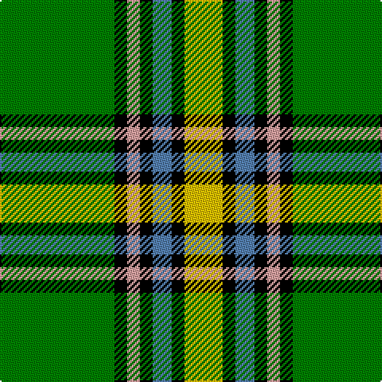

This page is one **sett** — a single exact thread-count. It belongs to the [tartan](/tartans/g18k2lr2k2b3k2y6/)
(the same proportion at any scale), whose colour order is pattern [GKYKBKY](/stripes/gkykbky/).

Sourced from weddslist.  It is a [7 stripe tartan](/stripes/stripes7/).

Original link http://www.weddslist.com/cgi-bin/tartans/pg.pl?source=sts

## Thread count
G/72 K8 LR8 K8 B12 K8 Y/24

## Palette
Each colour and the base-6 reference it is a variant of.

| Colour | Shade | Base |
|---|---|---|
| B | <code style="background-color:#5480B0;">#5480B0</code> `oklch(58.8% 0.089 251.5)` <small>#5480B0</small> | B <code style="background-color:#2A418A;">#2A418A</code> |
| G | <code style="background-color:#008000;">#008000</code> `oklch(52.0% 0.177 142.5)` <small>#008000</small> | G <code style="background-color:#006100;">#006100</code> |
| K | <code style="background-color:#000000;">#000000</code> `oklch(0.0% 0.000 0.0)` <small>#000000</small> | K <code style="background-color:#000000;">#000000</code> |
| LR | <code style="background-color:#E0A0A0;">#E0A0A0</code> `oklch(76.7% 0.077 19.0)` <small>#E0A0A0</small> | Y <code style="background-color:#F2BF00;">#F2BF00</code> |
| Y | <code style="background-color:#F0C000;">#F0C000</code> `oklch(82.7% 0.169 90.5)` <small>#F0C000</small> | Y <code style="background-color:#F2BF00;">#F2BF00</code> |

# Sample pattern

## Nearest tartans

The nearest existing variants by ΔTartan distance, with this tartan at the top so the swatches line up against it.

ΔTartan

Tartan

Sett

—

<a href="/ttd/edit/#slug=g18k2lr2k2t3k2ly6~x4">Alberta</a> <a class="nn-out" href="/setts/s7/g18k2lr2k2t3k2ly6~x4/" title="open its dictionary page">↗</a>

1.03

<a href="/ttd/edit/#slug=g12k1r1k1t2k1ly4~x2">Alberta District Tartan Tartan Number: 2055. Earliest known date: 1961 Designed for the Edmonton Rehabilitation Society as a project for handloom weaving by disabled students. The Provincial Legislative of Alberta gave formal approval for the Alberta tartan in 1961. See products available Copyright © Blair Urquhart, Comrie, 2015</a> <a class="nn-out" href="/setts/s7/g12k1r1k1t2k1ly4~x2/" title="open its dictionary page">↗</a>

1.12

<a href="/ttd/edit/#slug=g12k1r1k1b2k1ly4~x8">Alberta (District)</a> <a class="nn-out" href="/setts/s7/g12k1r1k1b2k1ly4~x8/" title="open its dictionary page">↗</a>

1.14

<a href="/ttd/edit/#slug=g11w11k3ly3dg36r7~x2">Driver, RC</a> <a class="nn-out" href="/setts/s6/g11w11k3ly3dg36r7~x2/" title="open its dictionary page">↗</a>

1.17

<a href="/ttd/edit/#slug=ly17w7ly6g43k5o6k13~x2">Keeling Dress</a> <a class="nn-out" href="/setts/s7/ly17w7ly6g43k5o6k13~x2/" title="open its dictionary page">↗</a>

1.21

<a href="/ttd/edit/#slug=w8k16g32dt3lo5w5~x2">Mellor (Name)</a> <a class="nn-out" href="/setts/s6/w8k16g32dt3lo5w5~x2/" title="open its dictionary page">↗</a>

1.26

<a href="/ttd/edit/#slug=g13p1g1p1g3db5k4ly2~x2">Carrick, hunting</a> <a class="nn-out" href="/setts/s8/g13p1g1p1g3db5k4ly2~x2/" title="open its dictionary page">↗</a>

1.26

<a href="/ttd/edit/#slug=g1k1g9k7ly1g5g4w2g1w1g1~x4">Parkhead</a> <a class="nn-out" href="/setts/s11/g1k1g9k7ly1g5g4w2g1w1g1~x4/" title="open its dictionary page">↗</a>

1.29

<a href="/ttd/edit/#slug=w6g5r5g45k4o24k4g5~x2">O'Neill</a> <a class="nn-out" href="/setts/s8/w6g5r5g45k4o24k4g5~x2/" title="open its dictionary page">↗</a>

1.31

<a href="/ttd/edit/#slug=g13k1r1k1b2k1ly4~x8">Alberta (Province)</a> <a class="nn-out" href="/setts/s7/g13k1r1k1b2k1ly4~x8/" title="open its dictionary page">↗</a>

1.31

<a href="/ttd/edit/#slug=m5dg27o2g25ly7dg3m3~x2">Kilkenny</a> <a class="nn-out" href="/setts/s7/m5dg27o2g25ly7dg3m3~x2/" title="open its dictionary page">↗</a>

## Neighbour map

Every grey dot is one of 14299 variants placed by the first two principal components of the ΔTartan feature space (44% of its variance). Red is this tartan; blue dots are its nearest — click one to open its page.

<svg viewBox="0 0 640 380" role="img" style="max-width:100%;height:auto;border:1px solid #e0e0e0;border-radius:4px;display:block" xmlns="http://www.w3.org/2000/svg"><image href="/nn/cloud.v1.png" width="640" height="380"/><a href="/setts/s7/g12k1r1k1t2k1ly4~x2/"><circle cx="270.5" cy="155.3" r="4" fill="#3465a4"><title>Alberta District Tartan Tartan Number: 2055. Earliest known date: 1961 Designed for the Edmonton Rehabilitation Society as a project for handloom weaving by disabled students. The Provincial Legislative of Alberta gave formal approval for the Alberta tartan in 1961. See products available Copyright © Blair Urquhart, Comrie, 2015</title></circle></a><a href="/setts/s7/g12k1r1k1b2k1ly4~x8/"><circle cx="270.8" cy="156.5" r="4" fill="#3465a4"><title>Alberta (District)</title></circle></a><a href="/setts/s6/g11w11k3ly3dg36r7~x2/"><circle cx="194.5" cy="150.2" r="4" fill="#3465a4"><title>Driver, RC</title></circle></a><a href="/setts/s7/ly17w7ly6g43k5o6k13~x2/"><circle cx="142.1" cy="163.0" r="4" fill="#3465a4"><title>Keeling Dress</title></circle></a><a href="/setts/s6/w8k16g32dt3lo5w5~x2/"><circle cx="187.3" cy="178.6" r="4" fill="#3465a4"><title>Mellor (Name)</title></circle></a><a href="/setts/s8/g13p1g1p1g3db5k4ly2~x2/"><circle cx="260.2" cy="159.0" r="4" fill="#3465a4"><title>Carrick, hunting</title></circle></a><a href="/setts/s11/g1k1g9k7ly1g5g4w2g1w1g1~x4/"><circle cx="187.1" cy="163.7" r="4" fill="#3465a4"><title>Parkhead</title></circle></a><a href="/setts/s8/w6g5r5g45k4o24k4g5~x2/"><circle cx="283.5" cy="159.2" r="4" fill="#3465a4"><title>O'Neill</title></circle></a><a href="/setts/s7/g13k1r1k1b2k1ly4~x8/"><circle cx="290.9" cy="152.6" r="4" fill="#3465a4"><title>Alberta (Province)</title></circle></a><a href="/setts/s7/m5dg27o2g25ly7dg3m3~x2/"><circle cx="202.7" cy="165.0" r="4" fill="#3465a4"><title>Kilkenny</title></circle></a><circle cx="209.6" cy="159.6" r="5" fill="#c00000"/></svg>

ID: /setts/s7/g18k2lr2k2t3k2ly6~x4/
