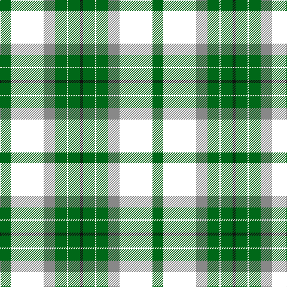

**Bands:** [KGWGRWG](/stripes/kgwgrwg/) · **Stripes:** [K G W G O W G](/stripes/stripes7/) K G W G O W G

This was sourced from register-of-tartans.  It is a [7 band tartan](/bands/bands7/).

Original link https://www.tartanregister.gov.uk/tartanDetails.aspx?ref=2476

## Also known as

This cloth is also recorded under:

- Michigan State University (Corporate

## Attestations

This cloth appears in 3 source records; the oldest owns this page.

- 01/01/2005 — Michigan State University (register-of-tartans, [record](https://www.tartanregister.gov.uk/tartanDetails.aspx?ref=2476))
- pre 2005 — Michigan State University (Corporate (tartans-authority, [record](http://www.tartansauthority.com/tartan-ferret/display/6776/))
- undated — Michigan State University American Corporate Tartan Tartan Number: 6776. Earliest known date: 2005 Designed to celebrate and commemorate the 150th Anniversary of the founding of Michigan State University. Woven sample. See products available Copyright © Blair Urquhart, Comrie, 2015 (house-of-tartan, [record](http://www.house-of-tartan.scotland.net/house/TartanViewjs.asp?colr=Def&tnam=6776))

## Register references

External register numbers recorded for this tartan.

- Scottish Register of Tartans: [2476](https://www.tartanregister.gov.uk/tartanDetails.aspx?ref=2476)
- Scottish Tartans Authority (ITI): 6776

## Thread count
G/18 W55 N19 G20 W2 G20 K/5

## Palette
Each colour and its ΔE from the base-6 reference it is a variant of.

| Colour | Shade | Base | ΔE (OKLab) |
|---|---|---|---|
| G | <code style="background-color:#006818;">#006818</code> `#006818` | G <code style="background-color:#006100;">#006100</code> | 0.02 |
| K | <code style="background-color:#101010;">#101010</code> `#101010` | K <code style="background-color:#000000;">#000000</code> | 0.17 |
| N | <code style="background-color:#888888;">#888888</code> `#888888` | R <code style="background-color:#CC0000;">#CC0000</code> | 0.24 |
| W | <code style="background-color:#FFFFFF;">#FFFFFF</code> `#FFFFFF` | W <code style="background-color:#F7F7F7;">#F7F7F7</code> | 0.02 |

# Sample pattern

## Nearest tartans

The nearest existing variants by ΔTartan distance.

1. [Shaw, Miss Rebecca (Personal)](/setts/s8/t5k1w30dp15w8g30w8dp2~x2/) — ΔT 1.17
1. [Pearce Scotch Plaid 4 (Fashion)](/setts/s7/ly6dg36w5b4w30b1w2~x2/) — ΔT 1.34
1. [British Columbia #2](/setts/s8/dg4dr14dg14o6dr1w30dg2dr1~x2/) — ΔT 1.35
1. [Delaware Fine Spirits Guild (Corp)](/setts/s6/k5g25k10lg15ly1lg5~x2/) — ΔT 1.38
1. [Dogwood](/setts/s8/dg4do10dg10o6do1w26dg2do1~x4/) — ΔT 1.38
1. [Aviemore Check](/setts/s8/g2dy10g11ly4dy1w18g2dy1~x2/) — ΔT 1.43
1. [MacDiarmid, dress](/setts/s9/w38r12w37g32k3w4k3g32r4/) — ΔT 1.47
1. [Dogwood](/setts/s8/g3r12g12o5r1w25g2r1~x2/) — ΔT 1.47
1. [MacDiarmid Dress](/setts/s9/w38r12w37g32k3w4k3g32r4~x2/) — ΔT 1.50
1. [Dogwood Trade Tartan Tartan Number: 913. Earliest known date: 1968 The registered tartan of the Dinwiddie Clan. Dinwiddies are normally associated with the Maxwells, but Lord Lyon stated, in 1988, that Dinwiddies were a sept of no other clan. See products available Copyright © Blair Urquhart, Comrie, 2015](/setts/s8/g3r12g12lo5r1w25g2r1~x2/) — ΔT 1.53

## Neighbour map

Every grey dot is one of 14299 variants placed by the first two principal components of the ΔTartan feature space (44% of its variance). Red is this tartan; blue dots are its nearest — click one to open its page.

<svg viewBox="0 0 640 380" role="img" style="max-width:100%;height:auto;border:1px solid #e0e0e0;border-radius:4px;display:block" xmlns="http://www.w3.org/2000/svg"><image href="/nn/cloud.v1.png" width="640" height="380"/><a href="/setts/s8/t5k1w30dp15w8g30w8dp2~x2/"><circle cx="213.8" cy="108.4" r="4" fill="#3465a4"><title>Shaw, Miss Rebecca (Personal)</title></circle></a><a href="/setts/s7/ly6dg36w5b4w30b1w2~x2/"><circle cx="269.8" cy="114.5" r="4" fill="#3465a4"><title>Pearce Scotch Plaid 4 (Fashion)</title></circle></a><a href="/setts/s8/dg4dr14dg14o6dr1w30dg2dr1~x2/"><circle cx="215.5" cy="111.0" r="4" fill="#3465a4"><title>British Columbia #2</title></circle></a><a href="/setts/s6/k5g25k10lg15ly1lg5~x2/"><circle cx="225.1" cy="172.6" r="4" fill="#3465a4"><title>Delaware Fine Spirits Guild (Corp)</title></circle></a><a href="/setts/s8/dg4do10dg10o6do1w26dg2do1~x4/"><circle cx="217.7" cy="118.1" r="4" fill="#3465a4"><title>Dogwood</title></circle></a><a href="/setts/s8/g2dy10g11ly4dy1w18g2dy1~x2/"><circle cx="188.0" cy="146.7" r="4" fill="#3465a4"><title>Aviemore Check</title></circle></a><a href="/setts/s9/w38r12w37g32k3w4k3g32r4/"><circle cx="224.6" cy="162.0" r="4" fill="#3465a4"><title>MacDiarmid, dress</title></circle></a><a href="/setts/s8/g3r12g12o5r1w25g2r1~x2/"><circle cx="222.9" cy="124.9" r="4" fill="#3465a4"><title>Dogwood</title></circle></a><a href="/setts/s9/w38r12w37g32k3w4k3g32r4~x2/"><circle cx="226.3" cy="162.2" r="4" fill="#3465a4"><title>MacDiarmid Dress</title></circle></a><a href="/setts/s8/g3r12g12lo5r1w25g2r1~x2/"><circle cx="223.1" cy="124.7" r="4" fill="#3465a4"><title>Dogwood Trade Tartan Tartan Number: 913. Earliest known date: 1968 The registered tartan of the Dinwiddie Clan. Dinwiddies are normally associated with the Maxwells, but Lord Lyon stated, in 1988, that Dinwiddies were a sept of no other clan. See products available Copyright © Blair Urquhart, Comrie, 2015</title></circle></a><circle cx="218.9" cy="145.0" r="5" fill="#c00000"/></svg>

ID: /setts/s7/g18w55o19g20w2g20k5/
