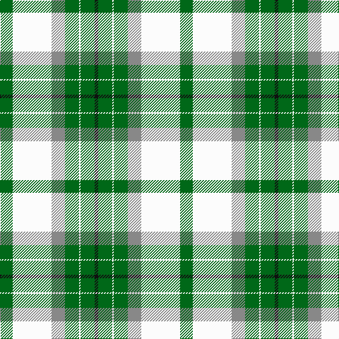

In pattern [GWRGWGK](/patterns/gwrgwgk/).

This was sourced from tartans-authority.  It is a [7 stripes tartan](/stripes/stripes7/).

Original link http://www.tartansauthority.com/tartan-ferret/display/6776/

## Attestations

This cloth appears in 2 source records; the oldest owns this page.

- pre 2005 — Michigan State University (Corporate (tartans-authority, [record](http://www.tartansauthority.com/tartan-ferret/display/6776/))
- undated — Michigan State University American Corporate Tartan Tartan Number: 6776. Earliest known date: 2005 Designed to celebrate and commemorate the 150th Anniversary of the founding of Michigan State University. Woven sample. See products available Copyright © Blair Urquhart, Comrie, 2015 (house-of-tartan, [record](http://www.house-of-tartan.scotland.net/house/TartanViewjs.asp?colr=Def&tnam=6776))

## Thread count
G/18 W55 N19 G20 W2 G20 K/5

## Palette
Each colour and its ΔE from the base-6 reference it is a variant of.

| Colour | Shade | Base | ΔE (OKLab) |
|---|---|---|---|
| G | <code style="background-color:#006818;">#006818</code> `#006818` | G <code style="background-color:#006400;">#006400</code> | 0.02 |
| K | <code style="background-color:#101010;">#101010</code> `#101010` | K <code style="background-color:#000000;">#000000</code> | 0.17 |
| N | <code style="background-color:#888888;">#888888</code> `#888888` | R <code style="background-color:#C80000;">#C80000</code> | 0.24 |
| W | <code style="background-color:#FCFCFC;">#FCFCFC</code> `#FCFCFC` | W <code style="background-color:#F4F4F0;">#F4F4F0</code> | 0.03 |

# Sample pattern

## Nearest tartans

The nearest existing variants by ΔTartan distance.

1. [Michigan State University](/setts/s7/g18w55r19g20w2g20k5-g006818-k101010-r888888-wffffff/) — ΔT 0.05
1. [Shaw, Miss Rebecca (Personal)](/setts/s8/b10k2w60ba30w16g60w16ba4-b5c8ca8-ba440044-g289c18-k101010-wf8f8f8/) — ΔT 1.17
1. [Pearce Scotch Plaid 4 (Fashion)](/setts/s7/y12g72w10b8w60b2w4-b1474b4-g003820-we0e0e0-ye8c000/) — ΔT 1.33
1. [Delaware Fine Spirits Guild (Corp)](/setts/s6/k10g50k20y30ya2y10-g589058-k101010-y9cc484-yae8c000/) — ΔT 1.33
1. [British Columbia #2](/setts/s8/g8b28g28ga12b2w60g4b2-b541c0c-g004c00-ga9c8000-wffffff/) — ΔT 1.34
1. [Dogwood](/setts/s8/g16b40g40r24b4w104g8b4-b381c0c-g004800-rb07430-wf8f4d0/) — ΔT 1.37
1. [Aviemore Check](/setts/s8/g4ga20g22y8ga2w36g4ga2-g006818-ga604000-we0e0e0-ye8c000/) — ΔT 1.40
1. [Aviemore Check (Fashion)](/setts/s8/g4ga20g22y8ga2w36g4ga2-g007c1c-ga604000-we0e0e0-ye8c000/) — ΔT 1.41
1. [Dogwood](/setts/s8/g6r24g24ra10r2w50g4r2-g008000-r800000-ra906030-we0e0e0/) — ΔT 1.45
1. [MacDiarmid, dress](/setts/s9/w38r12w37g32k3w4k3g32r4-g008000-k000000-rc00000-we0e0e0/) — ΔT 1.46

## Neighbour map

Every grey dot is one of 15726 variants placed by the first two principal components of the ΔTartan feature space (44% of its variance). Red is this tartan; blue dots are its nearest — click one to open its page.

<svg viewBox="0 0 640 380" role="img" style="max-width:100%;height:auto;border:1px solid #e0e0e0;border-radius:4px;display:block" xmlns="http://www.w3.org/2000/svg"><image href="/nn/cloud.v1.png" width="640" height="380"/><a href="/setts/s7/g18w55r19g20w2g20k5-g006818-k101010-r888888-wffffff/"><circle cx="216.3" cy="146.7" r="4" fill="#3465a4"><title>Michigan State University</title></circle></a><a href="/setts/s8/b10k2w60ba30w16g60w16ba4-b5c8ca8-ba440044-g289c18-k101010-wf8f8f8/"><circle cx="210.8" cy="110.4" r="4" fill="#3465a4"><title>Shaw, Miss Rebecca (Personal)</title></circle></a><a href="/setts/s7/y12g72w10b8w60b2w4-b1474b4-g003820-we0e0e0-ye8c000/"><circle cx="266.3" cy="115.8" r="4" fill="#3465a4"><title>Pearce Scotch Plaid 4 (Fashion)</title></circle></a><a href="/setts/s6/k10g50k20y30ya2y10-g589058-k101010-y9cc484-yae8c000/"><circle cx="222.2" cy="172.3" r="4" fill="#3465a4"><title>Delaware Fine Spirits Guild (Corp)</title></circle></a><a href="/setts/s8/g8b28g28ga12b2w60g4b2-b541c0c-g004c00-ga9c8000-wffffff/"><circle cx="212.5" cy="113.1" r="4" fill="#3465a4"><title>British Columbia #2</title></circle></a><a href="/setts/s8/g16b40g40r24b4w104g8b4-b381c0c-g004800-rb07430-wf8f4d0/"><circle cx="214.9" cy="120.2" r="4" fill="#3465a4"><title>Dogwood</title></circle></a><a href="/setts/s8/g4ga20g22y8ga2w36g4ga2-g006818-ga604000-we0e0e0-ye8c000/"><circle cx="184.9" cy="147.4" r="4" fill="#3465a4"><title>Aviemore Check</title></circle></a><a href="/setts/s8/g4ga20g22y8ga2w36g4ga2-g007c1c-ga604000-we0e0e0-ye8c000/"><circle cx="187.3" cy="148.3" r="4" fill="#3465a4"><title>Aviemore Check (Fashion)</title></circle></a><a href="/setts/s8/g6r24g24ra10r2w50g4r2-g008000-r800000-ra906030-we0e0e0/"><circle cx="220.3" cy="126.2" r="4" fill="#3465a4"><title>Dogwood</title></circle></a><a href="/setts/s9/w38r12w37g32k3w4k3g32r4-g008000-k000000-rc00000-we0e0e0/"><circle cx="223.0" cy="163.9" r="4" fill="#3465a4"><title>MacDiarmid, dress</title></circle></a><circle cx="217.5" cy="147.3" r="5" fill="#c00000"/></svg>

ID: /setts/s7/g18w55r19g20w2g20k5-g006818-k101010-r888888-wfcfcfc/
