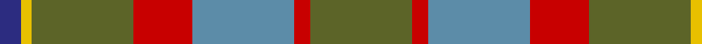

In pattern [BYGRBRG](/patterns/bygrbrg/).

This was sourced from house-of-tartan.  It is a [7 stripes tartan](/stripes/stripes7/).

Original link http://www.house-of-tartan.scotland.net/house/TartanViewjs.asp?colr=Def&tnam=2187

## Thread count
DB/8 Y4 G38 R22 B38 R6 G/38

## Palette
Each colour and its ΔE from the base-6 reference it is a variant of.

| Colour | Shade | Base | ΔE (OKLab) |
|---|---|---|---|
| B | <code style="background-color:#5C8CA8;">#5C8CA8</code> `#5C8CA8` | B <code style="background-color:#2A418A;">#2A418A</code> | 0.23 |
| DB | <code style="background-color:#2C2C80;">#2C2C80</code> `#2C2C80` | B <code style="background-color:#2A418A;">#2A418A</code> | 0.06 |
| G | <code style="background-color:#5C6428;">#5C6428</code> `#5C6428` | G <code style="background-color:#006100;">#006100</code> | 0.10 |
| R | <code style="background-color:#C80000;">#C80000</code> `#C80000` | R <code style="background-color:#CC0000;">#CC0000</code> | 0.01 |
| Y | <code style="background-color:#E8C000;">#E8C000</code> `#E8C000` | Y <code style="background-color:#F2BF00;">#F2BF00</code> | 0.02 |

# Sample pattern

## Nearest tartans

The nearest existing variants by ΔTartan distance.

1. [Brodie Silver Clan Tartan Tartan Number: 1630. Earliest known date: c.1940-50 Probably a trade design based on Hunting Brodie, that has appeared in the last forty years. It is sometimes referred to as muted Brodie. (P.E. MacDonald, STS 1984) See products available Copyright © Blair Urquhart, Comrie, 2015](/setts/s7/r3b20y2b20ra20w20r3~b5c5c5c-rc80000-ra888888-wc0c0c0-ye8c000~x2/) — ΔT 0.97
1. [Fraser hunting](/setts/s11/r3ra18g10ra2b10ra2b10ra2g10ra18w3~b304080-g008000-rc00000-ra806050-we0e0e0~x2/) — ΔT 1.12
1. [Brodie, Silver](/setts/s7/r3b20y2b20g20w20r3~b505050-g808080-rc00000-wc0c0c0-yf0c000~x2/) — ΔT 1.13
1. [Buchanhaven Heritage](/setts/s7/b24r27g20y6g20r2w3~b5c8ca8-g408060-rc82828-we0e0e0-ye0a126~x2/) — ΔT 1.20
1. [Brodie Silver](/setts/s7/r3b20k2b20ra20w20r3~b5c5c5c-k000000-rc80000-ra888888-wc0c0c0~x2/) — ΔT 1.22
1. [Hutcheson (Name)](/setts/s6/b8g4r30ga30y3ga4~b003c64-g789484-ga00643c-rcc4438-ydc943c~x2/) — ΔT 1.25
1. [Harmony 14](/setts/s11/g3ga16gb11ga2y11ga2y11ga2gb11ga16w3~g005020-ga808080-gb503c14-we0e0e0-yc89600~x2/) — ΔT 1.27
1. [Hawaii (District)](/setts/s8/b4r1y1b12ba4g10y1r3~b5c8ca8-ba4c3428-g406054-rc80000-ye8c000~x4/) — ΔT 1.34
1. [Hutcheson](/setts/s10/g30y3g4y3g30r30ga4b8ga4r30~b003c64-g00643c-ga789484-rcc4438-ydc943c~x2/) — ΔT 1.34
1. [Hesco](/setts/s7/b3ba24bb10ba2g11ba8w3~b5a008c-ba5c5c5c-bb505050-g289c18-we0e0e0~x2/) — ΔT 1.34

## Neighbour map

Every grey dot is one of 15726 variants placed by the first two principal components of the ΔTartan feature space (44% of its variance). Red is this tartan; blue dots are its nearest — click one to open its page.

<svg viewBox="0 0 640 380" role="img" style="max-width:100%;height:auto;border:1px solid #e0e0e0;border-radius:4px;display:block" xmlns="http://www.w3.org/2000/svg"><image href="/nn/cloud.v1.png" width="640" height="380"/><a href="/setts/s7/r3b20y2b20ra20w20r3~b5c5c5c-rc80000-ra888888-wc0c0c0-ye8c000~x2/"><circle cx="235.4" cy="209.1" r="4" fill="#3465a4"><title>Brodie Silver Clan Tartan Tartan Number: 1630. Earliest known date: c.1940-50 Probably a trade design based on Hunting Brodie, that has appeared in the last forty years. It is sometimes referred to as muted Brodie. (P.E. MacDonald, STS 1984) See products available Copyright © Blair Urquhart, Comrie, 2015</title></circle></a><a href="/setts/s11/r3ra18g10ra2b10ra2b10ra2g10ra18w3~b304080-g008000-rc00000-ra806050-we0e0e0~x2/"><circle cx="248.0" cy="200.0" r="4" fill="#3465a4"><title>Fraser hunting</title></circle></a><a href="/setts/s7/r3b20y2b20g20w20r3~b505050-g808080-rc00000-wc0c0c0-yf0c000~x2/"><circle cx="220.1" cy="203.8" r="4" fill="#3465a4"><title>Brodie, Silver</title></circle></a><a href="/setts/s7/b24r27g20y6g20r2w3~b5c8ca8-g408060-rc82828-we0e0e0-ye0a126~x2/"><circle cx="224.5" cy="201.4" r="4" fill="#3465a4"><title>Buchanhaven Heritage</title></circle></a><a href="/setts/s7/r3b20k2b20ra20w20r3~b5c5c5c-k000000-rc80000-ra888888-wc0c0c0~x2/"><circle cx="218.6" cy="203.3" r="4" fill="#3465a4"><title>Brodie Silver</title></circle></a><a href="/setts/s6/b8g4r30ga30y3ga4~b003c64-g789484-ga00643c-rcc4438-ydc943c~x2/"><circle cx="254.7" cy="196.1" r="4" fill="#3465a4"><title>Hutcheson (Name)</title></circle></a><a href="/setts/s11/g3ga16gb11ga2y11ga2y11ga2gb11ga16w3~g005020-ga808080-gb503c14-we0e0e0-yc89600~x2/"><circle cx="204.6" cy="196.8" r="4" fill="#3465a4"><title>Harmony 14</title></circle></a><a href="/setts/s8/b4r1y1b12ba4g10y1r3~b5c8ca8-ba4c3428-g406054-rc80000-ye8c000~x4/"><circle cx="248.0" cy="183.9" r="4" fill="#3465a4"><title>Hawaii (District)</title></circle></a><a href="/setts/s10/g30y3g4y3g30r30ga4b8ga4r30~b003c64-g00643c-ga789484-rcc4438-ydc943c~x2/"><circle cx="255.8" cy="178.3" r="4" fill="#3465a4"><title>Hutcheson</title></circle></a><a href="/setts/s7/b3ba24bb10ba2g11ba8w3~b5a008c-ba5c5c5c-bb505050-g289c18-we0e0e0~x2/"><circle cx="322.8" cy="209.6" r="4" fill="#3465a4"><title>Hesco</title></circle></a><circle cx="264.5" cy="219.3" r="5" fill="#c00000"/></svg>

ID: /setts/s7/g19r3b19r11g19y2ba4~b5c8ca8-ba2c2c80-g5c6428-rc80000-ye8c000~x2/
