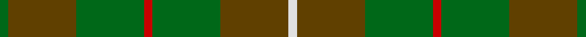

In pattern [GGGRGGW](/stripes/gggrggw/).

This was sourced from house-of-tartan.  It is a [7 stripe tartan](/stripes/stripes7/).

Original link http://www.house-of-tartan.scotland.net/house/TartanViewjs.asp?colr=Def&tnam=917

## Thread count
G/2 T16 G16 R2 G16 T16 LN/2

## Palette
Each colour and its ΔE from the base-6 reference it is a variant of.

| Colour | Shade | Base | ΔE (OKLab) |
|---|---|---|---|
| G | <code style="background-color:#006818;">#006818</code> `#006818` | G <code style="background-color:#006100;">#006100</code> | 0.02 |
| LN | <code style="background-color:#E0E0E0;">#E0E0E0</code> `#E0E0E0` | W <code style="background-color:#F7F7F7;">#F7F7F7</code> | 0.07 |
| R | <code style="background-color:#C80000;">#C80000</code> `#C80000` | R <code style="background-color:#CC0000;">#CC0000</code> | 0.01 |
| T | <code style="background-color:#604000;">#604000</code> `#604000` | G <code style="background-color:#006100;">#006100</code> | 0.14 |

# Sample pattern

## Nearest tartans

The nearest existing variants by ΔTartan distance.

1. [MacKinnon, hunting](/setts/s7/g1o8g8r1g8o8w1~x4/) — ΔT 1.07
1. [MacKinnon Hunting](/setts/s7/dg1dy8dg8r1dg8dy8w1~x2/) — ΔT 1.21
1. [Confederate Artillery (Military)](/setts/s6/r2g12o3g8o14g2~x2/) — ΔT 1.36
1. [MacKinnon Hunting #3](/setts/s12/dy8w1dy8g8r1g8dy8g1dy8g8r1g8~x8/) — ΔT 1.45
1. [MacKinnon Hunting](/setts/s7/dg1dr8dg8r1dg8dr8lr1~x4/) — ΔT 1.46
1. [MacKinnon Hunting](/setts/s7/dg1dr8dg8r1dg8dr8lr1~x2/) — ΔT 1.46
1. [Daks (Loden)](/setts/s8/db3dy7g2y2g14dy2g2db3~x2/) — ΔT 1.51
1. [Park Estate](/setts/s6/y4dg18dg6dg6dg24k3~x2/) — ΔT 1.56
1. [Park (Estate Check)](/setts/s6/y4dg18dg6dg6dg24ly3~x2/) — ΔT 1.62
1. [Canadian Fancy](/setts/s6/g4dy25g6t12g12t3~x2/) — ΔT 1.65

## Neighbour map

Every grey dot is one of 14299 variants placed by the first two principal components of the ΔTartan feature space (44% of its variance). Red is this tartan; blue dots are its nearest — click one to open its page.

<svg viewBox="0 0 640 380" role="img" style="max-width:100%;height:auto;border:1px solid #e0e0e0;border-radius:4px;display:block" xmlns="http://www.w3.org/2000/svg"><image href="/nn/cloud.v1.png" width="640" height="380"/><a href="/setts/s7/g1o8g8r1g8o8w1~x4/"><circle cx="335.1" cy="268.0" r="4" fill="#3465a4"><title>MacKinnon, hunting</title></circle></a><a href="/setts/s7/dg1dy8dg8r1dg8dy8w1~x2/"><circle cx="371.2" cy="295.8" r="4" fill="#3465a4"><title>MacKinnon Hunting</title></circle></a><a href="/setts/s6/r2g12o3g8o14g2~x2/"><circle cx="385.1" cy="298.1" r="4" fill="#3465a4"><title>Confederate Artillery (Military)</title></circle></a><a href="/setts/s12/dy8w1dy8g8r1g8dy8g1dy8g8r1g8~x8/"><circle cx="358.1" cy="283.9" r="4" fill="#3465a4"><title>MacKinnon Hunting #3</title></circle></a><a href="/setts/s7/dg1dr8dg8r1dg8dr8lr1~x4/"><circle cx="361.8" cy="281.9" r="4" fill="#3465a4"><title>MacKinnon Hunting</title></circle></a><a href="/setts/s7/dg1dr8dg8r1dg8dr8lr1~x2/"><circle cx="361.8" cy="281.9" r="4" fill="#3465a4"><title>MacKinnon Hunting</title></circle></a><a href="/setts/s8/db3dy7g2y2g14dy2g2db3~x2/"><circle cx="329.4" cy="256.1" r="4" fill="#3465a4"><title>Daks (Loden)</title></circle></a><a href="/setts/s6/y4dg18dg6dg6dg24k3~x2/"><circle cx="369.9" cy="301.1" r="4" fill="#3465a4"><title>Park Estate</title></circle></a><a href="/setts/s6/y4dg18dg6dg6dg24ly3~x2/"><circle cx="377.3" cy="303.3" r="4" fill="#3465a4"><title>Park (Estate Check)</title></circle></a><a href="/setts/s6/g4dy25g6t12g12t3~x2/"><circle cx="302.3" cy="289.1" r="4" fill="#3465a4"><title>Canadian Fancy</title></circle></a><circle cx="353.1" cy="281.6" r="5" fill="#c00000"/></svg>

ID: /setts/s7/g1dy8g8r1g8dy8w1~x2/
