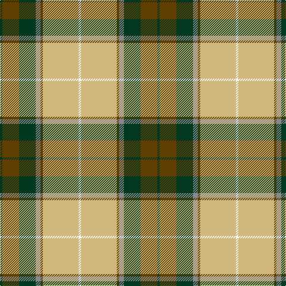

In pattern [GGGRGYW](/patterns/gggrgyw/).

This was sourced from register-of-tartans.  It is a [7 stripes tartan](/stripes/stripes7/).

Original link https://www.tartanregister.gov.uk/tartanDetails.aspx?ref=3487

## Attestations

This cloth appears in 2 source records; the oldest owns this page.

- 01/01/1975 — Regalia (register-of-tartans, [record](https://www.tartanregister.gov.uk/tartanDetails.aspx?ref=3487))
- pre1975 — Regalia (Fashion) (tartans-authority, [record](http://www.tartansauthority.com/tartan-ferret/display/5418/))

## Thread count
DG/4 T28 DG28 N8 T4 LG60 W/4

## Palette
Each colour and its ΔE from the base-6 reference it is a variant of.

| Colour | Shade | Base | ΔE (OKLab) |
|---|---|---|---|
| DG | <code style="background-color:#003820;">#003820</code> `#003820` | G <code style="background-color:#006100;">#006100</code> | 0.15 |
| LG | <code style="background-color:#D0B87C;">#D0B87C</code> `#D0B87C` | Y <code style="background-color:#F2BF00;">#F2BF00</code> | 0.09 |
| N | <code style="background-color:#888888;">#888888</code> `#888888` | R <code style="background-color:#CC0000;">#CC0000</code> | 0.24 |
| T | <code style="background-color:#604000;">#604000</code> `#604000` | G <code style="background-color:#006100;">#006100</code> | 0.14 |
| W | <code style="background-color:#F8F8F8;">#F8F8F8</code> `#F8F8F8` | W <code style="background-color:#F7F7F7;">#F7F7F7</code> | 0.00 |

# Sample pattern

## Nearest tartans

The nearest existing variants by ΔTartan distance.

1. [Hamilton of Brandon (Fashion)](/setts/s6/y16k7w1g7k1ya3~g006818-k101010-we0e0e0-ya08858-yae8c000~x4/) — ΔT 0.75
1. [Fraser Yellow](/setts/s7/r2w2y27g14y2b14y2~b2c4084-g005020-rdc0000-we0e0e0-ye8c000~x2/) — ΔT 0.79
1. [Fraser Yellow Tartan Tartan Number: 1709. Earliest known date: pre 2003 Similar to Vestiarium Scoticum See products available Copyright © Blair Urquhart, Comrie, 2015](/setts/s7/r2w2y27g14y2b14y2~b2c2c80-g006818-rc80000-we0e0e0-ye8c000~x2/) — ΔT 0.84
1. [Fraser, Yellow](/setts/s7/r2w2y27g14y2b14y2~b304080-g008000-rc00000-we0e0e0-yf0c000~x2/) — ΔT 1.04
1. [MacLachlan Dress Clan Tartan Tartan Number: 828. Earliest known date: 1990 Based on the MacLachlan pattern in Old And Rare See products available Copyright © Blair Urquhart, Comrie, 2015](/setts/s7/r34w3g4ga23w24k3g4~g006428-ga006818-k101010-rd05054-we0e0e0~x2/) — ΔT 1.18
1. [Drummond of Perth Dress (Dance)](/setts/s9/g41y3ga7b3w24g10ga7b7w3~b5c5c5c-g285800-ga408060-wfcfcfc-ybc8c00~x2/) — ΔT 1.20
1. [MacLachlan, dress](/setts/s7/r34w3g4ga23w24k3g4~g006030-ga008000-k000000-rd03030-we0e0e0~x2/) — ΔT 1.20
1. [Mostyn](/setts/s9/r20k2r2k2r2k8g24b2g3~b202060-g289c18-k101010-re87878~x2/) — ΔT 1.21
1. [Cornish National Small Set Tartan Tartan Number: 7651. Earliest known date: See products available Copyright © Blair Urquhart, Comrie, 2015](/setts/s6/w2k11y11b3k1r1~b5c8ca8-k101010-rc80000-we0e0e0-ye8c000~x2/) — ΔT 1.23
1. [Golden Wedding (Fashion)](/setts/s8/r8y44k32w2ra52k7ra7w3~k101010-rc80000-ra888888-we0e0e0-ybc8c00/) — ΔT 1.26

## Neighbour map

Every grey dot is one of 15726 variants placed by the first two principal components of the ΔTartan feature space (44% of its variance). Red is this tartan; blue dots are its nearest — click one to open its page.

<svg viewBox="0 0 640 380" role="img" style="max-width:100%;height:auto;border:1px solid #e0e0e0;border-radius:4px;display:block" xmlns="http://www.w3.org/2000/svg"><image href="/nn/cloud.v1.png" width="640" height="380"/><a href="/setts/s6/y16k7w1g7k1ya3~g006818-k101010-we0e0e0-ya08858-yae8c000~x4/"><circle cx="213.8" cy="163.5" r="4" fill="#3465a4"><title>Hamilton of Brandon (Fashion)</title></circle></a><a href="/setts/s7/r2w2y27g14y2b14y2~b2c4084-g005020-rdc0000-we0e0e0-ye8c000~x2/"><circle cx="222.2" cy="145.0" r="4" fill="#3465a4"><title>Fraser Yellow</title></circle></a><a href="/setts/s7/r2w2y27g14y2b14y2~b2c2c80-g006818-rc80000-we0e0e0-ye8c000~x2/"><circle cx="221.0" cy="144.6" r="4" fill="#3465a4"><title>Fraser Yellow Tartan Tartan Number: 1709. Earliest known date: pre 2003 Similar to Vestiarium Scoticum See products available Copyright © Blair Urquhart, Comrie, 2015</title></circle></a><a href="/setts/s7/r2w2y27g14y2b14y2~b304080-g008000-rc00000-we0e0e0-yf0c000~x2/"><circle cx="227.2" cy="145.9" r="4" fill="#3465a4"><title>Fraser, Yellow</title></circle></a><a href="/setts/s7/r34w3g4ga23w24k3g4~g006428-ga006818-k101010-rd05054-we0e0e0~x2/"><circle cx="152.8" cy="156.2" r="4" fill="#3465a4"><title>MacLachlan Dress Clan Tartan Tartan Number: 828. Earliest known date: 1990 Based on the MacLachlan pattern in Old And Rare See products available Copyright © Blair Urquhart, Comrie, 2015</title></circle></a><a href="/setts/s9/g41y3ga7b3w24g10ga7b7w3~b5c5c5c-g285800-ga408060-wfcfcfc-ybc8c00~x2/"><circle cx="209.9" cy="137.8" r="4" fill="#3465a4"><title>Drummond of Perth Dress (Dance)</title></circle></a><a href="/setts/s7/r34w3g4ga23w24k3g4~g006030-ga008000-k000000-rd03030-we0e0e0~x2/"><circle cx="147.1" cy="152.9" r="4" fill="#3465a4"><title>MacLachlan, dress</title></circle></a><a href="/setts/s9/r20k2r2k2r2k8g24b2g3~b202060-g289c18-k101010-re87878~x2/"><circle cx="221.6" cy="150.8" r="4" fill="#3465a4"><title>Mostyn</title></circle></a><a href="/setts/s6/w2k11y11b3k1r1~b5c8ca8-k101010-rc80000-we0e0e0-ye8c000~x2/"><circle cx="171.4" cy="162.2" r="4" fill="#3465a4"><title>Cornish National Small Set Tartan Tartan Number: 7651. Earliest known date: See products available Copyright © Blair Urquhart, Comrie, 2015</title></circle></a><a href="/setts/s8/r8y44k32w2ra52k7ra7w3~k101010-rc80000-ra888888-we0e0e0-ybc8c00/"><circle cx="206.4" cy="123.7" r="4" fill="#3465a4"><title>Golden Wedding (Fashion)</title></circle></a><circle cx="209.3" cy="145.5" r="5" fill="#c00000"/></svg>

ID: /setts/s7/g1ga7g7r2ga1y15w1~g003820-ga604000-r888888-wf8f8f8-yd0b87c~x4/
