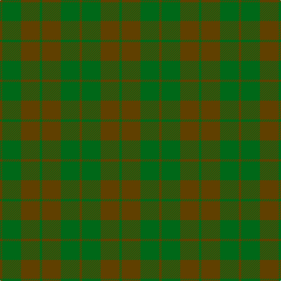

In pattern [GGGGGGG](/patterns/ggggggg/).

This was sourced from tartans-authority.  It is a [7 stripes tartan](/stripes/stripes7/).

Original link http://www.tartansauthority.com/tartan-ferret/display/1641/

## Thread count
T/4 Ga32 Ta32 G4 Ta32 Ga32 Ta/4

## Palette
Each colour and its ΔE from the base-6 reference it is a variant of.

| Colour | Shade | Base | ΔE (OKLab) |
|---|---|---|---|
| G | <code style="background-color:#006818;">#006818</code> `#006818` | G <code style="background-color:#006100;">#006100</code> | 0.02 |
| Ga | <code style="background-color:#006818;">#006818</code> `#006818` | G <code style="background-color:#006100;">#006100</code> | 0.02 |
| T | <code style="background-color:#604000;">#604000</code> `#604000` | G <code style="background-color:#006100;">#006100</code> | 0.14 |
| Ta | <code style="background-color:#604000;">#604000</code> `#604000` | G <code style="background-color:#006100;">#006100</code> | 0.14 |

# Sample pattern

## Nearest tartans

The nearest existing variants by ΔTartan distance.

1. [Emerald, The](/setts/s6/g2ga2gb7g10gb1ga1~g005448-ga289c18-gb006818~x4/) — ΔT 2.22
1. [Conlon](/setts/s9/g4b2g17ga2r4ga2g3ga11g2~b2c2c80-g005448-ga003820-r880000~x2/) — ΔT 2.26
1. [McGuigan, Julia (St Monans, Fife) (Personal)](/setts/s4/g9ga52gb15y4~g70714d-ga5a601e-gb4e3d20-ybfab40~x2/) — ΔT 2.29
1. [de Meuron (Neuchâtel) Day, The](/setts/s7/g40b5g6ga26gb13gc9ga3~b2613cd-g4f310f-ga214211-gb184f06-gc1e5b30~x2/) — ΔT 2.31
1. [Sanix Muted](/setts/s4/g3ga30g40r3~g003820-ga603800-r880000~x2/) — ΔT 2.33
1. [McWilliams (2014)](/setts/s4/g22b1ga22r4~b780078-g8c7038-ga5c6428-rc80000~x4/) — ΔT 2.47
1. [London Regiment (Military)](/setts/s6/g34b27r3b27g34w3~b687488-g747c60-rc80000-wfcfcfc~x2/) — ΔT 2.49
1. [Gleneagles (Corporate)](/setts/s7/g6ga6gb1ga6g5b6g1~b083454-g581c00-ga003820-gb684800~x4/) — ΔT 2.50
1. [Park (Estate Check)](/setts/s6/g4ga18gb6ga6gb24y3~g5c6428-ga003820-gb285800-yb8a040~x2/) — ΔT 2.50
1. [Calais (Fashion)](/setts/s7/g11b4g6ga11b1k1ga4~b306084-g085454-ga604000-k000000~x4/) — ΔT 2.51

## Neighbour map

Every grey dot is one of 15726 variants placed by the first two principal components of the ΔTartan feature space (44% of its variance). Red is this tartan; blue dots are its nearest — click one to open its page.

<svg viewBox="0 0 640 380" role="img" style="max-width:100%;height:auto;border:1px solid #e0e0e0;border-radius:4px;display:block" xmlns="http://www.w3.org/2000/svg"><image href="/nn/cloud.v1.png" width="640" height="380"/><a href="/setts/s6/g2ga2gb7g10gb1ga1~g005448-ga289c18-gb006818~x4/"><circle cx="445.7" cy="298.4" r="4" fill="#3465a4"><title>Emerald, The</title></circle></a><a href="/setts/s9/g4b2g17ga2r4ga2g3ga11g2~b2c2c80-g005448-ga003820-r880000~x2/"><circle cx="443.1" cy="268.8" r="4" fill="#3465a4"><title>Conlon</title></circle></a><a href="/setts/s4/g9ga52gb15y4~g70714d-ga5a601e-gb4e3d20-ybfab40~x2/"><circle cx="538.8" cy="286.7" r="4" fill="#3465a4"><title>McGuigan, Julia (St Monans, Fife) (Personal)</title></circle></a><a href="/setts/s7/g40b5g6ga26gb13gc9ga3~b2613cd-g4f310f-ga214211-gb184f06-gc1e5b30~x2/"><circle cx="386.5" cy="254.6" r="4" fill="#3465a4"><title>de Meuron (Neuchâtel) Day, The</title></circle></a><a href="/setts/s4/g3ga30g40r3~g003820-ga603800-r880000~x2/"><circle cx="536.9" cy="317.0" r="4" fill="#3465a4"><title>Sanix Muted</title></circle></a><a href="/setts/s4/g22b1ga22r4~b780078-g8c7038-ga5c6428-rc80000~x4/"><circle cx="470.1" cy="273.8" r="4" fill="#3465a4"><title>McWilliams (2014)</title></circle></a><a href="/setts/s6/g34b27r3b27g34w3~b687488-g747c60-rc80000-wfcfcfc~x2/"><circle cx="469.1" cy="306.2" r="4" fill="#3465a4"><title>London Regiment (Military)</title></circle></a><a href="/setts/s7/g6ga6gb1ga6g5b6g1~b083454-g581c00-ga003820-gb684800~x4/"><circle cx="328.6" cy="333.6" r="4" fill="#3465a4"><title>Gleneagles (Corporate)</title></circle></a><a href="/setts/s6/g4ga18gb6ga6gb24y3~g5c6428-ga003820-gb285800-yb8a040~x2/"><circle cx="376.0" cy="287.4" r="4" fill="#3465a4"><title>Park (Estate Check)</title></circle></a><a href="/setts/s7/g11b4g6ga11b1k1ga4~b306084-g085454-ga604000-k000000~x4/"><circle cx="368.7" cy="274.8" r="4" fill="#3465a4"><title>Calais (Fashion)</title></circle></a><circle cx="445.5" cy="312.4" r="5" fill="#c00000"/></svg>

ID: /setts/s7/g1ga8g8ga1g8ga8g1~g604000-ga006818~x4/
