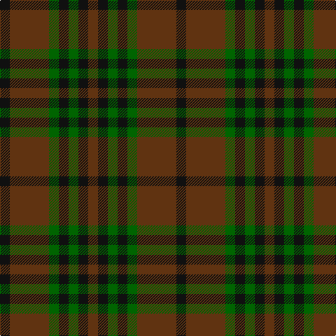

In pattern [GKGKGGK](/patterns/gkgkggk/).

This was sourced from register-of-tartans.  It is a [7 stripes tartan](/stripes/stripes7/).

Original link https://www.tartanregister.gov.uk/tartanDetails.aspx?ref=10274

## Register references

External register numbers recorded for this tartan.

- Scottish Register of Tartans: [10274](https://www.tartanregister.gov.uk/tartanDetails.aspx?ref=10274)

## Thread count
K/14 T56 G14 K14 G14 K14 T/14

## Palette
Each colour and its ΔE from the base-6 reference it is a variant of.

| Colour | Shade | Base | ΔE (OKLab) |
|---|---|---|---|
| G | <code style="background-color:#006400;">#006400</code> `#006400` | G <code style="background-color:#006100;">#006100</code> | 0.01 |
| K | <code style="background-color:#101010;">#101010</code> `#101010` | K <code style="background-color:#000000;">#000000</code> | 0.17 |
| T | <code style="background-color:#603311;">#603311</code> `#603311` | G <code style="background-color:#006100;">#006100</code> | 0.17 |

# Sample pattern

## Nearest tartans

The nearest existing variants by ΔTartan distance.

1. [McCanna NW Htg (Personal)](/setts/s7/g1k1ga1k1ga1g4k1~g604000-ga285800-k101010~x10/) — ΔT 0.59
1. [Chindecella Gorse (Kemete Heil)](/setts/s8/r9b4r4b4r24g19b19g4~b241b1e-g4f4232-r8c6627~x2/) — ΔT 1.25
1. [MacKinnon Hunting](/setts/s7/g1b8g8r1g8b8y1~b521510-g11450d-raa0000-yaaaaaa~x4/) — ΔT 1.65
1. [MacKinnon Hunting](/setts/s7/g1b8g8r1g8b8y1~b521510-g11450d-raa0000-yaaaaaa~x2/) — ΔT 1.65
1. [Lindsay](/setts/s9/g24b3g3b3g3b9r24g3r4~b102040-g004010-r800030~x2/) — ΔT 1.73
1. [Daks-Simpson (Muted Skye)](/setts/s8/b5r15g4r4g24r4g4b5~b2c2c80-g604000-r888888/) — ΔT 1.82
1. [Lindsay (Chisholm Red)](/setts/s9/g24b3g3b3g3b9r24g3r4~b141e46-g003c14-r7c0034~x2/) — ΔT 1.84
1. [Harbour Town Hilton Head, The](/setts/s6/b3g11b3ba11b18y3~b003c64-ba680028-g006818-ya08858~x2/) — ΔT 1.89
1. [Fraser Hunting #2](/setts/s6/g1b3g1ga3g4r1~b2c4084-g503c14-ga005020-rdc0000~x2/) — ΔT 1.89
1. [Dorward/Dogwood](/setts/s7/g7r3g9ga15b19g14r4~b2c2c80-g604000-ga006818-rc80000~x2/) — ΔT 1.90

## Neighbour map

Every grey dot is one of 15726 variants placed by the first two principal components of the ΔTartan feature space (44% of its variance). Red is this tartan; blue dots are its nearest — click one to open its page.

<svg viewBox="0 0 640 380" role="img" style="max-width:100%;height:auto;border:1px solid #e0e0e0;border-radius:4px;display:block" xmlns="http://www.w3.org/2000/svg"><image href="/nn/cloud.v1.png" width="640" height="380"/><a href="/setts/s7/g1k1ga1k1ga1g4k1~g604000-ga285800-k101010~x10/"><circle cx="327.4" cy="303.5" r="4" fill="#3465a4"><title>McCanna NW Htg (Personal)</title></circle></a><a href="/setts/s8/r9b4r4b4r24g19b19g4~b241b1e-g4f4232-r8c6627~x2/"><circle cx="280.2" cy="267.0" r="4" fill="#3465a4"><title>Chindecella Gorse (Kemete Heil)</title></circle></a><a href="/setts/s7/g1b8g8r1g8b8y1~b521510-g11450d-raa0000-yaaaaaa~x4/"><circle cx="361.0" cy="272.0" r="4" fill="#3465a4"><title>MacKinnon Hunting</title></circle></a><a href="/setts/s7/g1b8g8r1g8b8y1~b521510-g11450d-raa0000-yaaaaaa~x2/"><circle cx="361.0" cy="272.0" r="4" fill="#3465a4"><title>MacKinnon Hunting</title></circle></a><a href="/setts/s9/g24b3g3b3g3b9r24g3r4~b102040-g004010-r800030~x2/"><circle cx="335.0" cy="239.2" r="4" fill="#3465a4"><title>Lindsay</title></circle></a><a href="/setts/s8/b5r15g4r4g24r4g4b5~b2c2c80-g604000-r888888/"><circle cx="314.2" cy="249.5" r="4" fill="#3465a4"><title>Daks-Simpson (Muted Skye)</title></circle></a><a href="/setts/s9/g24b3g3b3g3b9r24g3r4~b141e46-g003c14-r7c0034~x2/"><circle cx="340.6" cy="241.7" r="4" fill="#3465a4"><title>Lindsay (Chisholm Red)</title></circle></a><a href="/setts/s6/b3g11b3ba11b18y3~b003c64-ba680028-g006818-ya08858~x2/"><circle cx="275.8" cy="270.3" r="4" fill="#3465a4"><title>Harbour Town Hilton Head, The</title></circle></a><a href="/setts/s6/g1b3g1ga3g4r1~b2c4084-g503c14-ga005020-rdc0000~x2/"><circle cx="269.8" cy="311.6" r="4" fill="#3465a4"><title>Fraser Hunting #2</title></circle></a><a href="/setts/s7/g7r3g9ga15b19g14r4~b2c2c80-g604000-ga006818-rc80000~x2/"><circle cx="228.1" cy="271.9" r="4" fill="#3465a4"><title>Dorward/Dogwood</title></circle></a><circle cx="316.2" cy="297.7" r="5" fill="#c00000"/></svg>

ID: /setts/s7/g1k1ga1k1ga1g4k1~g603311-ga006400-k101010~x14/
