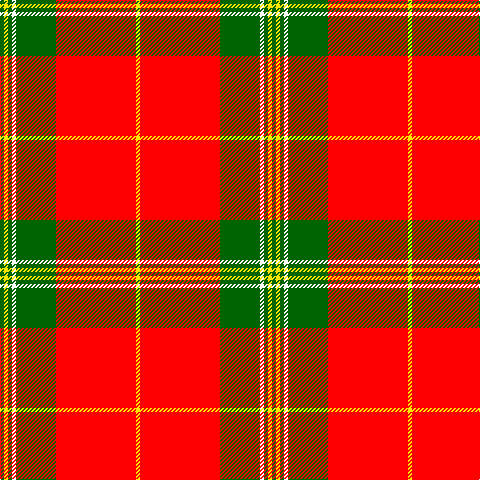

**Bands:** [GYGWGRY](/stripes/gygwgry/) · **Stripes:** [G LY G W G R LY](/stripes/stripes7/) G LY G W G R LY

This was sourced from register-of-tartans.  It is a [7 band tartan](/bands/bands7/).

Original link https://www.tartanregister.gov.uk/tartanDetails.aspx?ref=10329

## Register references

External register numbers recorded for this tartan.

- Scottish Register of Tartans: [10329](https://www.tartanregister.gov.uk/tartanDetails.aspx?ref=10329)

## Thread count
G/4 Y4 G4 W4 G40 R80 Y/4

## Palette
Each colour and its ΔE from the base-6 reference it is a variant of.

| Colour | Shade | Base | ΔE (OKLab) |
|---|---|---|---|
| G | <code style="background-color:#006400;">#006400</code> `#006400` | G <code style="background-color:#006100;">#006100</code> | 0.01 |
| R | <code style="background-color:#FF0000;">#FF0000</code> `#FF0000` | R <code style="background-color:#CC0000;">#CC0000</code> | 0.11 |
| W | <code style="background-color:#FFFFFF;">#FFFFFF</code> `#FFFFFF` | W <code style="background-color:#F7F7F7;">#F7F7F7</code> | 0.02 |
| Y | <code style="background-color:#FFE600;">#FFE600</code> `#FFE600` | Y <code style="background-color:#F2BF00;">#F2BF00</code> | 0.10 |

# Sample pattern

## Nearest tartans

The nearest existing variants by ΔTartan distance.

1. [Masai Shuka 16 (Artefact)](/setts/s6/ly8k3ly4k2r30ly6~x2/) — ΔT 1.24
1. [Colchester & District Pipes & Drums](/setts/s6/g10r4g46r69k2w6/) — ΔT 1.28
1. [Baluch Regiment (Military)](/setts/s9/r5g20r5g3r4g5r36do2w4~x2/) — ΔT 1.32
1. [National Defense](/setts/s6/r40w2db2w2r1ly20~x2/) — ΔT 1.34
1. [MacGregor](/setts/s6/r35g16r5g5w2k3~x2/) — ΔT 1.34
1. [FIRES Center of Excelence](/setts/s8/r50ly8k2w2k2ly8k22r3~x2/) — ΔT 1.35
1. [Lantern, The](/setts/s9/lb6k2r32lo2k6lo2r4k2lb3~x2/) — ΔT 1.39
1. [Fernandes (Personal)](/setts/s7/g5ly5g5ly35r44r3r3~x2/) — ΔT 1.40
1. [MacGregor](/setts/s6/r35dg16r5dg5w2k3~x2/) — ΔT 1.41
1. [Spens](/setts/s8/r56w2db6w2g32r11db6w5/) — ΔT 1.45

## Neighbour map

Every grey dot is one of 14313 variants placed by the first two principal components of the ΔTartan feature space (44% of its variance). Red is this tartan; blue dots are its nearest — click one to open its page.

<svg viewBox="0 0 640 380" role="img" style="max-width:100%;height:auto;border:1px solid #e0e0e0;border-radius:4px;display:block" xmlns="http://www.w3.org/2000/svg"><image href="/nn/cloud.v1.png" width="640" height="380"/><a href="/setts/s6/ly8k3ly4k2r30ly6~x2/"><circle cx="362.5" cy="162.9" r="4" fill="#3465a4"><title>Masai Shuka 16 (Artefact)</title></circle></a><a href="/setts/s6/g10r4g46r69k2w6/"><circle cx="379.6" cy="129.2" r="4" fill="#3465a4"><title>Colchester &amp; District Pipes &amp; Drums</title></circle></a><a href="/setts/s9/r5g20r5g3r4g5r36do2w4~x2/"><circle cx="384.5" cy="141.5" r="4" fill="#3465a4"><title>Baluch Regiment (Military)</title></circle></a><a href="/setts/s6/r40w2db2w2r1ly20~x2/"><circle cx="409.9" cy="104.4" r="4" fill="#3465a4"><title>National Defense</title></circle></a><a href="/setts/s6/r35g16r5g5w2k3~x2/"><circle cx="380.9" cy="161.8" r="4" fill="#3465a4"><title>MacGregor</title></circle></a><a href="/setts/s8/r50ly8k2w2k2ly8k22r3~x2/"><circle cx="337.8" cy="107.3" r="4" fill="#3465a4"><title>FIRES Center of Excelence</title></circle></a><a href="/setts/s9/lb6k2r32lo2k6lo2r4k2lb3~x2/"><circle cx="370.3" cy="117.0" r="4" fill="#3465a4"><title>Lantern, The</title></circle></a><a href="/setts/s7/g5ly5g5ly35r44r3r3~x2/"><circle cx="285.1" cy="143.3" r="4" fill="#3465a4"><title>Fernandes (Personal)</title></circle></a><a href="/setts/s6/r35dg16r5dg5w2k3~x2/"><circle cx="388.0" cy="160.7" r="4" fill="#3465a4"><title>MacGregor</title></circle></a><a href="/setts/s8/r56w2db6w2g32r11db6w5/"><circle cx="360.8" cy="124.0" r="4" fill="#3465a4"><title>Spens</title></circle></a><circle cx="370.1" cy="118.0" r="5" fill="#c00000"/></svg>

ID: /setts/s7/g1ly1g1w1g10r20ly1~x4/
