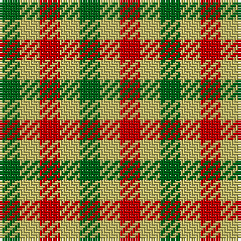

**Bands:** [GYRYGYR](/stripes/gyrygyr/) · **Stripes:** [G LY R LY G LY R](/stripes/stripes7/) G LY R LY G LY R

This was sourced from tartans-authority.  It is a [7 band tartan](/bands/bands7/).

Original link http://www.tartansauthority.com/tartan-ferret/display/5471/

## Thread count
G/8 LG8 R8 LG8 Ga8 LG8 R/8

## Palette
Each colour and its ΔE from the base-6 reference it is a variant of.

| Colour | Shade | Base | ΔE (OKLab) |
|---|---|---|---|
| G | <code style="background-color:#006818;">#006818</code> `#006818` | G <code style="background-color:#006100;">#006100</code> | 0.02 |
| Ga | <code style="background-color:#006818;">#006818</code> `#006818` | G <code style="background-color:#006100;">#006100</code> | 0.02 |
| LG | <code style="background-color:#C4BC68;">#C4BC68</code> `#C4BC68` | Y <code style="background-color:#F2BF00;">#F2BF00</code> | 0.08 |
| R | <code style="background-color:#C80000;">#C80000</code> `#C80000` | R <code style="background-color:#CC0000;">#CC0000</code> | 0.01 |

# Sample pattern

## Nearest tartans

The nearest existing variants by ΔTartan distance.

1. [Lochwood Estate Check](/setts/s7/g4ly4b4ly4g4ly3r4~x2/) — ΔT 1.47
1. [Seaforth (Estate Check)](/setts/s9/r1o1k1o1y1o1k1o1y1~x12/) — ΔT 1.97
1. [Seaforth Estate Check Estate Check Weavers Tartan Tartan Number: 5344. Earliest known date: pre 1990 No details. See products available Copyright © Blair Urquhart, Comrie, 2015](/setts/s9/r1o1k1o1y1o1k1o1y1~x6/) — ΔT 1.97
1. [Ballindalloch Check](/setts/s5/dg1o1dr1o1dr1~x8/) — ΔT 2.33
1. [Strathspey (Estate Check)](/setts/s9/do1w1k1w1do1w1k1w1dt1~x6/) — ΔT 2.40
1. [Wilson's No.187](/setts/s4/g1r1g1k1~x8/) — ΔT 2.58
1. [Dupplin Check](/setts/s9/do1lb1k1lb1do1lb1k1lb1r1~x6/) — ΔT 2.61
1. [Mothers Pride](/setts/s3/ly1db1r1~x40/) — ΔT 2.67
1. [Compaq Check (Corporate)](/setts/s9/ly1lo1ly1lo1ly1r1ly1r1ly1~x6/) — ΔT 2.69
1. [Seaforth Estate Check](/setts/s16/o1k1o1y1o1k1o1y1o1k1o1y1o1k1o1r1~x12/) — ΔT 2.70

## Neighbour map

Every grey dot is one of 14313 variants placed by the first two principal components of the ΔTartan feature space (44% of its variance). Red is this tartan; blue dots are its nearest — click one to open its page.

<svg viewBox="0 0 640 380" role="img" style="max-width:100%;height:auto;border:1px solid #e0e0e0;border-radius:4px;display:block" xmlns="http://www.w3.org/2000/svg"><image href="/nn/cloud.v1.png" width="640" height="380"/><a href="/setts/s7/g4ly4b4ly4g4ly3r4~x2/"><circle cx="23.7" cy="366.0" r="4" fill="#3465a4"><title>Lochwood Estate Check</title></circle></a><a href="/setts/s9/r1o1k1o1y1o1k1o1y1~x12/"><circle cx="14.0" cy="366.0" r="4" fill="#3465a4"><title>Seaforth (Estate Check)</title></circle></a><a href="/setts/s9/r1o1k1o1y1o1k1o1y1~x6/"><circle cx="14.0" cy="366.0" r="4" fill="#3465a4"><title>Seaforth Estate Check Estate Check Weavers Tartan Tartan Number: 5344. Earliest known date: pre 1990 No details. See products available Copyright © Blair Urquhart, Comrie, 2015</title></circle></a><a href="/setts/s5/dg1o1dr1o1dr1~x8/"><circle cx="67.3" cy="366.0" r="4" fill="#3465a4"><title>Ballindalloch Check</title></circle></a><a href="/setts/s9/do1w1k1w1do1w1k1w1dt1~x6/"><circle cx="14.0" cy="366.0" r="4" fill="#3465a4"><title>Strathspey (Estate Check)</title></circle></a><a href="/setts/s4/g1r1g1k1~x8/"><circle cx="89.7" cy="366.0" r="4" fill="#3465a4"><title>Wilson's No.187</title></circle></a><a href="/setts/s9/do1lb1k1lb1do1lb1k1lb1r1~x6/"><circle cx="14.0" cy="366.0" r="4" fill="#3465a4"><title>Dupplin Check</title></circle></a><a href="/setts/s3/ly1db1r1~x40/"><circle cx="14.0" cy="366.0" r="4" fill="#3465a4"><title>Mothers Pride</title></circle></a><a href="/setts/s9/ly1lo1ly1lo1ly1r1ly1r1ly1~x6/"><circle cx="137.6" cy="366.0" r="4" fill="#3465a4"><title>Compaq Check (Corporate)</title></circle></a><a href="/setts/s16/o1k1o1y1o1k1o1y1o1k1o1y1o1k1o1r1~x12/"><circle cx="14.0" cy="363.5" r="4" fill="#3465a4"><title>Seaforth Estate Check</title></circle></a><circle cx="14.0" cy="366.0" r="5" fill="#c00000"/></svg>

ID: /setts/s7/g1ly1r1ly1g1ly1r1~x8/
