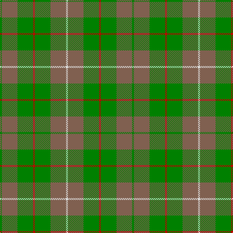

This page is one **sett** — a single exact thread-count. It belongs to the [tartan](/tartans/g1lt8g8r1g8lt8ln1/)
(the same proportion at any scale), whose colour order is pattern [GRGRGRW](/stripes/grgrgrw/).

Sourced from weddslist.  It is a [7 stripe tartan](/stripes/stripes7/).

Original link http://www.weddslist.com/cgi-bin/tartans/pg.pl?source=sts

## Thread count
G/4 LT32 G32 R4 G32 LT32 LN/4

## Palette
Each colour and the base-6 reference it is a variant of.

| Colour | Shade | Base |
|---|---|---|
| G | <code style="background-color:#008000;">#008000</code> `oklch(52.0% 0.177 142.5)` <small>#008000</small> | G <code style="background-color:#006100;">#006100</code> |
| LN | <code style="background-color:#E0E0E0;">#E0E0E0</code> `oklch(90.7% 0.000 89.9)` <small>#E0E0E0</small> | W <code style="background-color:#F7F7F7;">#F7F7F7</code> |
| LT | <code style="background-color:#806050;">#806050</code> `oklch(51.7% 0.049 47.8)` <small>#806050</small> | R <code style="background-color:#CC0000;">#CC0000</code> |
| R | <code style="background-color:#C00000;">#C00000</code> `oklch(50.7% 0.208 29.2)` <small>#C00000</small> | R <code style="background-color:#CC0000;">#CC0000</code> |

# Sample pattern

## Nearest tartans

The nearest existing variants by ΔTartan distance, with this tartan at the top so the swatches line up against it.

ΔTartan

Tartan

Sett

—

<a href="/ttd/edit/#slug=g1o8g8r1g8o8w1~x4">MacKinnon, hunting</a> <a class="nn-out" href="/setts/s7/g1o8g8r1g8o8w1~x4/" title="open its dictionary page">↗</a>

1.07

<a href="/ttd/edit/#slug=g1dy8g8r1g8dy8w1~x2">MacKinnon Hunting Clan Tartan Tartan Number: 917. Earliest known date: 1960 The modern hunting MacKinnon is based on the sett published in the Vestiarium Scoticum in 1842. The change is simply from red in the V.S. to brown in the modern version. The result was registered with Lord Lyon in 1960. See products available Copyright © Blair Urquhart, Comrie, 2015</a> <a class="nn-out" href="/setts/s7/g1dy8g8r1g8dy8w1~x2/" title="open its dictionary page">↗</a>

1.12

<a href="/ttd/edit/#slug=r2g12o3g8o14g2~x2">Confederate Artillery (Military)</a> <a class="nn-out" href="/setts/s6/r2g12o3g8o14g2~x2/" title="open its dictionary page">↗</a>

1.41

<a href="/ttd/edit/#slug=db3o7g2r2g14o2g2db3~x2">Daks, Tartan-Loden</a> <a class="nn-out" href="/setts/s8/db3o7g2r2g14o2g2db3~x2/" title="open its dictionary page">↗</a>

1.44

<a href="/ttd/edit/#slug=g8k2g13lr4g12n22g5lo3~x2">Taylor</a> <a class="nn-out" href="/setts/s8/g8k2g13lr4g12n22g5lo3~x2/" title="open its dictionary page">↗</a>

1.47

<a href="/ttd/edit/#slug=lo11g5lo10g4g26lo4~x2">North Dakota State University (Corp.</a> <a class="nn-out" href="/setts/s6/lo11g5lo10g4g26lo4~x2/" title="open its dictionary page">↗</a>

1.54

<a href="/ttd/edit/#slug=r1g8o8w1~x2">MacKinnon, hunting</a> <a class="nn-out" href="/setts/s4/r1g8o8w1~x2/" title="open its dictionary page">↗</a>

1.62

<a href="/ttd/edit/#slug=db3dy7g2y2g14dy2g2db3~x2">Daks (Loden)</a> <a class="nn-out" href="/setts/s8/db3dy7g2y2g14dy2g2db3~x2/" title="open its dictionary page">↗</a>

1.65

<a href="/ttd/edit/#slug=g4dy25g6t12g12t3~x2">Canadian Fancy</a> <a class="nn-out" href="/setts/s6/g4dy25g6t12g12t3~x2/" title="open its dictionary page">↗</a>

1.68

<a href="/ttd/edit/#slug=g22k3g3g16g6k4~x2">Campbell Simpson (Dalgliesh)</a> <a class="nn-out" href="/setts/s6/g22k3g3g16g6k4~x2/" title="open its dictionary page">↗</a>

1.69

<a href="/ttd/edit/#slug=r1g8dy8w1~x2">MacKinnon Hunting (Var) Clan Tartan Tartan Number: 1542. Earliest known date: pre 2003 Two times actual count given in letter from MacKinnon of MacKinnon 1908 as 'the Composition of the MacKinnon tartan...' See products available Copyright © Blair Urquhart, Comrie, 2015</a> <a class="nn-out" href="/setts/s4/r1g8dy8w1~x2/" title="open its dictionary page">↗</a>

## Neighbour map

Every grey dot is one of 14299 variants placed by the first two principal components of the ΔTartan feature space (44% of its variance). Red is this tartan; blue dots are its nearest — click one to open its page.

<svg viewBox="0 0 640 380" role="img" style="max-width:100%;height:auto;border:1px solid #e0e0e0;border-radius:4px;display:block" xmlns="http://www.w3.org/2000/svg"><image href="/nn/cloud.v1.png" width="640" height="380"/><a href="/setts/s7/g1dy8g8r1g8dy8w1~x2/"><circle cx="353.1" cy="281.6" r="4" fill="#3465a4"><title>MacKinnon Hunting Clan Tartan Tartan Number: 917. Earliest known date: 1960 The modern hunting MacKinnon is based on the sett published in the Vestiarium Scoticum in 1842. The change is simply from red in the V.S. to brown in the modern version. The result was registered with Lord Lyon in 1960. See products available Copyright © Blair Urquhart, Comrie, 2015</title></circle></a><a href="/setts/s6/r2g12o3g8o14g2~x2/"><circle cx="385.1" cy="298.1" r="4" fill="#3465a4"><title>Confederate Artillery (Military)</title></circle></a><a href="/setts/s8/db3o7g2r2g14o2g2db3~x2/"><circle cx="304.8" cy="239.0" r="4" fill="#3465a4"><title>Daks, Tartan-Loden</title></circle></a><a href="/setts/s8/g8k2g13lr4g12n22g5lo3~x2/"><circle cx="336.1" cy="237.2" r="4" fill="#3465a4"><title>Taylor</title></circle></a><a href="/setts/s6/lo11g5lo10g4g26lo4~x2/"><circle cx="345.8" cy="279.6" r="4" fill="#3465a4"><title>North Dakota State University (Corp.</title></circle></a><a href="/setts/s4/r1g8o8w1~x2/"><circle cx="301.8" cy="267.7" r="4" fill="#3465a4"><title>MacKinnon, hunting</title></circle></a><a href="/setts/s8/db3dy7g2y2g14dy2g2db3~x2/"><circle cx="329.4" cy="256.1" r="4" fill="#3465a4"><title>Daks (Loden)</title></circle></a><a href="/setts/s6/g4dy25g6t12g12t3~x2/"><circle cx="302.3" cy="289.1" r="4" fill="#3465a4"><title>Canadian Fancy</title></circle></a><a href="/setts/s6/g22k3g3g16g6k4~x2/"><circle cx="373.9" cy="285.5" r="4" fill="#3465a4"><title>Campbell Simpson (Dalgliesh)</title></circle></a><a href="/setts/s4/r1g8dy8w1~x2/"><circle cx="305.6" cy="273.0" r="4" fill="#3465a4"><title>MacKinnon Hunting (Var) Clan Tartan Tartan Number: 1542. Earliest known date: pre 2003 Two times actual count given in letter from MacKinnon of MacKinnon 1908 as 'the Composition of the MacKinnon tartan...' See products available Copyright © Blair Urquhart, Comrie, 2015</title></circle></a><circle cx="335.1" cy="268.0" r="5" fill="#c00000"/></svg>

ID: /setts/s7/g1o8g8r1g8o8w1~x4/
