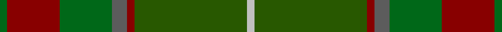
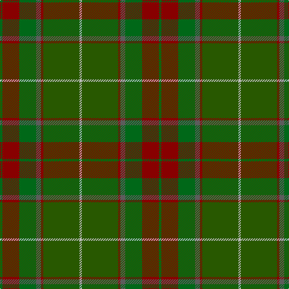

This page is one **sett** — a single exact thread-count. It belongs to the [tartan](/tartans/g1r7g7n2r1dg15lb1/)
(the same proportion at any scale), whose colour order is pattern [GRGBRGW](/stripes/grgbrgw/).

Sourced from register-of-tartans.  It is a [7 stripe tartan](/stripes/stripes7/).

Original link https://www.tartanregister.gov.uk/tartanDetails.aspx?ref=5006

## Register references

External register numbers recorded for this tartan.

- Scottish Register of Tartans: [5006](https://www.tartanregister.gov.uk/tartanDetails.aspx?ref=5006)
- Scottish Tartans Authority (ITI): 3148

## Thread count
G/4 DR28 G28 N8 DR4 Ga60 Na/4

## Palette

Palette: <strong>Tartan Register</strong> <small style="color:#888">(4 of 5 colours)</small>
<table><thead><tr><th>Colour</th><th>Threads</th><th>Shade</th><th>Base</th><th>OKLCh</th></tr></thead><tbody><tr><td>G/</td><td style="text-align:right;font-variant-numeric:tabular-nums">4</td><td><code style="background-color:#006818;">#006818</code> <small style="color:#888">#006818</small></td><td>G <code style="background-color:#006100;">#006100</code></td><td><small style="color:#888">oklch(45.0% 0.142 145.0)</small></td></tr><tr><td>DR</td><td style="text-align:right;font-variant-numeric:tabular-nums">28</td><td><code style="background-color:#880000;">#880000</code> <small style="color:#888">#880000</small></td><td>R <code style="background-color:#CC0000;">#CC0000</code></td><td><small style="color:#888">oklch(39.4% 0.162 29.2)</small></td></tr><tr><td>G</td><td style="text-align:right;font-variant-numeric:tabular-nums">28</td><td><code style="background-color:#006818;">#006818</code> <small style="color:#888">#006818</small></td><td>G <code style="background-color:#006100;">#006100</code></td><td><small style="color:#888">oklch(45.0% 0.142 145.0)</small></td></tr><tr><td>N</td><td style="text-align:right;font-variant-numeric:tabular-nums">8</td><td><code style="background-color:#5C5C5C;">#5C5C5C</code> <small style="color:#888">#5C5C5C</small></td><td>B <code style="background-color:#2A418A;">#2A418A</code></td><td><small style="color:#888">oklch(47.5% 0.000 89.9)</small></td></tr><tr><td>DR</td><td style="text-align:right;font-variant-numeric:tabular-nums">4</td><td><code style="background-color:#880000;">#880000</code> <small style="color:#888">#880000</small></td><td>R <code style="background-color:#CC0000;">#CC0000</code></td><td><small style="color:#888">oklch(39.4% 0.162 29.2)</small></td></tr><tr><td>Ga</td><td style="text-align:right;font-variant-numeric:tabular-nums">60</td><td><code style="background-color:#285800;">#285800</code> <small style="color:#888">#285800</small></td><td>G <code style="background-color:#006100;">#006100</code></td><td><small style="color:#888">oklch(41.0% 0.122 135.8)</small></td></tr><tr><td>Na/</td><td style="text-align:right;font-variant-numeric:tabular-nums">4</td><td><code style="background-color:#C0C0C0;">#C0C0C0</code> <small style="color:#888">#C0C0C0</small></td><td>W <code style="background-color:#F7F7F7;">#F7F7F7</code></td><td><small style="color:#888">oklch(80.8% 0.000 89.9)</small></td></tr></tbody></table>

# Sample pattern

## Nearest tartans

The nearest existing variants by ΔTartan distance, with this tartan at the top so the swatches line up against it.

ΔTartan

Tartan

Sett

—

<a href="/ttd/edit/#slug=g1r7g7n2r1dg15lb1~x4">Ramsay (Green Fashion)</a> <a class="nn-out" href="/setts/s7/g1r7g7n2r1dg15lb1~x4/" title="open its dictionary page">↗</a>

0.95

<a href="/ttd/edit/#slug=r4g46r10db10dy33db5dy4lo3~x2">State Seal of Minnesota (Fashion)</a> <a class="nn-out" href="/setts/s8/r4g46r10db10dy33db5dy4lo3~x2/" title="open its dictionary page">↗</a>

1.06

<a href="/ttd/edit/#slug=dy35dg19r3y8r3dg8r3t3~x2">John Muir Way</a> <a class="nn-out" href="/setts/s8/dy35dg19r3y8r3dg8r3t3~x2/" title="open its dictionary page">↗</a>

1.21

<a href="/ttd/edit/#slug=do6lg3do18dy2do2dy10y28r2y4~x2">Scottish Crofting Foundation</a> <a class="nn-out" href="/setts/s9/do6lg3do18dy2do2dy10y28r2y4~x2/" title="open its dictionary page">↗</a>

1.32

<a href="/ttd/edit/#slug=dy35dg19r3g8r3dg8r3db3~x2">John Muir Way</a> <a class="nn-out" href="/setts/s8/dy35dg19r3g8r3dg8r3db3~x2/" title="open its dictionary page">↗</a>

1.36

<a href="/ttd/edit/#slug=lo5y33dg33r6w2~x2">Symington</a> <a class="nn-out" href="/setts/s5/lo5y33dg33r6w2~x2/" title="open its dictionary page">↗</a>

1.47

<a href="/ttd/edit/#slug=dg2lo6g24r2y2dg1y6dg10g2~x2">Fitzgibbon (Name)</a> <a class="nn-out" href="/setts/s9/dg2lo6g24r2y2dg1y6dg10g2~x2/" title="open its dictionary page">↗</a>

1.48

<a href="/ttd/edit/#slug=r2dy1dg9y1dy2y6g2y1~x4">Tomass</a> <a class="nn-out" href="/setts/s8/r2dy1dg9y1dy2y6g2y1~x4/" title="open its dictionary page">↗</a>

1.48

<a href="/ttd/edit/#slug=g5k2g28k10dy26db4g4~x2">John Telfar Dunbar/Hunting Tartan Tartan Number: 776. Earliest known date: pre 2003 Check this entry... See products available Copyright © Blair Urquhart, Comrie, 2015</a> <a class="nn-out" href="/setts/s7/g5k2g28k10dy26db4g4~x2/" title="open its dictionary page">↗</a>

1.60

<a href="/ttd/edit/#slug=lo3g30y20o6y3o3y3dt20r2~x2">Glens of Corbie</a> <a class="nn-out" href="/setts/s9/lo3g30y20o6y3o3y3dt20r2~x2/" title="open its dictionary page">↗</a>

1.62

<a href="/ttd/edit/#slug=r4n38k4n6k41dg62y4">Bennett, John Paul (Personal)</a> <a class="nn-out" href="/setts/s7/r4n38k4n6k41dg62y4/" title="open its dictionary page">↗</a>

## Neighbour map

Every grey dot is one of 14299 variants placed by the first two principal components of the ΔTartan feature space (44% of its variance). Red is this tartan; blue dots are its nearest — click one to open its page.

<svg viewBox="0 0 640 380" role="img" style="max-width:100%;height:auto;border:1px solid #e0e0e0;border-radius:4px;display:block" xmlns="http://www.w3.org/2000/svg"><image href="/nn/cloud.v1.png" width="640" height="380"/><a href="/setts/s8/r4g46r10db10dy33db5dy4lo3~x2/"><circle cx="289.3" cy="195.0" r="4" fill="#3465a4"><title>State Seal of Minnesota (Fashion)</title></circle></a><a href="/setts/s8/dy35dg19r3y8r3dg8r3t3~x2/"><circle cx="302.0" cy="206.0" r="4" fill="#3465a4"><title>John Muir Way</title></circle></a><a href="/setts/s9/do6lg3do18dy2do2dy10y28r2y4~x2/"><circle cx="309.8" cy="194.3" r="4" fill="#3465a4"><title>Scottish Crofting Foundation</title></circle></a><a href="/setts/s8/dy35dg19r3g8r3dg8r3db3~x2/"><circle cx="300.4" cy="205.5" r="4" fill="#3465a4"><title>John Muir Way</title></circle></a><a href="/setts/s5/lo5y33dg33r6w2~x2/"><circle cx="305.9" cy="219.0" r="4" fill="#3465a4"><title>Symington</title></circle></a><a href="/setts/s9/dg2lo6g24r2y2dg1y6dg10g2~x2/"><circle cx="329.0" cy="171.5" r="4" fill="#3465a4"><title>Fitzgibbon (Name)</title></circle></a><a href="/setts/s8/r2dy1dg9y1dy2y6g2y1~x4/"><circle cx="234.2" cy="220.5" r="4" fill="#3465a4"><title>Tomass</title></circle></a><a href="/setts/s7/g5k2g28k10dy26db4g4~x2/"><circle cx="333.4" cy="234.2" r="4" fill="#3465a4"><title>John Telfar Dunbar/Hunting Tartan Tartan Number: 776. Earliest known date: pre 2003 Check this entry... See products available Copyright © Blair Urquhart, Comrie, 2015</title></circle></a><a href="/setts/s9/lo3g30y20o6y3o3y3dt20r2~x2/"><circle cx="238.1" cy="190.0" r="4" fill="#3465a4"><title>Glens of Corbie</title></circle></a><a href="/setts/s7/r4n38k4n6k41dg62y4/"><circle cx="291.5" cy="211.6" r="4" fill="#3465a4"><title>Bennett, John Paul (Personal)</title></circle></a><circle cx="314.2" cy="212.2" r="5" fill="#c00000"/></svg>

ID: /setts/s7/g1r7g7n2r1dg15lb1~x4/
