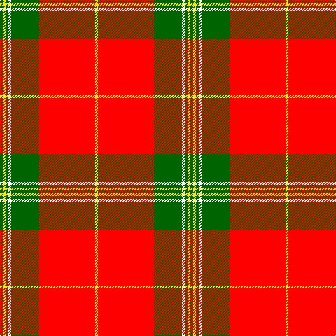

In pattern [GYGWGRY](/patterns/gygwgry/).

This was sourced from register-of-tartans.  It is a [7 stripes tartan](/stripes/stripes7/).

Original link https://www.tartanregister.gov.uk/tartanDetails.aspx?ref=10329

## Thread count
G/4 Y4 G4 W4 G40 R80 Y/4

## Palette
Each colour and its ΔE from the base-6 reference it is a variant of.

| Colour | Shade | Base | ΔE (OKLab) |
|---|---|---|---|
| G | <code style="background-color:#006400;">#006400</code> `#006400` | G <code style="background-color:#006100;">#006100</code> | 0.01 |
| R | <code style="background-color:#FF0000;">#FF0000</code> `#FF0000` | R <code style="background-color:#CC0000;">#CC0000</code> | 0.11 |
| W | <code style="background-color:#FFFFFF;">#FFFFFF</code> `#FFFFFF` | W <code style="background-color:#F7F7F7;">#F7F7F7</code> | 0.02 |
| Y | <code style="background-color:#FFE600;">#FFE600</code> `#FFE600` | Y <code style="background-color:#F2BF00;">#F2BF00</code> | 0.10 |

# Sample pattern

## Nearest tartans

The nearest existing variants by ΔTartan distance.

1. [Masai Shuka 16 (Artefact)](/setts/s6/y8k3y4k2r30y6x2~k101010-rc80000-ye8c000/) — ΔT 1.24
1. [Colchester & District Pipes & Drums](/setts/s6/g10r4g46r69k2w6~g458b00-k101010-ree0000-wffffff/) — ΔT 1.28
1. [Baluch Regiment (Military)](/setts/s9/r5g20r5g3r4g5r36b2w4x2~b4c3428-g006818-rc80000-wfcfcfc/) — ΔT 1.32
1. [MacGregor](/setts/s6/r35g16r5g5w2k3x2~g008000-k000000-rc00000-we0e0e0/) — ΔT 1.34
1. [National Defense](/setts/s6/r40w2b2w2r1y20x2~b0000cd-r8b0000-wffffff-ye6b426/) — ΔT 1.34
1. [FIRES Center of Excelence](/setts/s8/r50y8k2w2k2y8k22r3x2~k101010-rc80000-wfcfcfc-ye8c000/) — ΔT 1.35
1. [Lantern, The](/setts/s9/w6k2r32y2k6y2r4k2w3x2~k101010-rc80000-wc0c0c0-yd09800/) — ΔT 1.39
1. [National Defense (Unauthorised)](/setts/s6/r40w2b2w2r1y20x2~b2c2c80-rc80000-we0e0e0-ye8c000/) — ΔT 1.40
1. [Fernandes (Personal)](/setts/s7/g5y5g5y35r44ra3r3x2~g289c18-r880000-rac80000-ye8c000/) — ΔT 1.40
1. [MacGregor](/setts/s6/r35g16r5g5w2k3x2~g005020-k101010-rdc0000-we0e0e0/) — ΔT 1.41

## Neighbour map

Every grey dot is one of 15726 variants placed by the first two principal components of the ΔTartan feature space (44% of its variance). Red is this tartan; blue dots are its nearest — click one to open its page.

<svg viewBox="0 0 640 380" role="img" style="max-width:100%;height:auto;border:1px solid #e0e0e0;border-radius:4px;display:block" xmlns="http://www.w3.org/2000/svg"><image href="/nn/cloud.v1.png" width="640" height="380"/><a href="/setts/s6/y8k3y4k2r30y6x2~k101010-rc80000-ye8c000/"><circle cx="362.8" cy="170.6" r="4" fill="#3465a4"><title>Masai Shuka 16 (Artefact)</title></circle></a><a href="/setts/s6/g10r4g46r69k2w6~g458b00-k101010-ree0000-wffffff/"><circle cx="379.4" cy="133.7" r="4" fill="#3465a4"><title>Colchester &amp; District Pipes &amp; Drums</title></circle></a><a href="/setts/s9/r5g20r5g3r4g5r36b2w4x2~b4c3428-g006818-rc80000-wfcfcfc/"><circle cx="384.3" cy="145.0" r="4" fill="#3465a4"><title>Baluch Regiment (Military)</title></circle></a><a href="/setts/s6/r35g16r5g5w2k3x2~g008000-k000000-rc00000-we0e0e0/"><circle cx="380.6" cy="166.8" r="4" fill="#3465a4"><title>MacGregor</title></circle></a><a href="/setts/s6/r40w2b2w2r1y20x2~b0000cd-r8b0000-wffffff-ye6b426/"><circle cx="409.7" cy="111.8" r="4" fill="#3465a4"><title>National Defense</title></circle></a><a href="/setts/s8/r50y8k2w2k2y8k22r3x2~k101010-rc80000-wfcfcfc-ye8c000/"><circle cx="337.4" cy="113.7" r="4" fill="#3465a4"><title>FIRES Center of Excelence</title></circle></a><a href="/setts/s9/w6k2r32y2k6y2r4k2w3x2~k101010-rc80000-wc0c0c0-yd09800/"><circle cx="370.3" cy="122.9" r="4" fill="#3465a4"><title>Lantern, The</title></circle></a><a href="/setts/s6/r40w2b2w2r1y20x2~b2c2c80-rc80000-we0e0e0-ye8c000/"><circle cx="430.8" cy="112.0" r="4" fill="#3465a4"><title>National Defense (Unauthorised)</title></circle></a><a href="/setts/s7/g5y5g5y35r44ra3r3x2~g289c18-r880000-rac80000-ye8c000/"><circle cx="284.3" cy="148.2" r="4" fill="#3465a4"><title>Fernandes (Personal)</title></circle></a><a href="/setts/s6/r35g16r5g5w2k3x2~g005020-k101010-rdc0000-we0e0e0/"><circle cx="388.0" cy="165.8" r="4" fill="#3465a4"><title>MacGregor</title></circle></a><circle cx="370.1" cy="124.5" r="5" fill="#c00000"/></svg>

ID: /setts/s7/g1y1g1w1g10r20y1x4~g006400-rff0000-wffffff-yffe600/
